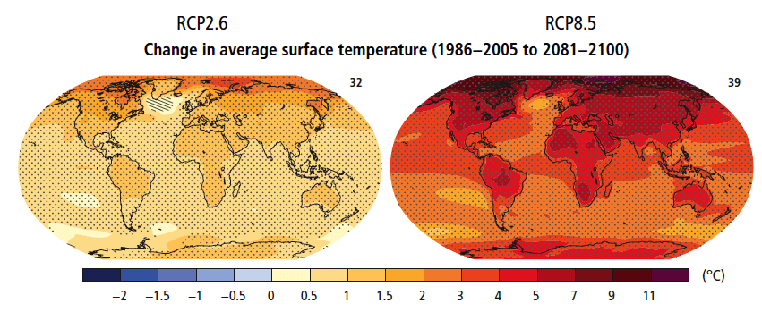
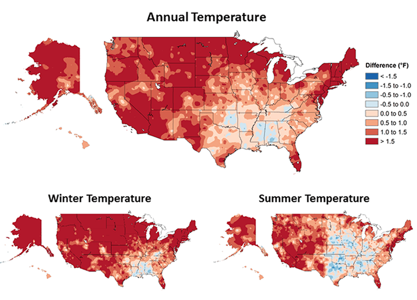

# Changes in Temperature

Potential temperature and precipitation changes will not be uniform across the earth’s surface.

Various regions (e.g. high latitudes) are predicted to experience far more warming than others (e.g. tropical latitudes). Drier mid-latitude and subtropical regions are projected to receive less rainfall, while wetter mid-latitude regions are expected to have an increase in precipitation. Extreme precipitation events are expected to increase in frequency and intensity over most land masses.

It is virtually certain that as global mean temperatures increase there will be more frequent hot and fewer cold temperature extremes over most land areas on daily and seasonal timescales. It is also very likely that heat waves will occur with a higher frequency and duration while, occasional cold winter extremes will continue to occur (IPCC 2014).

<figcaption>
Figure 2: Change in average surface temperature based on multi-model mean projections for
2081–2100 relative to 1986–2005 under the RCP2.6 (left) and RCP8.5 (right) scenarios. The number of models used to calculate the multi-model mean is indicated in the upper right corner of each panel. Stippling (i.e., dots) shows regions where the projected change is large compared to natural internal variability and where at least 90% of models agree on the sign of change. Hatching (i.e., diagonal lines) shows regions where the projected change is less than one standard deviation of the natural internal variability.
IPCC AR5. 2014. Synthesis Report. Page 12, Figure SPM.7.a.
<a href="https://www.ipcc.ch/pdf/assessment-report/ar5/syr/SYR_AR5_FINAL_full.pdf"  target="_blank" rel="noopener noreferrer">https://www.ipcc.ch/pdf/assessment-report/ar5/syr/SYR_AR5_FINAL_full.pdf</a>
</figcaption>

## Is the climate already changing?

While the global temperatures have been increasing over the past several decades, there is regional and local variation. Models of the US, comparing averages from 1901-1960 with averages from 1986-2016, show changes in both annual and seasonal measurements of temperature.

<figcaption>Figure 4: Observed changes in annual, winter, and summer temperature (°F). Changes are the difference between the average for present-day (1986–2016) and the average for the first half of the last century (1901–1960 for the contiguous United States, 1925–1960 for Alaska and Hawai‘i). Estimates are derived from the nClimDiv dataset.1, 2 (Figure source: NOAA/NCEI, Figure 6.1).Images from: USGCRP, 2017: Climate Science Special Report: Fourth National Climate Assessment, Volume I [Wuebbles, D.J., D.W. Fahey, K.A. Hibbard, D.J. Dokken, B.C. Stewart, and T.K. Maycock (eds.)]. U.S. Global Change Research Program, Washington, DC, USA, 470 pp., doi: 10.7930/J0J964J6.</figcaption>
