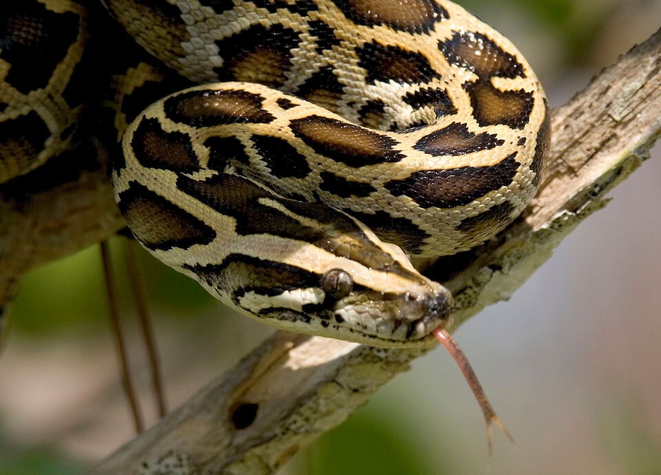

# Invasive Species

Florida has a well-documented list of invasive plants and animals—a list that is expected to increase as temperatures warm, number of frost/freeze nights decrease, intensity and/or frequency of storm events increase, and Florida’s human population increases and responds to climate change. More than 170 species of ferns and flowering plants are naturalized in southeastern Florida and hundreds of exotic plants have been introduced into the region. Some of these species are not currently invasive or have not spread beyond South Florida; however, with climate change, these species may become invasive in the future or expand their current range into other regions of the state. Category I plants, defined as invasive exotics that are altering native plant communities by displacing native species, changing community structures or ecological functions, or hybridizing with natives include species such as Melaleuca, Australian Pine, Water-hyacinth, and old world climbing fern. These species are invading native habitats and decreasing diversity, in some cases becoming so abundant that they interfere with species use of the area (e.g., nesting sea turtles and crocodiles) and contribute to the degradation of the habitat (e.g., erosion, clogging water bodies).

<!-- https://www.flickr.com/photos/evergladesnps/9099355261/ -->

There are more than 400 documented non-native animals in Florida, although not all are currently considered invasive. The Gambian pouch rat, Burmese python, green iguana, giant toad, walking catfish, Cuban tree frog, and lionfish are examples of invasive animals found in Florida. These species are known to prey upon and compete with native species. The Burmese python, native to Asia, is now found throughout much of southern Florida and has been the focus of several recent studies on impacts to native species. Many of the invasive plant and animal species found in Florida are constrained to their current extent by temperature. As temperatures increase and the number of frost/freeze nights is reduced or eliminated, many of these species will be able to migrate northward, expanding their range and potentially increasing the density of their infestations/populations.

Invasive species can have significant impacts on fundamental biological processes and these will most likely increase as climate change affects the distribution, spread, abundance, and impact of the invasive species. Climate change is expected to exacerbate impacts from non-native invasive species by facilitating the introduction of invasive species and by increasing the invasiveness (rate of spread, competitiveness) of species. Invasive species affect native populations via competition, predation, and disease, as well as by alterations of habitat structure and the food web dynamics, such as replacing natives that serve as a food source (e.g., plants providing fruits, seeds, nectar, pollen).

Climate change has already enabled range expansion of some invasive species and will likely create welcoming conditions for new invaders. Climate changes, including extreme climatic events (i.e., storms, floods), can enhance invasion processes from initial introduction through establishment and spread. Changes in the amount and timing of precipitation can alter the pathways of species introductions as new or increased flow routes transport invasive species, including animals, plants and plant propagules. Changes in precipitation may also allow for additional areas to be invaded by existing species, such as the Brazilian pepper.

The competitive resistance of native species may be reduced as climate change causes native species to shift out of the conditions to which they are adapted. It is expected that, on average, mechanisms (e.g., dispersal) enabling invasion will allow existing invasive species to expand their ranges into newly suitable habitat more quickly than native species. Therefore, those species that have the ability to shift ranges quickly would have a competitive advantage if native populations become progressively poorer competitors for resources in a changing climate. In addition to facilitating the colonization of new invasive species, climate change could exacerbate the effects of existing invasive species, including selective mortality of native versus invasive species, reversals in competitive dominance, increased consumption by predators, or increased virulence of disease organisms.

How species respond to the impacts of climate change may make it necessary to re-evaluate the definitions of “non-native” and “invasive” species. Some species not currently considered native, but instead transient or occasional, may “naturally” expand or shift their range more permanently into Florida. For example, there is speculation that climate change is a contributing factor in the natural invasion and recent establishment in Florida of two species of tropical dragonflies from Cuba and the Bahamas. Climate change could also facilitate the movement of native species into a new area of habitat or increase its abundance in an area, and in doing so it may harm other native species in ways we typically associate with invasive species, possibly leading to localized mass extinctions, speciation, and the formation of new ecosystems. Climate change impacts on the population size and scarcity of native species will influence the significance of the impact from invasive species.
