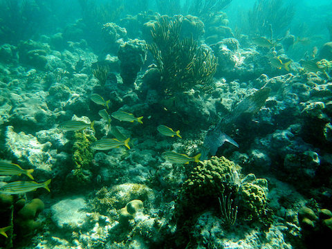

<content-header icon="water_co2_change" title="Impacts from Changes in Water Chemistry in Florida"></content-header>

<!-- https://www.flickr.com/photos/evergladesnps/9247497359/ -->

## Water Chemistry Changes in Freshwater Ecosystems

Increased CO2 will lead to pH shifts in Florida’s lakes and other freshwater systems.

Altered water chemistry can lead to community structure shifts as the systems become more favorable to a different suite of species, including invasive plants (e.g., hydrilla). Freshwater mollusks and other shell producing species may be affected by increased CO2, similar to those in the marine environment. Lowered pH, compounded by excess nitrogen from fertilizer, sewage and other sources could increase harmful algal bloom events.

## Ocean Acidification

South Florida is likely to be impacted by ocean acidification more than any other state in the county.

<!-- https://www.flickr.com/photos/bigcypressnps/30909720004/ -->

The Florida Reef is the only living coral barrier reef in the continental US and the third largest in the world. It is approximately 4 miles wide and extends 170 miles, with more than 6,000 individual reefs in the system.

Known impacts due to ocean acidification include changes in shellfish growth and decreases in coral calcification, reproduction, and growth. Florida’s panhandle, Nature Coast, and Indian River Lagoon regions are also likely to experience increasing impacts from ocean acidification. Most of Florida’s shellfish industry, including oyster, clam and scallop, is in this region. It becomes more difficult for shellfish to make their calcium carbonate shells as the availability of carbonate ions decreases. The carbonate ions become more inaccessible as the oceans become more acidic.

### What's next?

[Learn about social and economic impacts of climate change in Florida.](/impacts/florida/social)
