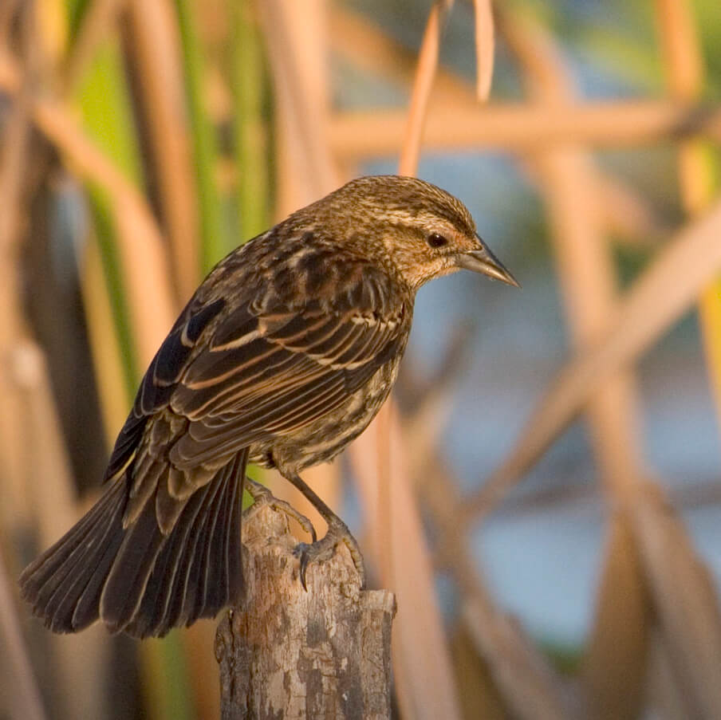

# Impacts of Climate Change in Florida

**Projections for the next century indicate that few other states will be impacted by climate change as severely as Florida.**

Climate change will have impacts on Florida’s natural resources that operate at the individual, population, community, and ecosystem scales. These impacts will affect species through changes in community dynamics, habitat suitability and geographic range, species fitness and survival, phenology and physiology, risk of extinction, and altered disturbance regimes.

Climate change will have additional impacts on Florida’s natural resources that will affect [social, cultural, and economic](/impacts/florida/social) aspects of Florida’s natural resources including the ability of residents and tourist to safely enjoy and use them.

<!-- https://www.flickr.com/photos/evergladesnps/9099305573/ -->

The overall vulnerability of some systems and species is primarily driven by the severity and extent of existing non-climate stressors, including human-caused alterations and impacts. The rate of climate change may become the most important feature in terms of consequences for biodiversity, potentially leading to escalating extinctions and widespread reorganizations of ecosystems, particularly where the rate of change is too fast and overwhelms the capacity of current ecosystems to adapt. Those species, populations, and communities that cannot keep pace with the rate of change will be most adversely impacted.

Major climate changes in Florida include:

- [Sea level rise](/impacts/florida/slr)
- [Changes in temperature](/impacts/florida/temperature)
- [Changes in precipitation](/impacts/florida/precipitation)
- [Changes in extreme events](/impacts/florida/extreme-events)
- [Changes in water chemistry](/impacts/florida/co2)

**TODO:restructure as boxes in 5 columns if possible**

These changes are likely to result in the following impacts:

- Many terrestrial, freshwater, and marine species have shifted their geographic ranges, seasonal activities, migration patterns, abundances, and species interactions in response to ongoing climate change (**high confidence**).
- A large fraction of both terrestrial and freshwater species faces increased extinction risk under projected climate change during and beyond the 21st century, especially as climate change interacts with other stressors, such as habitat modification, over-exploitation, pollution, and invasive species (**high confidence**).

* Within this century, magnitudes and rates of climate change associated with medium- to high-emission scenarios (RCP4.5, 6.0, and 8.5) pose high risk of abrupt and irreversible regional-scale change in the composition, structure, and function of terrestrial and freshwater ecosystems, including wetlands (**medium confidence**).
* Due to sea level rise projected throughout the 21st century and beyond, coastal systems and low-lying areas will increasingly experience adverse impacts such as submergence, coastal flooding, and coastal erosion (**very high confidence**).
* Due to projected climate change by the mid 21st century and beyond, global marine-species redistribution and marine-biodiversity reduction in sensitive regions will challenge the sustained provision of fisheries productivity and other ecosystem services (**high confidence**).
* For medium- to high-emission scenarios (RCP4.5, 6.0, and 8.5), ocean acidification poses substantial risks to marine ecosystems, especially polar ecosystems and coral reefs, associated with impacts on the physiology, behavior, and population dynamics of individual species from phytoplankton to animals (**medium to high confidence**).

Source: [Top-Level Findings, From the Working Group II AR5 Summary for PolicyMakers](https://www.ipcc.ch/site/assets/uploads/2018/03/WGIIAR5_SPM_Top_Level_Findings-1.pdf).
