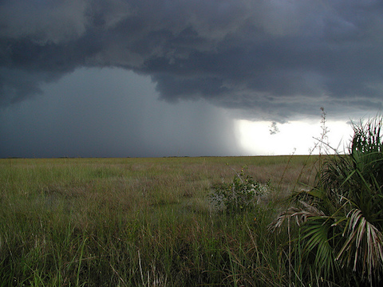

<content-header icon="precipitation_change" title="Changes in Precipitation in Florida"></content-header>

<figcaption>Everglades summer thunderstorm.  Photo: NPS.</figcaption>
<!-- https://www.flickr.com/photos/evergladesnps/9257940598/ -->

Predicting departures from annual average precipitation is more complex than projecting changing temperatures. Climate models are still evolving (particularly precipitation models), especially at these finer scales.

While the future projected shifts in temperature across Florida are greater than natural variability, the projected precipitation changes may not differ greatly from the natural variability for much of Florida and that these precipitation projections should be seen as likely possibilities and not significant trends.

Statewide, the annual trends are projected to remain relatively stable with the exception of the spring being drier and fall being wetter. In the fall, precipitation is projected to increase throughout most of the state. Trends on monthly projections are more difficult to discern. South Florida is still projected to have more monthly precipitation decreases than northern Florida, accounting for less precipitation overall.

There is a latitudinal (north/south) pattern in the precipitation projections. North Florida is expected to have a slight to moderate increase in precipitation. In contrast, south Florida is projected to experience a moderate decrease in precipitation. Central Florida appears largely unchanged on average across the year, but spring precipitation may decrease slightly.

### What's next?

[Learn about changes in extreme events in Florida.](/impacts/florida/extreme-events)
