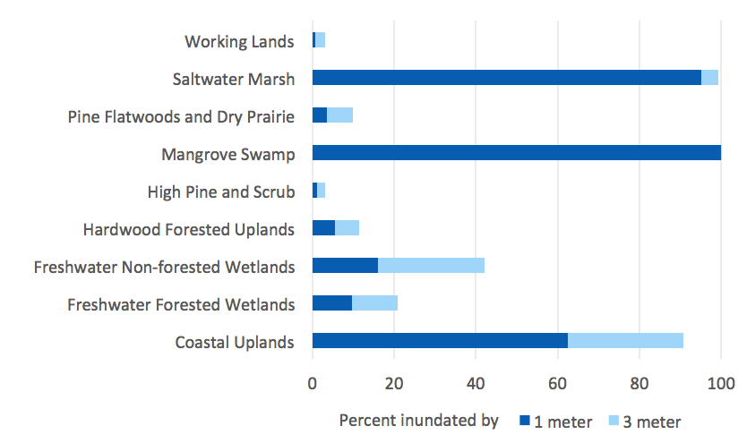

<content-header icon="sea_level_rise" title="Sea Level Rise in Florida"></content-header>

Sea level rise (SLR) will not impact the coastal areas of Florida to the same degree. Multiple variables will influence the type of changes and impacts, including location, coastline complexity, elevation, habitat type, and the presence of barriers to inland migration.

Across Florida, sea levels are expected to rise by 0.25 - 0.34 meters by 2080. However, this amount varies for different areas within the state. For example, Key West is expected to experience 0.31 meters SLR by 2080, whereas St. Petersburg is expected to have 0.35 meters, Pensacola is expected to have 0.34 meters, and Fernandina is expected to have 0.25 meters within that same timeframe.

Sea level rise is often modeled in defined increments such as feet or meters. This tool includes an analysis of impacts of SLR at 1 and 3 meters.

[Explore interactive sea level rise map.](slr_map)

Barriers to inland migration include anthropogenic structures such as seawalls, dikes, and coastal development, as well as natural biophysical factors such as different soils or available groundwater. These barriers may make it difficult or impossible for species and habitats to migrate inland with increasing sea levels.

 

## Impacts to Ecosystems

Impacts caused by changes in water and soil salinity will vary based on ecosystem type; Coastal, Terrestrial, and Freshwater, and Estuarine/Marine.

When considering the impact of SLR, there will likely be a shift in the natural community structure before being completely lost. With loss of habitat, the impact to species will vary but in some cases will be extreme.

<figcaption class="left">Figure 1: Percent inundation of coastal and terrestrial conservation assets by 1 and 3 meters sea level rise.</figcaption>

### Where are the largest impacts of sea level rise in Florida?

[Explore the interactive sea level rise map to learn more.](slr_map)

### What's next?

[Learn about changes to temperature in Florida.](/impacts/florida/temperature)
