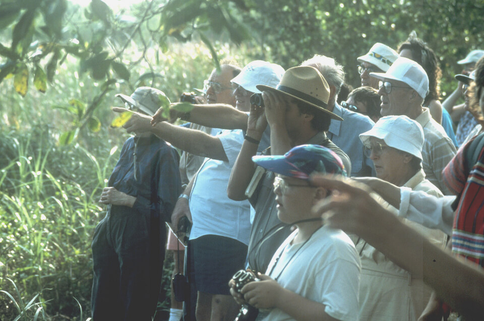

<content-header icon="social_impacts" title="Social and Economic impacts of Climate Change in Florida"></content-header>

<!-- https://www.flickr.com/photos/evergladesnps/9258239728/ -->

Florida is well-known for its variety of outdoor activities, enjoyed by both residents and tourists. Changes in precipitation patterns, sea level rise, and an increased intensity of storms may cause a reduction in activities such as birdwatching, wildlife viewing, hunting, fishing, and other recreational opportunities. Such opportunities may be affected due to changes in the species presence, abundance, diversity and health, alterations to the species habitats, compromised habitat due to storm damages and flooding, and restricted access to waterways.

Florida may lose key elements of its floral and faunal diversity, including endemic species, many of which are the focus of wildlife viewing activities.

Reduced availability and opportunity could have a significant impact on Floridian's who depend on local fish, wildlife and plants for subsistence and traditional uses.

The availability of healthy and safe resources such as clean ground and surface water, and a disease-free environment may be impacted by climate change. In the future, there may be increased competition for limited freshwater resources between humans and wildlife. This limitation could be caused by and/or contribute to a reduction in healthy ground surface water supplies. Changes in precipitation and storm events (e.g., floods) could increase the number and severity of contaminated wellfields.

There may be some positive consequences to climate-related changes. Precipitation changes may provide increased opportunities for waterfowl hunting, improved sportfish populations, and improved angler harvest.

## Economic Impacts

As with addressing other threats to Florida’s species and habitats, there will be costs associated with minimizing and/or adapting to climate change impacts. There could be increased costs to various management activities including, land management, invasive plant and animal control, and mosquito control. Altered fire regimes could lead to increased costs for management activities such as fire suppression, and smoke management. Control of invasive plant species that are able to better adapt to changing climate conditions could have significant budgetary impacts for agencies and private landowners.

<!-- https://www.flickr.com/photos/evergladesnps/9258333562/in/album-72157634585832508/ -->
<!--  -->

<!-- https://www.flickr.com/photos/evergladesnps/9099355261/ -->

Climate change impacts could lead to increased numbers of insects due to increased number of life cycles/year, increased suitable breeding conditions and sites, and/or population declines of predators (e.g., frogs), leading to an increased need to manage nuisance insects (e.g., mosquitos). Additionally, there will be costs associated with monitoring and reacting to changes in the abundance and diversity of parasites and disease vectors that may impact emergence and virility of diseases to animals and humans.

Commercially important areas and activities may experience decreased stocks of harvested fish, crabs, shrimp, clams and oysters. Climate change may impact species directly through changes in their growth, reproduction or survival or indirectly through impacts to important nursery grounds and reef habitats. The number, size, and health of harvestable species will directly affect individuals who depend on a healthy fishery for their livelihood. Warmer winter temperatures could better enable pests to overwinter, leading to impacts on forest health and harvest yield.

### What's next?

Great work - you've made it through an overview of the major climate-related impacts across Florida.

[Learn about climate impacts to species in Florida.](/impacts/species)
