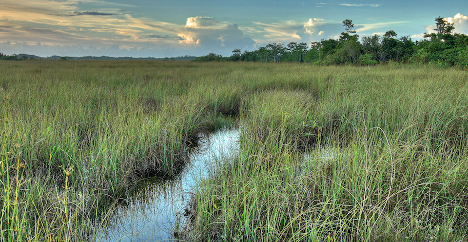

<content-header icon="marine_estuarine_ecosystems" title="Ecosystems and Habitats"></content-header>

Florida’s unique landscape is one of the most rapidly changing and climate-vulnerable within the United States. It is extremely vulnerable to sea level rise and impacts from severe storms due to low elevation, geographic location, and landscape configuration. Many habitats and species are highly sensitive to changes in temperature and precipitation.

Florida’s ecosystems and habitats will be impacted by the major climatic shifts Florida is likely to experience including sea level rise, changes in precipitation, changes in air temperature, changes in extreme events, and changes in carbon dioxide (CO2) concentration.

<!-- https://api.mapbox.com/styles/v1/mapbox/satellite-v9.html?title=true&access_token=pk.eyJ1IjoibWFwYm94IiwiYSI6ImNpejY4M29iazA2Z2gycXA4N2pmbDZmangifQ.-g_vE53SD2WrJ6tFX7QHmA#8.56/25.5513/-81.4365 -->

<figcaption>Image:<a href="https://www.mapbox.com/about/maps/">© Mapbox</a></figcaption>

### Explore overall impacts of climate change for major ecosystems in Florida:

<profile-snippet id="1000">
Increased temperatures will lead to increases in forest pest damage, changing fire patterns, longer growing seasons, higher evapotranspiration/drought stress, and the spread of non-native species.  Some tree species already at their southern range boundaries are predicted to have range reductions, which could affect forest suitability for nesting, roosting, or foraging.
</profile-snippet>

<profile-snippet id="1600">
Coastal systems have the natural ability to adapt to the dynamic conditions that formed and maintains them; however, these capacities are being overwhelmed by sea level rise, particularly in areas that have already been damaged by development, coastal armoring, and other activities. Many species depend on coastal areas for all or part of their life cycle. Habitat loss and degradation due to recreational and commercial activities have already led to declining wildlife populations. Additional impacts from climate change will only exacerbate these threats. 
</profile-snippet>

<profile-snippet id="2000">
Florida’s wetland and aquatic systems are expected to be impacted through changes in precipitation, temperature, sea level rise, and  interactions among these factors. Wetland-dependent species will be impacted through loss and degradation of habitat when water levels and the timing of water inputs become incompatible with their foraging, nesting, or roosting requirements.
</profile-snippet>

<profile-snippet id="5000">
Sea level rise, increasing ocean temperatures, ocean acidification, and changes in extreme events are expected to heavily impact estuarine and marine habitats.  Sea level rise will result in changes in the location, type, and quality of habitat for a wide range of species.  Impacts to corals long-term survival can have devastating effects on reef-associated biodiversity.
</profile-snippet>

 
 

This tool includes 29 habitats for these ecosystems. [Learn more about specific climate change impacts for individual habitats](/habitats).

## Florida has Many Unique Habitats

Florida is in a transitional zone between the pine and bottomland hardwood elements of the Coastal Plain and the tropical elements of south Florida. The location of natural communities is influenced by the local physical geography, including elevation, soil type, hydrology, climate. Florida’s elevation range is extremely small, ranging from sea level to a high of approximately 107 meters above mean sea level. However, subtle changes in elevation in combination with variations in physical geography have led to an incredible range of habitats within the state.

The state supports over 80 unique habitats including the scrub habitats of the Lake Wales Ridge, the Big Cypress Swamp, the coral reefs and tropical hardwood hammocks of the Florida Keys, mangroves, interior dry prairie, cypress domes and the Everglades. Many of Florida’s rarest and most diverse communities occur as small isolated areas, such as pine rocklands, rockland hammocks, upland glades, seepage slopes, cutthroat seeps and springs.

<!-- https://www.flickr.com/photos/evergladesnps/42295786392/ -->

Many of these unique habitats are very sensitive to changes in temperature and precipitation. For example, one of the most imperiled landscapes in the nation - the Florida Everglades - has received international recognition and is home to 68 threatened and endangered species. Likewise, the Florida Keys, with a mild tropical-maritime climate, provides habitats for a number of terrestrial and marine plant and animal species found nowhere else.

Florida has abundant surface water in lakes, rivers, streams, marshes and springs. The underlying karst geology supports more first magnitude springs (33) than any other state. Florida has 10,000 miles of rivers and streams and 7,800 lakes.

Florida also has an extremely diverse marine and estuarine ecosystem, and is the only state in the continental U.S. with an extensive shallow reef system. Vulnerable coastal areas provide critical habitat for many of Florida’s threatened species, including seaside sparrows, beach mice, sea turtles, beach nesting birds, and many endemic plant species.

### Landscape Conservation Planning - Conservation Assets:

Conservation Assets (formerly known as Priority Resources) were identified by the Peninsular Florida Landscape Conservation Cooperative (PFLCC) as the set of biological, ecological, and cultural features most important for Florida’s Landscape. They represent the most significant resources, embody key landscape components, and reflect the mission, vision, common interests, and values of the PFLCC partners. These conservation assets include:

#### Coastal and Terrestrial Ecosystems:

- [Coastal Uplands](/habitats/coastal/1601)
- [Hardwood Forested Uplands](/habitats/terrestrial/1100)
- [High Pine and Scrub](/habitats/terrestrial/1200)
- [Pine Flatwoods and Dry Prairie](/habitats/terrestrial/1300)
- [Working Lands](/habitats/terrestrial/1830)

#### Freshwater Ecosystems:

- [Freshwater Non-forested Wetlands](/habitats/freshwater/2100)
- [Freshwater Forested Wetlands](/habitats/freshwater/2200)
- [Lakes, Ponds, and Reservoirs](/habitats/freshwater/3100)
- [Rivers and Streams](/habitats/freshwater/4000)
- [Springs](/habitats/freshwater/4001)

#### Marine & Estuarine Ecosystems:

- [Marine / Estuarine System (inlets, bays, open ocean)](/habitats/marine/5200)
- [Saltwater Marsh](/habitats/marine/5240)
- [Mangrove Swamp](/habitats/marine/5250)
- [Coral Reef and Hardbottom](/habitats/marine/6100)
- [Seagrass](/habitats/marine/6200)
