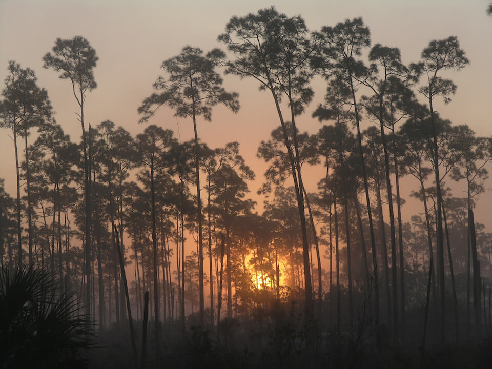

# Impacts of a Changing Climate

<!-- https://www.flickr.com/photos/bigcypressnps/31047005190/ -->

Changes in environmental conditions are one of the main drivers of changes in biodiversity. It will impact biodiversity at multiple scales, ranging from an individual to a population, community, and ecosystem.

In addition to the ways the climate may change, such as temperature, precipitation, and storm events, the rate of climate change may be the most important feature in terms of the impacts to biodiversity. This is particularly true for those species, populations, and communities that will not be able to keep pace with the rate of change. Even under the most modest climate change scenario, potential impacts on biodiversity will increase through most of this century.

<!-- https://www.flickr.com/photos/evergladesnps/9101475502/ -->

The ability of species and communities to adapt to climate change will be further challenged when considering the effects of existing stressors, including habitat loss, fragmentation and degradation, invasive species, pathogens, parasites and pollutants, and competition for resources. The synergistic effects of climate change and non-climate stressors may be severe enough to threaten some species with extinction or extirpation from portions of their range.

## Learn More

For an overview of climate science and climate change modeling, please see [Climate 101](/impacts/climate101). Several sections of this Explorer can serve as a useful starting point to learn more about potential climate change impacts in Florida and on Florida species and habitats.

Learn more about how climate change is impacting [Florida in general](/impacts/florida), [Florida species](/impacts/species), and [Florida Habitats](/impacts/habitats). Learn about how climate change interacts with [existing stressors](/impacts/existing-stressors) to further impact species and habitats.

You can also learn how species and habitats are assessed for [vulnerability to climate change](/impacts/vulnerability).
