<content-header icon="resources" title="Additional Resources for Climate Impacts"></content-header>

The following resources provide you with additional information about climate impacts and vulnerability assessments.

There is more information available on the [additional resources for adaptation strategies page](/strategies/resources).

## [Scanning the Conservation Horizon: A Guide to Climate Change Vulnerability Assessment](https://www.nwf.org/~/media/pdfs/global-warming/climate-smart-conservation/nwfscanningtheconservationhorizonfinal92311.ashx)

by: Glick, P. B.A. Stein, and N.A. Edelson, editors. 2011. National Wildlife Foundation, Washington, D.C.

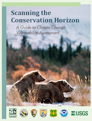</img>

This is a broad document put together by the National Wildlife Federation and is intended to help fish and wildlife researchers and managers as well as other conservation practitioners recognize how vulnerability assessments can help them manage natural resources in an era of rapid climate change. The document offers guidance on developing and conducting vulnerability assessments in support of conservation and management missions and is a helpful tool when developing climate change adaptation strategies.

The guide outlines its three primary objectives as follows:

- Provide an overview of the general principles of climate change vulnerability as it relates to species, habitats, and ecosystems.
- Describe the various approaches available for assessing the components of vulnerability and address key issues and considerations related to these tools and practices.
- Highlight examples of climate change vulnerability assessment in practice among government agencies, academic institutions, and other stakeholders.

## [Integrating climate change vulnerability assessments into adaptation planning](http://www.defenders.org/climate-change/preparing-climate-change)

by: Dubois, N., A. Caldas, J. Boshoven, and A. Delach. 2011. Defenders of Wildlife, Washington D.C.

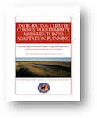</img>

Another assessment that emphasizes the importance of integrating climate change vulnerability assessments into adaptation planning is a work put out by Defenders of Wildlife to advise FWC lead conservation planning in Florida. This report begins by mentioning the current FWC efforts to plan for new threats that are emerging as a result of climate change. The key purpose of this assessment was to evaluate NatureServe as a Climate Change Vulnerability Index. Specifically, the goals were to determine what ways the tool might be modified to better denote the vulnerability of wildlife and their habitats to climate change and identify ways to use these tools to develop climate adaptation strategies.

## [A Vulnerability Assessment of 300 Species in Florida: threats from Sea Level Rise, Land Use, and Climate Change](http://journals.plos.org/plosone/article?id=10.1371/journal.pone.0080658)

by: Reece, J.S., R.F. Noss, J. Oetting, T. Hoctor, M. Volk. 2013. PLoS ONE 8(11): e80658. Doi: 10.1371/journal.pone.0080658

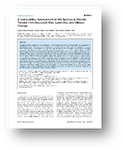</img>

In this study, the authors applied a new tool, the Standardized Index of Vulnerability and Value Assessments or SIVVA, to assess the conservation priority of 300 species of plants and animals in Florida given projections of climate change, human land-use patterns, and SLR by the year 2100. They prioritized species under five different systems of value, ranging from a primary emphasis on vulnerability or threats to an emphasis on metrics of conservation value such as phylogenetic distinctiveness.

## [Climate Change Vulnerability Assessment for natural resources management: toolbox of methods with case studies](http://www.fws.gov/home/climatechange/pdf/Guide-to-Vulnerability-Assessment%20Methods-Version-2-0.pdf)

by: Johnson, K.A. 2014. Version 2.0. U.S. Fish and Wildlife Service. Arlington, Virginia.

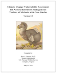</img>

This serves as a compilation of climate change vulnerability assessment methodologies and case studies. The methodologies include those for species, habitats, places, ecosystems, ecosystem services, watersheds and water resources. This document was developed with intent to be a living document and updated with new vulnerability assessment methodologies.

## [Natureserve climate change vulnerability index (CCVI)](http://www.natureserve.org/conservation-tools/climate-change-vulnerability-index)

by: NatureServe. Arlington, VA.

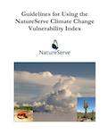</img>

CCVI is a spreadsheet assessment method for estimating a plant or animal species’ relative vulnerability to climate change. It combines readily accessible information on the natural history, distribution, and management with downscaled climate predictions from tools. After completion the results can be added to a national database to enable results to be accessible to the public.

## [Gulf Coast Vulnerability Assessment](http://gulfcoastprairielcc.org/science/science-projects/gulf-coast-vulnerability-assessment/)

by: Watson, A., J. Reece, B.E. Tirpak, C.K. Edwards, L. Geselbracht, M. Woodrey, M. LaPeyre, and
P.S. Dalyander. 2015.

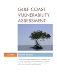</img>

The Gulf Coast Vulnerability Assessment used an expert opinion approach to qualitatively assess the vulnerability of four ecosystems: mangrove, oyster reef, tidal emergent marsh, and barrier islands, and a suite of wildlife species that depend on them. Vulnerability in this context incorporates the aspects of exposure and sensitivity to threats, coupled with the adaptive capacity to mitigate those threats. Potential impact and adaptive capacity reflect natural history features of target species and ecosystems.

## [Considering Climate Change in Florida’s Wildlife Action Planning – A Spatial Resilience Planning Approach](http://myfwc.com/media/1770248/consideringclimatechange-wildlifeactionplan.pdf)

by: Flaxman M., and J.C. Vargas-Moreno. 2011. Research Report FWC-2011. Department of Urban Studies and Planning, Massachusetts Institute of Technology. Cambridge, MA.

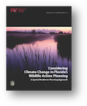</img>

This study was a pilot of a new methodological approach to incorporating climate change into wildlife action planning, termed “spatial resilience planning” or SRP. This is an extension of more general spatial scenario approaches, organized specifically for the case of climate change wildlife adaptation planning. The project evaluated 5 “alternative futures” developed by a prior research venture conducted jointly by MIT, the U.S. Geological Survey, and the U.S. Fish and Wildlife Service.

## [Landscape Conservation and Climate Change Scenarios for the State of Florida – A Decision Support System for Strategic Conservation](http://peninsularfloridalcc.org/page/climate-change-scenarios)

by: Vargas, J.C., Flaxman, and B. Fradkin. 2014. Summary for Decision Makers. GeoAdaptive LLC, Boston, MA and Geodesign Technologies Inc., San Francisco CA.

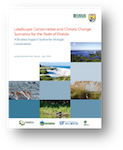</img>

This project, developed in 2012 by GeoAdaptive and Geodesign Technologies for the Peninsular Florida Landscape Conservation Cooperative (PFLCC), was designed to simulate differing future scenarios based on conservation and development policies. The results of this report identify three “alternative futures” for Florida by the year 2060. Put simply, the three futures diverge by an incrementally more aggressive conservation strategy (more conservation and sustainable development). These variables lead to three disparate futures for Florida with scenario one illustrating a business as usual prediction, scenario 2 predicting moderate amounts of conservation, and scenario 3 predicting broad statewide conservation.

## [Predicting and Mitigating the Effects of Sea Level Rise and Land Use Changes on Imperiled Species and Natural Communities in Florida](http://conservation.dcp.ufl.edu/Project-Downloads.html)

by: Center for Landscape Conservation Planning and Florida Natural Areas Inventory. 2014. Predicting and Mitigating the Effects of Sea Level Rise and Land Use Changes on Imperiled Species and Natural Communities in Florida. FWC Agreement 10289. Final Report submitted to Florida Fish and Wildlife Conservation Commission.

The goal of this project was to create a detailed assessment of the combined impacts of SLR and land-use changes on imperiled species and habitats throughout the state, which have been used to develop spatially explicit, science-based adaptive strategy recommendations to assist policy decisions. This project, also termed the SIVVA Report, is a starting point for future assessments of the impacts of SLR and adaptation options, and will form an essential foundation for future research that builds on the results and methodology of this project. This document was derived from the same efforts and work as was a publication previously mentioned in this resources section, “A Vulnerability Assessment of 300 Species in Florida: threats from Sea Level Rise, Land Use, and Climate Change.”

## [Resilient Sites for Terrestrial Conservation in the Southeast Region](https://easterndivision.s3.amazonaws.com/Terrestrial/Resilient_Sites_for_Terrestrial_Conservation_In_the_Southeast_Region.pdf)

by: Anderson, M.G., A. Barnett, M. Clark, C. Ferree, A. Olivero Sheldon, and J. Prince. 2014. The Nature Conservancy, Eastern Conservation Science.

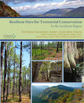</img>

The report is structured around the following key steps in the resilience analysis: 1) identify all
geophysical settings, 2) estimate site resilience, and 3) link sites into networks. The results section
presents the estimated resilience scores at two scales: 30 meter cells and 1000 acre (404-ha) sites. All
results are presented within ecological regions or “ecoregions” as defined by TNC based on the
subsections delineated by the US Forest Service (USDA FS 2007) and Canadian Provinces (Anderson
1999).

## [Climate Change Action Plan for the Florida Reef System 2010-2015](http://frrp.org/SLR%20documents/FL%20Reef%20Action%20Plan-WEB.pdf)

by: Florida Reef Resilience Program, State of Florida, NOAA, The Nature Conservancy, Great Barrier Reef Marine Park Authority. 2010.

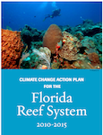</img>

This Action Plan is intended to guide coordination of
reef management across many jurisdictions
and serve as a more detailed, Florida-specific companion to the climate change
goal and objectives in “NOAA Coral Reef
Conservation Program Goals & Objectives
2010-2015” (NOAA CRCP 2009).

## [Being Prepared for Climate Change: A Workbook for Developing Risk-Based Adaptation Plans](http://www2.epa.gov/sites/production/files/2014-09/documents/being_prepared_workbook_508.pdf)

by: U.S. Environmental Protection Agency. 2014. Being Prepared for Climate Change: A Workbook for Developing Risk-Based Adaptation Plans. EPA Office of Water, Washington, D.C.

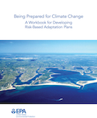</img>

