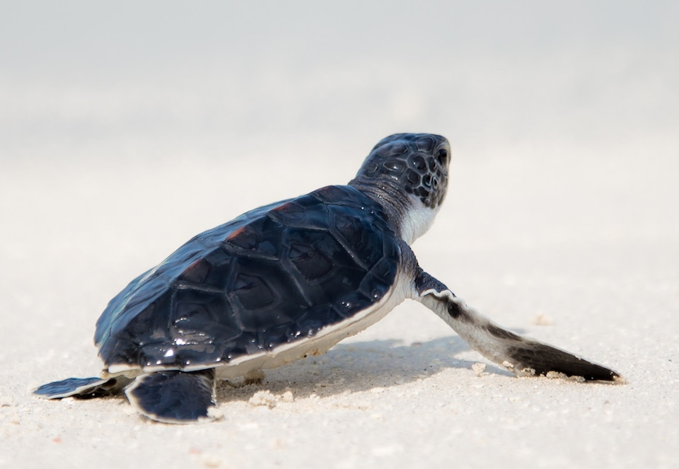

<content-header icon="sea_turtles" title="Altered Phenology and Physiology"></content-header>

**Phenology** is the seasonal timing of life stages or life cycle events. This timing may shift with changing climate conditions. Spring activities, such as breeding or first singing of birds, arrival of migrant birds, appearance of butterflies, choruses and spawning in amphibians, and shooting and flowering of plants, have been occurring progressively earlier since the 1960s. Species with closely intertwined life cycles may experience mismatched shifts if phenological changes do not coincide (e.g. bird migration/nesting cycles and insect emergence).

<!-- https://www.flickr.com/photos/bigcypressnps/32788402820/ -->

For example, bird migration, breeding, and nesting are timed every spring to coincide with the peak availability of critical food sources in a delicate synchronization that occurs across large distances and diverse habitats. If the arrival of a migrating bird to its breeding ground and the insect it depends on for food both occur two weeks earlier due to the effects of climate change, they remain in synchrony and may persist; however, if the bird arrives before or after the insect’s hatch/emergence they become out of synchrony and the bird not have enough food to successfully reproduce, ultimately leading to population declines.

Likewise, many flowering plants are dependent upon specialized pollinators, primarily insects. The plant will not be able to successfully reproduce if it begins to bloom earlier in response to climate change, but the insect emergence does not shift similarly. The plant’s flowering period may end before the pollinator ever emerges.

Changing environmental conditions may also cause fluctuations in the physiological processes of plants and animals, such as growth rate and sex ratio. There is particular interest in the effects of climate change on the population dynamics of species with temperature-dependent sex determination.

## Changes in Sex Ratios Due to Temperature-Dependent Sex Determination

<!-- https://unsplash.com/photos/uGPBqF1Yls0 -->

**Temperature-dependent sex determination (TSD)** is when the temperature of the eggs during a certain period of development determines sex. Sex determination is affected by both mean incubation temperature as well as the magnitude of daily temperature fluctuation. Small changes in temperature can significantly change the sex ratio

The sex of most turtle species and all species of crocodilians is determined by the environment after fertilization. Two parameters — the pivotal temperature and the transitional range of temperature — control sex determination in species with TSD. Species with a larger transitional range of temperature are expected to be at a lower risk to climate change.

Climate change may result in a strong sex ratio bias that could lead to significant population declines or extinction. Some species including the snapping turtle, crocodile, and alligator produce males at intermediate incubation temperatures and either females or a mixed sex ratio are produced at extreme (either high or low) temperatures. In contrast, sea turtles and most other turtle species are female-biased at higher temperatures and male-biased at lower temperatures.

## Phenotypic Plasticity and Microevolution

In addition to shifting their range, species can cope with climate change through phenotypic plasticity and microevolution.

**Phenotypic plasticity** is the ability of an organism to change its characteristics or traits, including morphological, physiological, and behavioral. Species with phenotypic plasticity can quickly compensate for a moderate change in environmental. For example, some species of pond snails exhibit morphological plasticity in that they develop spiny shells, rather than “normal” smooth shells, in the presence of predators. Plants are more phenotypically plastic than animals, because unlike animals, plants are forced to stay put and address various changing conditions with very limited options to move or migrate.

**Microevolution** is the change in the gene pool (allele frequencies) of a population over time that result in relatively small changes to the organism. Gene flow, genetic drift, and mutation are pathways for microevolution. These changes happen over a relatively short (in evolutionary terms) amount of time. Development of resistance of pests to pesticides, weeds to herbicides, and pathogens to medicines (e.g., antibiotics) are examples of microevolution.

#### Impacts of Salinity Shifts:

- Altered behavior/movement patterns due to loss of sources of freshwater
- Disruptions to and/or reduction in successful metamorphosis in amphibians
- Altered movement patterns due to increased salinity
- Loss of host plant or pollinator

#### Impacts of Warmer Temperatures:

- Earlier physiological developments and larval release in plankton
- Skewed sex ratio of species with temperature-dependent sex determination
- Altered length of spawning season for fish
- Increased growth rates of fish (potentially beneficial change)
- Earlier onset of spawning by fish species whose spawning is initiated by a minimum temperature

#### Impacts of Increased Cold Events:

- Delayed timing of reproduction
- Change in timing of migration – arrival and departure
- Slowed or delayed metabolic processes

#### Impacts of Increased or Decreased Precipitation:

- Altered behaviors/movements due to changes in prey/forage availability or distribution
- Change in timing of reproduction – species dependent on rainfall triggers

#### Impacts of Changes in Timing of Precipitation:

- Altered thermoregulatory responses/tactics of reptiles due to change in amount of sunlight penetrating to the ground as plant growth changes

#### Impacts of Changes in Frequency and Severity of Extreme Events:

- Increased stress due to reduction of food or cover
- Increased stress due to injury
- Disruption of life cycle events, e.g., migration, breeding

#### Impacts of Altered Water Chemistry:

- Increased stress
- Decreased physiological functions (shell formation)
- Decreased metabolic rate
- Depressed immune responses
- Loss of keystone species

### What's next?

[Learn about altered disturbance regimes from changes in climate in Florida.](/impacts/species/disturbance)
