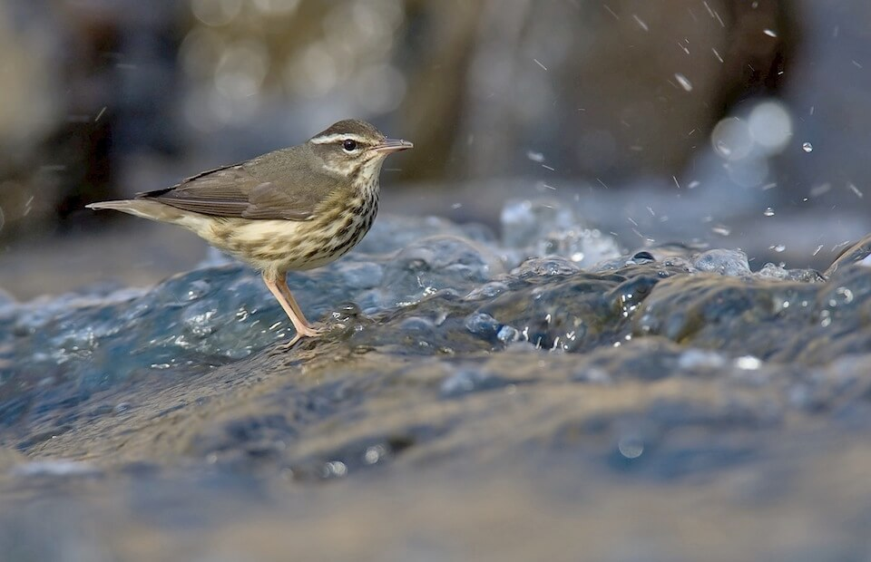

<content-header icon="perching_birds" title="Altered Habitat Suitability"></content-header>

The suitability of habitat may shift, as vegetative composition and other key environmental variables respond to climate change. Species distributions are influenced through species-specific temperature and precipitation thresholds and, as these thresholds are crossed, species will need to change their movement patterns, shift their ranges, or disperse further distances to reach suitable habitat as they are forced to move away from unsuitable habitat conditions. These changes may lead to habitat degradation, fragmentation or loss for some species. Of particular significance, the loss of a keystone species from a community can lead to the loss of habitat for many associated species.

While some species may be able to migrate as a means of adapting to shifts in habitat conditions, others may not be able to as the shifts in suitable habitat outpace their ability to move. Climate change impacts may be more severe for species occupying habitats in areas where migration or relocation is challenging due to physical barriers. Barriers to movement/migration pathways can be caused by natural (e.g., rivers) and man-made (e.g., roads, land use) features.

Climatic changes will lead to contraction of the range of some species. These same changes could lead to the range expansion of other species, particularly non-native invasive species.

#### Impacts to Migratory Species

Migratory species are likely to be strongly affected by climate change. They may be impacted at multiple geographic scales, possibly experiencing alterations of habitat in their wintering grounds, breeding grounds, and along their migratory. Mechanisms that aid in migrations, such as wind and water currents, may have positive or negative consequences depending on whether changes increase or decrease required energy expenditures to complete their migration. Altered directions of winds/currents can impact species’ ability to navigate to the desired location, even delivering individuals to the wrong location.

Although migratory species are adapted to adjust their behavior with annual changes in the weather, shifts in climatic variables are beginning to result in mistimed migration, with some species abandoning migration altogether and others shifting their migratory pattern. Changes in cues (e.g., temperatures, precipitation) for migration initiation or pathways could lead to mismatched availability of resources required for successful completion of migration or reproductive success and survival upon arriving at the spring or winter destinations.

#### Impacts of Sea Level Rise:

- Loss of habitat
- Habitat degradation due to changes in nutrient/sediment flow
- Habitat fragmentation
- Decreased range for salt intolerant species in coastal areas and south Florida Species
- Loss of critical sources of freshwater sources
- Reduction in the extent of occurrence of unique Florida Keys species
- Reductions (or expansions) in species ranges and occurrences

#### Impacts of Salinity Shifts:

- Decreased range for salt intolerant species in coastal areas and south Florida Species
- Reduction in the extent of occurrence of unique Florida Keys species
- Loss of critical sources of freshwater sources
- Loss of critical upland forest habitat in the Florida Keys
- Habitat degradation due to increases in salinty

#### Impacts of Warmer Temperatures:

- Species range reductions or shifts due to reduced habitats
- Range expansion of invasive exotic species
- Range expansion of euryhaline marine species further into inland waters
- Habitat migration

#### Impacts of Increased Cold Events:

- Impediments to seasonal movement due to variation in temperature regimes
- Shift in species range and occurrence

#### Impacts of Increased Precipitation:

- Increased connectivity of ephemeral wetlands to adjacent wetlands and water bodies
- Habitat degradation/fragmentation due to scouring of the streambed
- Changes in nutrient/sediment flows
- Loss/movement of nesting sites/locations

#### Impacts of Decreased Precipitation:

- Reduced forage due to drier conditions
- Loss of critical sources of freshwater
- Altered distribution of species due to increased inshore salinity levels
- Changes in nutrient/sediment flows
- Habitat fragmentation – disconnected aquatic systems
- Loss of keystone species

#### Impacts of Changes in Timing of Precipitation:

- Decreased migratory connectivity of aquatic species accessing feeding/breeding grounds
- Decreased connectivity to spawning grounds as timing of flood events change
- Changes in timing of species movement

#### Impacts of Changes in Frequency and Severity of Extreme Events:

- Increased fragmentation/barriers of travel corridors
- Loss of habitat – flooding, storm surge, drying up of source of freshwater, wildfire
- Loss of food source
- Habitat degradation - exposure to increased salinity – storm surge

#### Impacts of Altered Water Chemistry:

- Habitat degradation
- Habitat loss

### What's next?

[Learn about altered species survival and risk of extinction from changes in climate in Florida.](/impacts/species/altered-survival)
