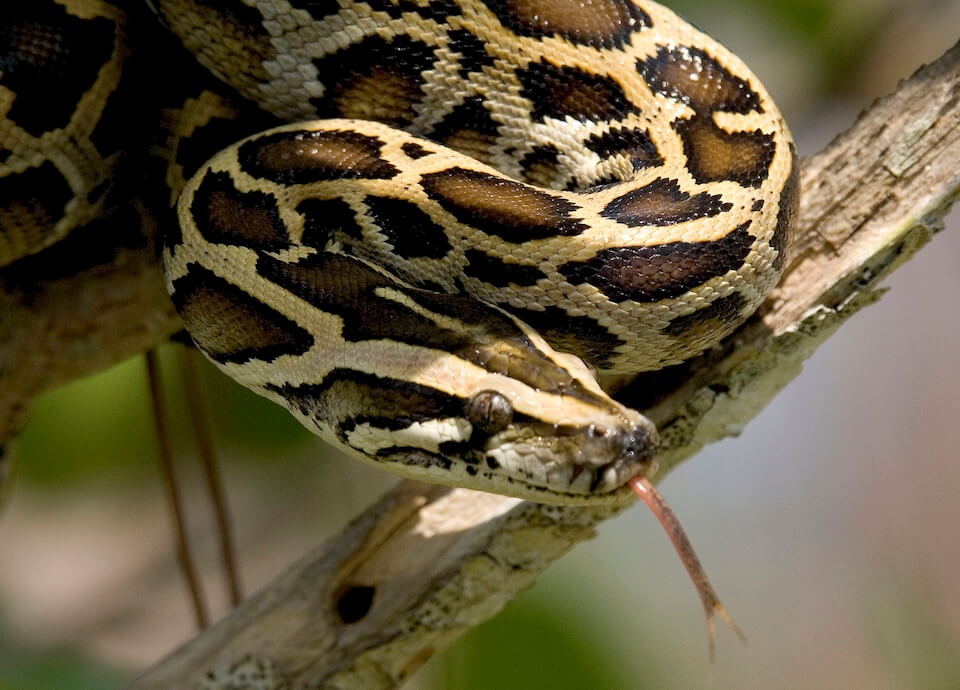

<content-header icon="turtles" title="Altered Community Dynamics"></content-header>

Species composition within a community will change as species and habitats respond to shifting environmental variables. These changes may lead to changes in availability of food due to increased competition and changes in predator-prey relationships.

<!-- https://www.flickr.com/photos/evergladesnps/9099355261/ -->

Many exotic and invasive plants and pest species already possess characteristics that will allow them to take advantage of climatic changes (e. g., highly mobile, opportunistic breeding, wide climatic tolerance) leading to an increase in abundance to such an extent that they have a transformative, and often negative, impact on other species and ecosystems. Native communities under stress from climatic changes may be more susceptible to invasion and other disturbances.

#### Impacts of Salinity Shifts:

- Changes in competition and predator/prey relationships due to de-coupling of mutualistic relationships as salt-intolerant plants and animals are reduced and/or replaced by salt tolerant species
- Changes in species composition as a result of salinity stress related shifts
- Shifts in species presence and abundance due to changes in plant community structure as vegetation responds to changes in groundwater and soil salinity

#### Impacts of Warning Temperatures:

- Shift in fish communities from sportfish to rough fish
- Changes in community composition
- Reduction of threatened species due to temperature increases exacerbating existing stressors
- Altered food web dynamics
- Altered composition of parasite community
- Range expansion of euryhaline marine species further into inland waters
- Range expansion of invasive exotic species
- Loss of keystone species

#### Impacts of Increased Cold Events:

- Shift in species distribution
- Decoupling of predator/prey relationships of fish
- Limit northern extent/expansion of exotic species range (potentially beneficial change)
- Reduced competitive ability

#### Impacts of Increased Precipitation:

- Increased connectivity of in ephemeral wetlands to adjacent wetlands and water bodies
- Reduced food source for aquatic species due to displacement of stored organic carbon

#### Impacts of Decreased Precipitation:

- Shift in species composition
- Loss of species due to alteration of habitat
- Altered macro-invertebrate assemblages in streams
- Loss or reduction of some species as biotic interactions are altered
- Increased predator density at limited sources of freshwater
- Altered distribution of species due to increased inshore salinity levels
- Loss of keystone species
- Increased competition for limited forage due to drier conditions

#### Impacts of Changes in Timing of Precipitation:

- Altered interactions between species that depend on seasonal availability of resources
- Altered predator/prey interactions due to changes in timing of migration

#### Impacts of Changes in Frequency and Severity of Extreme Events:

- Introduction of competitors and/or predators
- Loss of keystone species
- Loss of food sources

#### Impacts of Altered Water Chemistry:

- Increased disease, pathogens, parasites
- Shift in species composition
- Changes in competition and predator/prey relationships
- Reduced competitive ability

### What's next?

[Learn about altered habitat suitability from changes in climate in Florida.](/impacts/species/altered-range)
