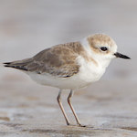
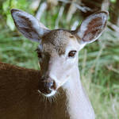
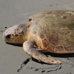

# Florida's Species

Florida has more than 16,000 species of native fish, wildlife, and invertebrates, including 147 endemic vertebrate species and approximately 400 terrestrial and freshwater endemic invertebrates. There are currently 82 species designated as federally endangered or threatened in Florida. An additional 59 species are listed as endangered or threatened by the state, including 21 birds, eight mammals, 13 reptiles, four amphibians, nine fish, and four invertebrates.

[See species profiles for more about how climate change will impact each species](/species).

## Climate Change Impacts on Florida Species

Physical environmental parameters play a major direct or indirect role in determining species distribution, survival and ecosystem sustainability. Many species of fish and wildlife in Florida have limited ranges that are determined in part by climatic conditions and their survival could be threatened by future climatic shifts. In contrast, many generalist species, such as white-tailed deer or raccoons, are likely to continue to thrive in a changing climate.

Florida’s species have migrated and adapted to climate change in the past, but that ability is severely compromised now due largely to human modification of the landscape. Species, both native and exotic, with traits that assist in invading or colonizing disturbed areas (e.g., ability to change/adjust their range, phenology, and physiology) will have an advantage in a rapidly changing climate.

Climate change impacts on species will be driven by one or more climate-related factors acting in concert or synergistically. These include:

- [altered community dynamics](/impacts/species/altered-dynamics)
- [altered habitat suitability/geographic range](/impacts/species/altered-range)
- [altered species fitness and survival](/impacts/species/altered-survival)
- [altered phenology and physiology](/impacts/species/altered-phenology)
- [increased risk of extinction](/impacts/species/altered-survival)
- [altered disturbance regimes](/impacts/species/disturbance)

## Most Severely Impacted Species

Species that are likely to be most affected by climate change have:

- poor dispersal ability
- long generation times
- long time to sexual maturity
- low reproductive rates
- low genetic variability
- narrow environmental tolerances
- specialized requirements or relationships with other species
- specialized habitat and/or microhabitat requirements
- narrow geographic range
- dependence on specific triggers or cues likely to be disrupted by climate change

### Some of the most highly vulnerable species include:

#### [Cuban snowy plover](/species/birds/shorebirds_seabirds/113)

As a beach nesting species, the Cuban snowy plover is extremely vulnerable to many threats that are common in coastal areas including habitat inundation from sea level rise. Cuban snowy plover nests on the open beach are easily destroyed by extreme weather events, human disturbance and predation, all of which are likely to increase as climate change accelerates.  [Read more...](/species/birds/shorebirds_seabirds/113)

 

#### [Key deer](/species/mammals/large_mammals/119)

Florida Key deer are likely to be heavily impacted sea level rise as well as potential changes in hydrology and disturbance regimes on freshwater drinking sources. Over 95% of the species' modeled potential habitat is expected to be impacted by a 1-meter sea level rise. [Read more...](/species/mammals/large_mammals/119)

 

#### [Loggerhead turtle](/species/reptiles/turtles/217)

Loggerhead turtles are likely to be impacted by sea level rise, anthropogenic barriers impacting the nesting habitat, and potentially incompatible human responses to climate change. Approximately 90% of the species' nesting habitat is expected to be impacted by a 1-meter sea level rise. Up to 80% of the nesting habitat is bordered by inland urban areas. [Read more...](/species/reptiles/turtles/217)

