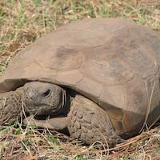
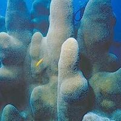
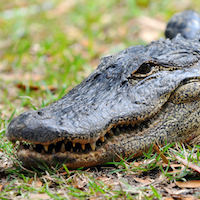

<content-header icon="coral_hardbottom" title="Loss of Keystone Species"></content-header>

A keystone species is a species that has a disproportionately large effect on its environment relative to its abundance. Such species play a critical role in maintaining the structure of an ecological community, affecting many other organisms in an ecosystem and helping to determine the types and numbers of various other species in the community.

<!-- https://www.flickr.com/photos/evergladesnps/9099546623/ -->

.')

Examples of keystone species in Florida include:

#### [Gopher Tortoise](/species/reptiles/129)

The gopher tortoise is considered a keystone species for the sandhill community in that it “engineers” the habitat of many other species. Species that have been reported using gopher tortoise burrows include at least 36 amphibians and reptiles, 19 mammals, seven birds, and more than 300 species of invertebrates. Climatic changes that impact gopher tortoise abundance or survival, such as alterations to fire regimes, will impact a large suite of associated species. [Read more...](/species/reptiles/129)

 

#### [Reef Building Corals](/species/invertebrates/320)

The species that create worm reefs and coral reefs are also considered to be keystone species. Coral reef systems composed of species such as Oculina provide habitat for many recreational and commercially important species, such as scallop, shrimp, grouper, snapper, and amberjack. Changes in circulation patterns, wave actions, sea surface temperatures, and ocean acidification may impact the coral and worm reef species and, in turn, the species that depend upon their structure as habitat. [Read more...](/species/invertebrates/320)

 

#### [American Alligator](/species/reptiles/301)

The American alligator is considered to be a keystone species of the Everglades ecosystem and wetlands systems throughout Florida, creating important habitat for other species and aiding in ecological processes. The deep holes that they create in the wetland systems retain water during the dry season, providing habitat for a variety of other species. Climate changes, particularly those changes impacting hydrological processes, can cause changes in the alligator’s range or nesting; multiple other species would also be impacted. [Read more...](/species/reptiles/301)

