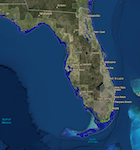
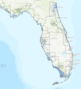
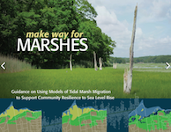
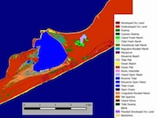

<content-header icon="tools" title="Other Climate-Oriented Tools">
</content-header>

The following tools may be useful in evaluating climate change, climate impacts, vulnerability of species and ecosystems, and informing climate-smart management practices.

---

## [NOAA Digital Coast – Sea Level Rise Viewer](http://coast.noaa.gov/digitalcoast/tools/slr)

</img>

This tool simulates various SLR scenarios and the corresponding areas that would be impacted by flooding. Additional information about marsh impacts, nuisance flood frequency and social and economic data is also provided.

## [Sea Level Scenario Sketch Planning Tool](http://sls.geoplan.ufl.edu/#intro)

</img>

This tool from the University of Florida can be used to conduct statewide and regional assessments of transportation facilities potentially vulnerable to climate trends.

##[Marshes on the Move](https://coast.noaa.gov/data/digitalcoast/pdf/marshes-on-the-move.pdf)

</img>

This report from the NOAA Coastal Services Center (CSC) and the Nature Conservancy provides a basic understanding of the parameters and uncertainties involved in modeling the future impacts of sea level rise on coastal wetlands.

##[Make Way for Marshes](http://northeastoceancouncil.org/committees/coastal-hazards-resilience/resilient-shorelines/make-way-for-marshes/)

</img>

This report from the Northeast Regional Ocean Council that covers the entire modeling lifecycle from developing a modeling approach and working with data to communicating modeling results.

##[The Sea Level Affecting Marshes Model (SLAMM)](http://warrenpinnacle.com/prof/SLAMM/)

</img>

This model simulates the dominant processes involved in wetland conversions and shoreline modifications during long-term SLR. It relies on digital elevation data to simulate the long-term impact of seal level rise (SLR) on tidal zones. Map distributions of wetlands are predicted under conditions of accelerated sea level rise, and results are summarized in tabular and graphical form. Model developed by Warren Pinnacle Consulting, Inc.

## Other Tools:

- [Climate Explorer](http://toolkit.climate.gov/climate-explorer/)
- [Climate Wizard](http://climatewizard.org/)
- [PINEMAP](http://www.nc-climate.ncsu.edu/pinemap/index.php)
- [U.S. Climate Resilience Toolkit](https://toolkit.climate.gov/tools)
- [Forest Service Climate Change Atlas](http://www.fs.fed.us/nrs/atlas/)
- [Gulf TREE](http://www.gulftree.org/)
- [Climate Smart Restoration Tool](https://climaterestorationtool.org/csrt/)
- [Seedlot Selection Tool](https://seedlotselectiontool.org/sst/)
