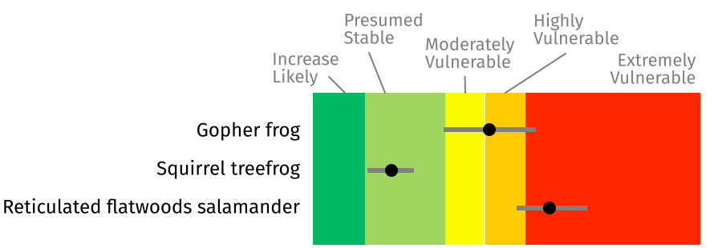
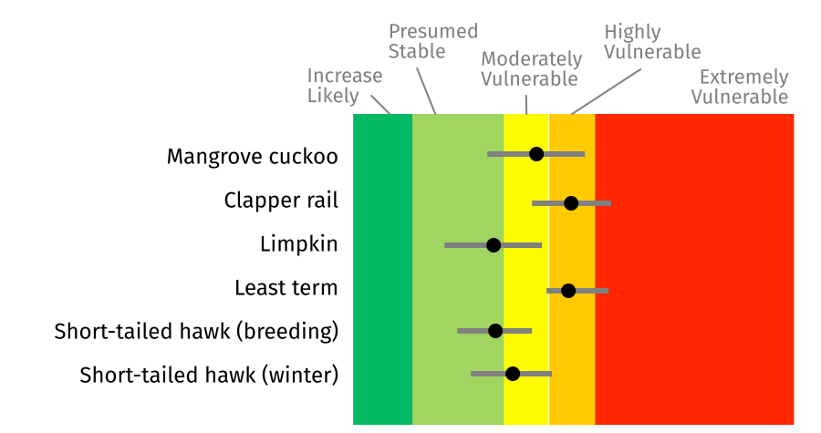

# Climate Change Vulnerability Index (CCVI)

This climate vulnerability assessment is a spreadsheet-based process used for rapid assessments of plant and animal species. It identifies the relative vulnerability of species using information about species' natural history, distribution, and landscape conditions to predict whether it will likely suffer a range contraction and/or population reductions due to climate change.

**21 florida species of greatest conservation need according to the Florida Fish and Wildlife Conservation Commission and several non-native invasive species were included in this analysis.**

## Overall Results

### Amphibians

Two out of the three amphibian species evaluated were rated as "Highly Vulnerable" (gopher frog) or "Extremely Vulnerable" (reticulated flatwoods salamander). Moderate dispersal ability combined with specific hydrologic requirements often contribute to vulnerability to climate change for amphibians.

### Reptiles

Reptiles tended to rank at the upper end of the scale, ranking as highly vulnerable as a group. Multiple species, including the diamondback terrapin, loggerhead sea turtle, Atlantic salt marsh snake, and American crocodile were identified as extremely vulnerable to climate change. Most of the native reptiles evaluated occur in coastal habitats, and therefore impacted by key factors such as sea level rise and anthropogenic barriers. Barriers may limit habitat migration in response to sea level rise as well as prevent species from tracking habitat shifts.

### Birds

Birds generally ranked lower on the vulnerability scale compared to the other species. Birds may have an advantage over other groups in that they have very good dispersal abilities. However, several of the species evaluated in this assessment had specific habitat requirements that may limit the degree to which these species may be able to shift their range. Potentially incompatible human responses to climate change, such as coastal armoring, have a significant role in increased vulnerability for some bird species, due to the potential to greatly reduce availability of suitable nesting habitat.

### Mammals

Among the mammals, those restricted to the Florida Keys ranked higher than the other mammals that were evaluated, including the Lower Keys marsh rabbit (“Extremely Vulnerable”) and the Key deer (“Highly Vulnerable”). Many of the mammals included in this assessment had relatively high dispersal ability, and therefore have the potential to be able to track climate related changes. The Florida panther’s rank of “Not Vulnerable/Presumed Stable” was heavily influenced by the assumption that the species’ habitat will not be vulnerable to climate change.

### Invertebrates

**TODO: description**

## Methods

Species are evaluated by species experts using indicators of:

- exposure (6 indicators)
- sensitivity (13 indicators)
- response to climate change - optional (4 indicators)

These indicators capture information about a species' natural history, distribution, and landscape conditions. Scores for each species are developed based on expected impacts to factors such as diet, habitat, and dispersal ability in response to projected changes in precipitation, temperature and sea level rise.

 

The CCVI generates an index score that corresponds to one of five categorical ranks, which are used to identify the species that are most vulnerable to climate change:

- **Extremely Vulnerable** (EV): Abundance and/or range extent within geographical area assessed is extremely likely to substantially decrease or disappear by 2050
- **Highly Vulnerable** (HV): Abundance and/or range extent within geographical area assessed is likely to decrease significantly by 2050
- **Moderately Vulnerable** (MV): Abundance and/or range extent within geographical area assessed is likely to decrease by 2050
- **Not Vulnerable/Presumed Stable** (PS): Available evidence does not suggest that abundance and/or range extent within the geographical area assessed will change substantially by 2050, actual range boundaries may change
- **Not Vulnerable/Increase Likely** (IL): Available evidence suggests that abundance and/or range extent within geographical area assessed is likely to increase by 2050

Note: it is important to understand why a particular species is vulnerable in order to develop appropriate management responses.

 

See the [full report](http://www.myfwc.com/media/1770251/DOW-FL-VulnerabilityReport.pdf) for more details.

---

## Resources

- [NatureServe's Climate Change Vulnerability Index](/impacts/resources#CCVI)
- [Florida Climate Change Vulnerability Index report](http://www.myfwc.com/media/1770251/DOW-FL-VulnerabilityReport.pdf)
