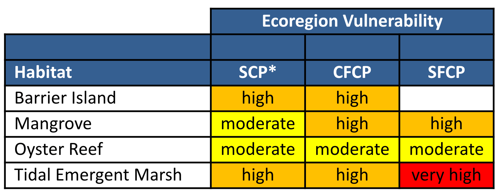

# Gulf Coast Vulnerability Assessment

The Gulf Coast Vulnerability Assessment (GCVA) evaluated species and habitats near the Gulf coast using the Standardized Index of Vulnerability and Value Assessment (SIVVA).

**This analysis includes 4 habitats and 11 species.**

<!-- https://www.flickr.com/photos/bigcypressnps/30908469564/ -->

### Species include:

- 6 birds
- 1 reptile
- 2 fish
- 2 invertebrates

 

### See overall results for:

- [species](#Species)
- [habitats](#Habitats)

 

[Learn more about the GCVA methods](#Methods).

You can also see specific vulnerability assessment results for these [species](/species) and [habitats](/habitats) included here on their profile pages.

## Species Overall Results

**TODO:intro/interpretation**

<figcaption>Table 1: Vulnerability levels for each species in the Coastal Florida Coastal Plain (CFCP), South Florida Coastal Plain (SFCP), Southern Coastal Plain (SCP) ecoregions..</figcaption>

## Habitats Overall Results

**TODO:intro/interpretation**

<figcaption>Table 2: Vulnerability levels for each habitat in the Coastal Florida Coastal Plain (CFCP), South Florida Coastal Plain (SFCP), Southern Coastal Plain (SCP) ecoregions..</figcaption>

## Methods

The Gulf Coast Vulnerability Assessment included six ecoregions across the Gulf coast. Three of these overlap with Florida:

- Coastal Florida Coastal Plain (CFCP)
- South Florida Coastal Plain (SFCP)
- Southern Coastal Plain (SCP).

Species were selected that have a distribution throughout the Gulf and include those that would be representative of other species. Habitats were selected based on data availability and models.

Standardized Index of Vulnerability and Value Assessment (SIVVA) and SIVVA-Natural Communities methods were used to evaluate the vulnerability of species and ecosystems.

For more information, please read the [full report](/impacts/resources#GCVA).

---

## Resources

- [Gulf Coast Vulnerability Assessment report](/impacts/resources#GCVA)

Gulf coast Vulnerability Assessment

### What's next?

[Learn about other climate-oriented tools.](/impacts/tools)
