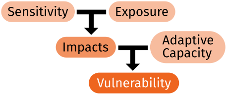

# Vulnerability to Climate Change

Awareness that change is likely to happen is critical to planning for the future. However, there is a high degree of uncertainty as to the extent and speed of climate change, as well as the ability of species and habitats to adapt. Vulnerability assessments and scenario planning can both help reduce some of the uncertainties.

A critical step in analyzing the potential impacts of current and future climate change is the assessment of the vulnerabilities of species and natural communities. Determining the relative vulnerabilities of habitats and species can lead to the development of more effective management actions and adaptation strategies to enhance resiliency. Additionally, assessing the vulnerability of species or habitats to climate change provides insight into which aspects of climate change may affect a species or community the most. Uncertainty of various types is an important factor to consider when implementing the results of a vulnerability assessment. For example, a high vulnerability to a particular threat, such as altered precipitation patterns, should be modulated by the relatively high uncertainty in precipitation projections relative to the more predictable change in temperature and sea level rise.

## Scenario Planning

Visualization of potential changes can be achieved through scenario planning. Scenario planning develops a visual or narrative description of plausible future outcomes based on the combination of a range of variables. When the variables are altered, the outcomes of the scenarios change to reflect how these differences are represented or expressed, and how they interact with each other. By applying scenario planning, employing credible information, informed questions, robust models, and a willingness to explore a range of alternatives, the percentage of what is unknown can be reduced to a manageable range of plausible futures. This process allows for informed decision-making to the benefit of biodiversity. By comparing multiple future scenarios, and identifying the strategic issues and causes that led to each of those particular outcomes, the potential impacts of individual decisions or modeled events can be directly visualized, evaluated, and contrasted between scenarios, thereby reducing uncertainty. This information can then be used in support of various vulnerability assessments of natural systems or species persistence across a modeled range of future climate changes.

[Learn more about scenario planning](/impacts/vulnerability/scenarios).

## What makes a species vulnerable to climate change?

- Specialized habitat and/or microhabitat requirements. The vulnerability associated with high habitat specialization is compounded when a species has several life stages, each with different specialized habitat or microhabitat.
- Narrow environmental tolerances or thresholds that are likely to be exceeded under climate change
- Dependence on species environmental triggers or cues that are likely to be disrupted by climate change (phenology, e.g. rainfall or temp. cues for migration, breeding or hibernation).
- Dependence on interactions between species that are likely to be disrupted
- Inability or poor ability to disperse quickly or to colonize a new, more suitable range.

## How is vulnerability measured?

Vulnerability can be separated into three elements:

<ul>
<li><b>Exposure:</b> the degree to which a species or habitat is likely to experience climate change factors.</li>
<li><b>Sensitivity:</b> the degree to which a species or habitat is likely to be affected by climate change.</li>
<li><b>Adaptive capacity:</b> the degree to which a species or habitat can adapt to a changing environment.</li>
</ul>

<!-- </img> -->

Reducing vulnerability will involve decreasing exposure or sensitivity or enabling increased adaptive capacity.

## Vulnerability Assessments

Vulnerability assessments are a suite of tools that reflect the relative and cumulative vulnerability of populations, species, or groups of species comprising a natural community, to stressors. Several vulnerability assessment tools are available and have been implemented throughout Florida and surrounding regions. Each tool focuses on different aspects of vulnerability, often leading to varied results for the same species. For some species it may be critical to assess vulnerability for various life stages.

Of the 139 species included in this tool, 96 have been evaluated using at least one vulnerability assessment. For the most part, each species was only evaluated in one vulnerability assessment; however, there were some that were evaluated by more than one.

Species were assigned a vulnerability rank based on results from these three assessments.

### Florida Climate Vulnerability Assessments

This tool includes vulnerability of species and habitats to climate change from three assessments:

- [Climate Change Vulnerability Index (CCVI)](/impacts/vulnerability/ccvi): 22 native species and non-native invasive species
- [Standardized Index for Vulnerability and Value Assessment (SIVVA)](/impacts/vulnerability/sivva): 83 species (out of 300 assessed species)
- [Gulf Coast Vulnerability Assessment](/impacts/vulnerability/gcva): 11 species and 4 habitats within 6 ecoregions across the Gulf Coast

#### Combined Vulnerability Index:

An "overall" vulnerability level was developed for all species that were evaluated in one of the vulnerability assessment processes. To accommodate the differences across the three vulnerability assessment approaches, five relative levels are used in this tool.

Climate Adaptation Explorer CCVI GCVA
Very High Extremely vulnerable Very High
High Highly vulnerable High
Moderate Moderately vulnerable Moderate
Low Slightly vulnerable Low
Very Low/Presumed Stable Not vulnerable/presumed stable Very Low

<table>
<thead>
<tr>
<th>Overall vulnerability</th>
<th>Climate Change Vulnerability Index</th>
<th>Gulf Coast Vulnerability Assessment</th>
</tr>
</thead>
<tbody>
<tr>
<td>Very high</td>
<td>Extremely vulnerable</td>
<td>Very high</td>
</tr>

<tr>
<td>High</td>
<td>Highly vulnerable</td>
<td>High</td>
</tr>

<tr>
<td>Moderate</td>
<td>Moderately vulnerable</td>
<td>Moderate</td>
</tr>

<tr>
<td>Low</td>
<td>Slightly vulnerable</td>
<td>Low</td>
</tr>

<tr>
<td>Very low / presumed stable</td>
<td>Not vulnerable / presumed stable</td>
<td>Very low</td>
</tr>

</tbody>
</table>

The Standardized Index of Vulnerability and Value Assessment (SIVVA) does not produce relative rank categories, but allows for different weighting factors to be applied to determine relative order of the species’ vulnerability. A vulnerability rank was assigned to the SIVVA species based on the average rank across the four weighting factors ([learn more](/impacts/vulnerability/sivva/species#Methods)). To be consistent with the SIVVA report results, four levels were assigned to the SIVVA species.
