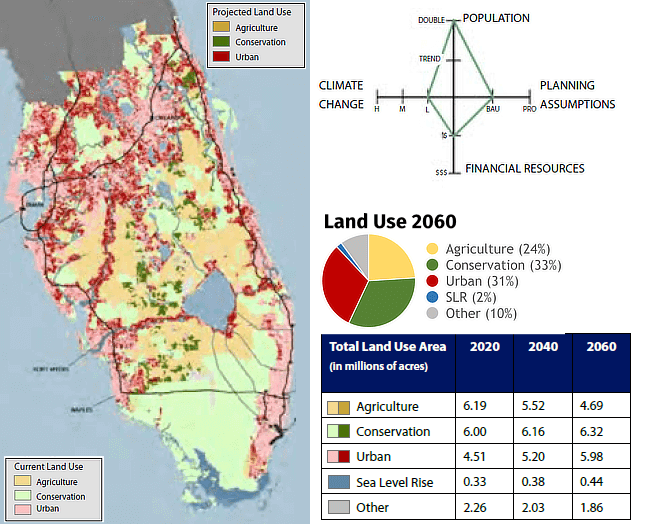

# Scenario Planning

<!-- https://www.flickr.com/photos/bigcypressnps/33014704172/ -->

The Spatially Explicit Vulnerability Analysis (SEVA) project used scenario modeling, Spatial Resiliency Planning, to predict future conservation opportunities in central and south Florida to maximize protection of biodiversity, as well as potential areas of conflict, for locations of high ecological importance that overlapped with predicted urban growth or climate change impacted areas.

The project used GIS-based spatial analyses that incorporated projections for sea level rise, population growth, land and water planning policies, and availability of funding resources to create a range of future scenarios.

Using spatial overlay analysis, the combination of a scenario and a species habitat map, this overlay process was conducted 5 times (A, B, C, E and I) for each species, giving a range of potential “impact” maps (one time for each scenario).

<figcaption class="left">Table 1: Scenario parameters.</figcaption>

<figcaption class="left">Table 2: Scenarios</figcaption>

The resulting “alternative futures” represent a range of plausible future land use and land cover configurations for each of the time series explored. Each Alternative Future visualizes land use patterns and landscape changes such as coastal inundation, urbanization, and infrastructure expansion. These maps also quantify and distill a complex range of conditions under which conservation strategies may operate, allowing managers to make strategic decisions despite considerable individual and compound uncertainties.

<figcaption class="left">Figure 1: Map and results for Scenario A</figcaption>

<figcaption class="left">Figure 2: Map and results for Scenario B</figcaption>

The SEVA project built upon work conducted by the Climate Change Vulnerability Index (CCVI) project. Six species from the CCVI project were further assessed using Spatial Resiliency Planning:

- American Crocodile
- Key deer
- Least tern
- Atlantic salt marsh snake
- Short-tailed hawk
- Florida panther.

Species responses and management options in Florida appeared to cluster into three common groups based on the intersection of species life history characteristics and management contexts:

- Species with narrow habitat ranges whose habitat is under severe threat from sea level rise, urbanization, or the combination of both. (Atlantic salt marsh snake, Key deer)
- Species persisting mostly within Florida’s extensive large conservation areas, such as Everglades National Park. These species are also potentially impacted by climate change, and particularly by sea level rise, but there is room for active habitat management and inland migration. (American crocodile, Short-tailed hawk – southern portion of Florida range)
- Species with a significant portion of their habitat on private lands, leading to different climate management actions. (Florida panther, Short-tailed hawk – northern portion of Florida range)

Read the [full report](http://www.myfwc.com/media/1770248/consideringclimatechange-wildlifeactionplan.pdf) for more information.

### What's next?

[Learn about the Climate Change Vulnerability Index for species in Florida.](/impacts/vulnerability/ccvi)
