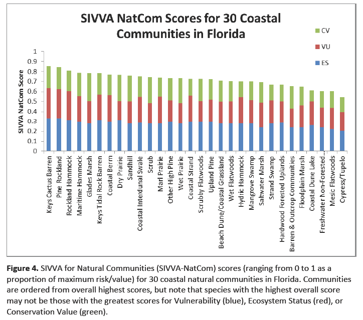

# Standardized Index of Vulnerability and Value Assessment (SIVVA) - Natural Communities

This vulnerability assessment is a spreadsheet-based vulnerability assessment tool that uses a mix of quantitative and qualitative criteria that can be adapted to fit the nature of the vulnerability assessment.

**This tool includes 30 natural communities assessed using this framework.**

Explore:

- [overall results](#Overall)
- [detailed results](#Detailed)

 

[Learn more about the SIVVA methods and vulnerability levels](#Methods).

You can also see specific vulnerability assessment results for the natural communities included here on their [profile pages](/habitats).

**TODO:term: natural community vs habitat**

## Overall Results

Natural communities in southern Florida are more vulnerable, especially those in the Florida Keys. The communities with the highest overall relative vulnerability score include:

<profile-snippet id="52111">
The Keys tidal rock barren community is at high risk of complete habitat loss, with 100% of the current area likely to be inundated by a 1 m rise in sea level. The plants found here are already highly adapted to isolated patches and high salinity levels. However, due to the isolated and patchy nature of this community and its association with flat exposed limestone, it is not likely that it will be able to successfully migrate inland to new suitable sites as sea levels rise.
</profile-snippet>

<profile-snippet id="1320">
Pine rockland habitat is likely to have 81% of the current area inundated by 1 m of sea level rise and 99% inundated by 3 m of sea level rise. Altered fire regimes or the absence of fire, along with other climatic changes, could lead to compositional and structural changes, potentially altering suitability to the current suite of species.
</profile-snippet>

<profile-snippet id="1130">
Florida's rockland hammock habitat is likely to have 58% of the current area inundated by 1 m of sea level rise and 91% inundated by 3 m of sea level rise. Increased soil salinity from saltwater intrusion and increased length of root inundation, increased exposure of salt spray and coastal erosion will lead to changes in species composition and structure as salt intolerant plants decline and plants with higher salt tolerances increase. 
</profile-snippet>

<profile-snippet id="1650">
Maritime hammock is likely to have 61% of the current area inundated by 1 m of sea level rise and 94% inundated by 3 m of sea level rise. Increased soil salinity will lead to changes in species composition and structure as salt intolerant plants decline and plants with higher salt tolerances increase. Coastal forests are already being impacted by saltwater intrusion, longer periods of root inundation, salt spray, and coastal erosion. 
</profile-snippet>

<profile-snippet id="2125">
Glades marsh is likely to have 30% of the current area inundated by 1 m of sea level rise and 92% inundated by 3 m of sea level rise. Decreased precipitation coupled with increased temperature will likely alter species composition and increase fragmentation of larger systems through reduced flow and connectivity. 
</profile-snippet>

 
 

[Learn more about climate impacts to ecosystems and habitats in Florida](/habitats).

## Detailed Results

<figcaption>SIVVA Score results (for SLR vulnerability) for 30 coastal communities reproduced from the SIVVA report. Ecosystem Status is denoted in blue, Vulnerability in red, and Conservation Value in green.</figcaption>

## Methods

Natural communities were evaluated using the following criteria:

- ecosystem status
- vulnerability
- conservation value

**TODO:need more details and number of factors**

---

## Resources

- [Standardized Index of Vulnerability and Value Assessment report](/impacts/resources#REECE)
- **TODO:Noss resource crosslink**
