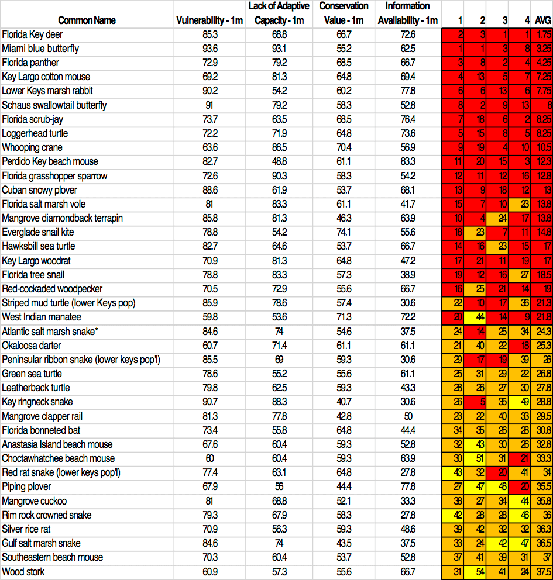
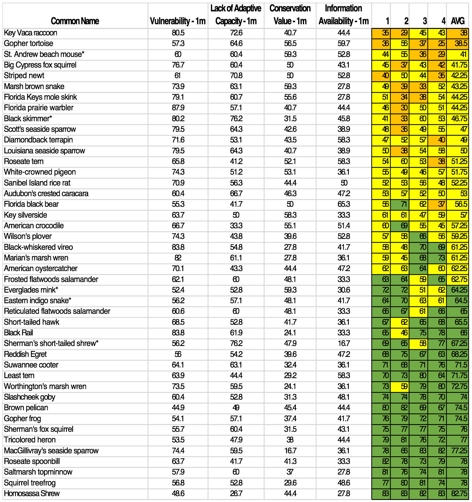

# Standardized Index of Vulnerability and Value Assessment (SIVVA) - Species

This vulnerability assessment is a spreadsheet-based vulnerability assessment tool that uses a mix of quantitative and qualitative criteria that can be adapted to fit the nature of the vulnerability assessment. [Learn more about the SIVVA methods and vulnerability levels](#Methods).

This tool includes 83 of the 300 species of conservation concern assessed using this framework. These species include 30 birds, 19 reptiles, 5 amphibians, 22 mammals, 4 fish, 3 invertebrates.

### Overall Results:

- Several species are highly likely to go extinct.
- Listed (state and federal threatened and endangered) species have significantly less adaptive capacity and ranked highly in conservation value.
- Listed species are generally not more vulnerable than non-listed species.
- Reptiles and invertebrates are relatively more vulnerable compared to other species.
- Amphibians and fish are relatively less vulnerable.
- Mammals and reptiles have the highest overall conservation value compared to other species.
- Birds and mammals have the highest overall information availability whereas invertebrates have the most limited available information.

You can also see specific vulnerability assessment results for the species included here on their [profile pages](/species).

## Several Species May Go Extinct

Several species may go extinct by 2100 due to 2 meters or less of sea level rise combined with other existing or future threats. They include:

<profile-snippet id="118">
The Florida grasshopper sparrow is particularly vulnerable to the presence of barriers, habitat fragmentation, and alterations to biotic interactions and disturbance regimes.
</profile-snippet>

<profile-snippet id="119">
Florida Key deer are likely to be heavily impacted sea level rise as well as potential changes in hydrology and disturbance regimes on freshwater drinking sources. Over 95% of the species' modeled potential habitat is expected to be impacted by a 1-meter sea level rise. 
</profile-snippet>

<profile-snippet id="136">
The Lower Keys mash rabbit is vulnerable to sea level rise, erosion, presence of barriers, changes in precipitation, minimal habitat protection, habitat fragmentation, changes in salinity, runoff and storm surge, and alterations to biotic interactions.
</profile-snippet>

<profile-snippet id="207">
The Florida tree snail is vulnerable to sea level rise, presence of barriers, runoff and storm surge, alterations to biotic interactions, and synergies with development.
</profile-snippet>

<profile-snippet id="222">
The Miami blue butterfly is vulnerable to sea level rise, the presence of barriers, habitat fragmentation, changes in salinity, runoff and storm surge, and alterations to biotic interactions and disturbance regimes. This species has a very restricted range and is already very close to extirpation.
</profile-snippet>

<profile-snippet id="213">
The Key ringneck snake is vulnerable to sea level rise, the presence of barriers, habitat fragmentation and changes in salinity.
</profile-snippet>

## Many Species are Impacted by 1 Meter of Sea Level Rise

Some of the most highly impacted species include:

- Mammals: Key deer, Florida panther, Key Largo cotton mouse, Lower Keys marsh rabbit, Perdido Key beach mouse, Florida salt marsh vole, Key Largo woodrat
- Birds:, Florida scrub jay, Whooping crane, Florida grasshopper sparrow, Cuban snowy plover, Everglade snail kite, Red-cockaded woodpecker
- Amphibians and reptiles: Loggerhead turtle, Mangrove diamondback terrapin, Hawksbill sea turtle, Striped mud turtle
- Invertebrates: Miami blue butterfly, Schaus swallowtail butterfly, Florida tree snail

## Detailed Results

### Top 40 ranked results from SIVVA for species included in this tool:

<figcaption class="left">Figure 1: Scores for each of the four categories for 1m of sea level rise are provided (Vulnerability, Lack of Adaptive Capacity, Conservation Value, and Information Availability).  Species are listed in order using the average rank value across the four ranking options. The four SIVVA ranking options included here: (1) Equal Weighting, (2) Emphasis on Vulnerability, (3) Emphasis on Conservation Value, and (4) Emphasis on Vulnerability and Information Availability.  Colors represent four classes of vulnerability red = extremely vulnerable, orange = highly vulnerable , yellow = moderately vulnerable, and green = slightly vulnerable. The numbers inside the colored boxes correspond with the species’ rank within each weighting option, with 1 being the most vulnerable.  Note: These results are slightly different than those in the SIVVA publication because a subset of the SIVVA species were included in this analysis.
 
 
* species whose Avg. rank at 3m of sea level rise results in the next higher category (in table).
</figcaption>

### Bottom 43 ranked results from SIVVA for species included in this tool:

<figcaption class="left">Figure 2: Scores for each of the four categories for 1m of sea level rise are provided (Vulnerability, Lack of Adaptive Capacity, Conservation Value, and Information Availability).  Species are listed in order using the average rank value across the four ranking options. The four SIVVA ranking options included here: (1) Equal Weighting, (2) Emphasis on Vulnerability, (3) Emphasis on Conservation Value, and (4) Emphasis on Vulnerability and Information Availability.  Colors represent four classes of vulnerability red = extremely vulnerable, orange = highly vulnerable , yellow = moderately vulnerable, and green = slightly vulnerable. The numbers inside the colored boxes correspond with the species’ rank within each weighting option, with 1 being the most vulnerable. Note: These results are slightly different than those in the SIVVA publication because a subset of the SIVVA species were included in this analysis.
 
 
* species whose Avg. rank at 3m of sea level rise results in the next higher category (in table).
</figcaption>

## Methods

Species were evaluated based on a mixture of quantitative measures and expert knowledge. Experts ranked species using several criteria including exposure and sensitivity (12 indicators), adaptive capacity (6 indicators), conservation value (7 indicators), and information availability (5 indicators). Based on these criteria, each species was assigned a score in four categories: Vulnerability (VU), Lack of Adaptive Capacity (LAC), Conservation Value (CV), Information Availability (IA).

We used four of the SIVVA weighting factors to evaluate overall vulnerability. We used different weighting factors to enable visualization of the relative priority of species and their mean priority across multiple competing value systems.

We weighted these factors according to (in order of VU, LAC, CV, IA):

- Emphasis on vulnerability: 45/25/20/10
- Equal weighting: 25/25/25/25
- Emphasis on conservation value: 20/20/50/10
- Emphasis on both conservation value and information availability: 15/15/35/35

For more information about SIVVA, please see the [full report](/impacts/resources#REECE).

---

## Resources

- [Standardized Index of Vulnerability and Value Assessment report](/impacts/resources#REECE)
