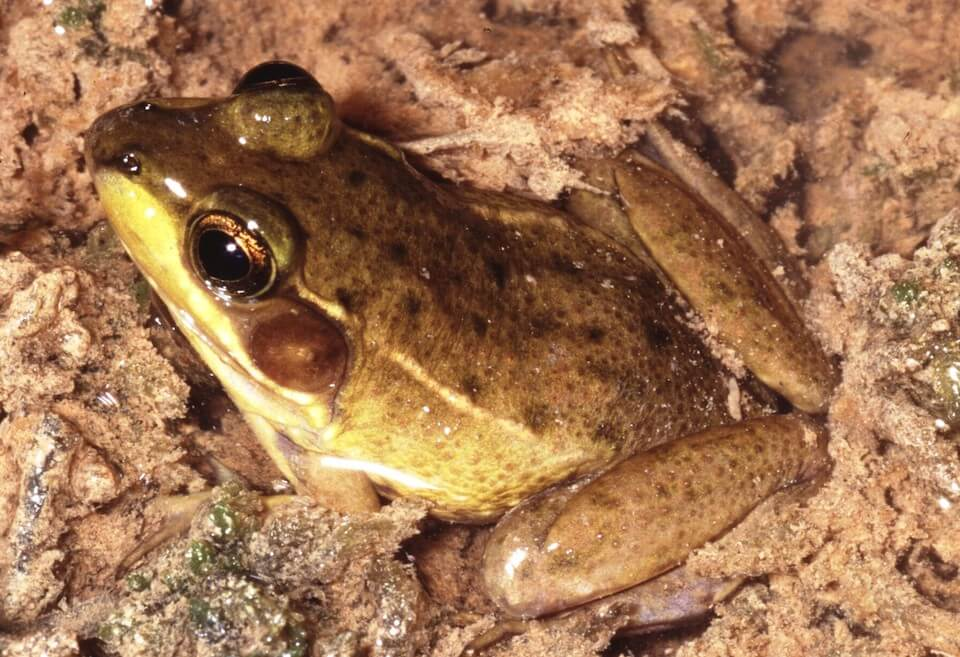

# Florida bog frog

### Lithobates okaloosae

<figcaption>Photo: FWC - Kevin Enge</figcaption>

### Overall vulnerability:

This species was not assessed for vulnerability.

### Conservation status:

State Threatened

## General Information

The Florida bog frog is a small and rare amphibian found within the western reaches of the Florida panhandle.  Knowledge about the life history of these shiny, brow frogs is limited.  Florida bog frogs rely on a diet of invertebrates and can be heard calling loudly during the spring and summer breeding season.  Tadpoles metamorphose into adult frogs during the months of the following spring.

## Habitat Requirements

**Total habitat within Florida:** 18,822 hectares (modeled)

Florida bog frogs can be found at the edges of permanent and ephemeral wetlands and sluggish bends of streams.  These frogs prefer shallow, acidic spring seeps and the boggy overflows of larger springs.

**TODO: habitat crosslinks**

**TODO: habitat map (if exists)**

## Climate Impacts

The Florida bog frog is vulnerable to the hydrological changes, increased periods of drought, loss of available ephemeral wetlands, salination from sea level rise, and increase in severe storm events expected with climate change.  The need for increased fire suppression if controlled burns become more difficult to implement in a changing climate is also a concern.  Florida bog frogs require an early successional vegetation community to thrive and lack of appropriate fire management is highly likely to degrade habitat.

[More information about general climate impacts to species in Florida](/impacts/species).

#### This species is expected to be impacted by sea level rise:

- 3 meters of sea level rise: 14% of habitat (2,652 ha)
- 1 meter of sea level rise: 6% of habitat (1,132 ha)
    

## Vulnerability Assessment(s)

This species was not assessed for vulnerability.

## Adaptation Strategies

- Strategies to preserve the integrity of wetlands during increased periods of drought and hydrological change, such as liners to maintain hydration is a possible adaptation strategy for the Florida bog frog.

- Monitoring natural community shifts to prioritize areas for conservation is an important first step in ensuring bog frog habitat can be conserved in a future climate.  Since sea level rise may cause salination of many current areas of freshwater habitat, monitoring can help conservationists get ahead of climate-driven shifts and understand where to best focus their efforts.

[More information about adaptation strategies](/strategies).

## Additional Resources

- [Florida Fish and Wildlife Conservation Commission Species Profile](https://myfwc.com/wildlifehabitats/profiles/amphibians/florida-bog-frog/)
