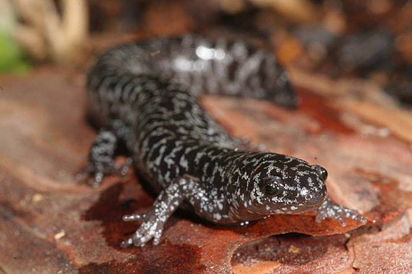

# Reticulated flatwoods salamander

### Ambystoma bishopi

<figcaption>Photo: FWC</figcaption>

### Overall vulnerability:

Moderate

### Conservation status:

Federally Endangered

## General Information

The reticulated flatwoods salamander occurs in the Florida panhandle west of the Apalachicola River.  This species is silvery black in color with white spots and a long and slender body.  The reticulated flatwoods salamander can be distinguished from the similar frosted flatwoods salamander but its spots – the reticulated salamander’s spots are well defined while the frosted salamander’s are muddled.  The reticulated flatwoods salamander feeds on a diet of earthworms and spiders and migrates to small ponds and puddles during the late fall to breed.  Larvae metamorphose into salamanders after 90 days.

## Habitat Requirements

**Total habitat within Florida:** 27,675 hectares (modeled)

The reticulated flatwoods salamander inhabits slash and longleaf pine flatwoods.  It seeks out areas with wiregrass ground cover and scattered ponds or ephemeral wetlands.

**TODO: habitat crosslinks**

**TODO: habitat map (if exists)**

## Climate Impacts

As a species with a small range, the reticulated flatwoods salamander is especially vulnerable to habitat fragmentation and loss.  While not directly linked to climate change at present, additional habitat fragmentation is likely to intensify in many areas as a changing climate begins to drive shifts in land use.  This species is also highly vulnerable to changes in precipitation patterns and hydrology.  This threat is magnified by the salamander’s small range – one or two seasons of intense drought and loss of ephemeral wetlands could spur significant population decline.

[More information about general climate impacts to species in Florida](/impacts/species).

#### This species is expected to be impacted by sea level rise:

- 3 meters of sea level rise: 44% of habitat (12,289 ha)
- 1 meter of sea level rise: 18% of habitat (4,978 ha)
    

## Vulnerability Assessment(s)

The overall vulnerability level (Moderate) was based on the following assessment(s).
#### 

<h3><a href="/impacts/vulnerability/ccvi">Climate Change Vulnerability Index</a></h3>

Extremely vulnerable

 

Both breeding and adult habitat for the reticulated flatwoods salamander are potentially vulnerable to climate change. Factors contributing to vulnerability to climate change for this species are sea level rise, natural barriers that may inhibit the species ability to track habitat shifts, and the impact of potential changes in hydrology on breeding ponds.    The majority of the known populations occur in lowlands near the coast and are vulnerable to sea level rise.  A 1-meter sea level rise may impact up to 70% of extant localities. In addition, seasonal and annual mean changes in temperature and moisture may affect area of occupancy or habitat reduction if ephemeral breeding sites experience reduced hydroperiod.  The species' reproduction is entirely dependent on seasonally-specific inundation of ephemeral wetlands with current hydroperiod trends limiting reproductive success in many breeding sites. Additional decreases in hydroperiod could lead to increased local extirpations.

#### 

<h3><a href="/impacts/vulnerability/sivva/species">Standardized Index of Vulnerability and Value Assessment</a></h3>

Slightly vulnerable

 

The primary factors contributing to vulnerability of the reticulated flatwoods salamander  are minimal habitat protection, and habitat fragmentation.

## Adaptation Strategies

- Conservation and restoration of existing wetland habitat is critical to increase habitat and species health and resilience at the onset of intensifying climate change.

- Monitoring population levels and hydrological conditions is important for this species.  Strategies such as lining breeding ponds and wetland areas to maintain hydration in the event of a significant period of drought and drop of the water table, may help the reticulated flatwoods salamander adapt to harsh conditions triggered by climate change.

- An appropriate prescribed fire regime will maintain natural conditions are reduce the risk of wild fire elevated by climate change.  Regular fire maintenance also reduces vegetation encroachment that can dehydrate wetland habitat critical to amphibians such as the reticulated flatwoods salamander.

[More information about adaptation strategies](/strategies).

## Additional Resources

- [Florida Fish and Wildlife Conservation Commission Species Profile](https://myfwc.com/wildlifehabitats/profiles/amphibians/reticulated-flatwoods-salamander/)
