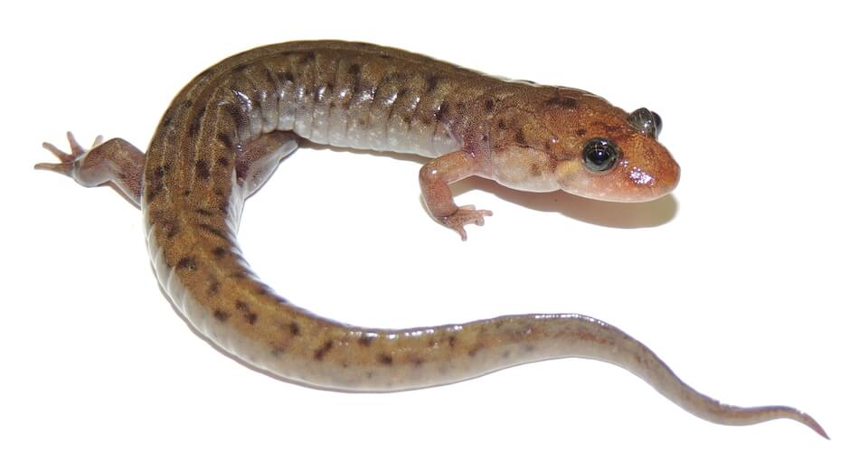

<content-header icon="salamanders" title="Seal salamander" subtitle="Desmognathus monticola">
</content-header>

<figcaption>Photo: Leif Van Laar</figcaption>

### Overall vulnerability:

This species was not assessed for vulnerability.

<h3>Habitat area: 
<a href="/species/amphibians/152/map" style="float:right;font-size:smaller;margin-right: 2rem;">
<fa-icon name="map"></fa-icon>
explore on map
</a>
</h3>

-   691 hectares within Florida (modeled)

### Conservation status:

Species of Greatest Conservation Need

## General Information

This lungless salamander is endemic to the eastern United States, most commonly found in the Appalachians.  Its range extends only into the far western tip of the Florida panhandle.  Seal salamanders are mottled dark brown in color and robust in size.  Their diet typically includes aquatic and terrestrial invertebrates but large individuals will also consume smaller salamanders.  Female seal salamanders lay their eggs in or near flowing water and guard them fiercely until hatching.  Hatchlings overwinter in their larval state before metamorphosing into adults the following spring.

## Habitat Requirements

The seal salamander is best adapted for the cold, mountain streams of Appalachia in which they are most abundant.  In Florida, they can be found in rivers, streams and seepage slopes within their narrow geographic range.

## Climate Impacts

Florida populations of seal salamanders are already stretched to the southern extent of their range.  Given their proclivity for cold rivers and streams with adequate flow, it is likely that the warming water temperatures and drought associated with climate change will push the species northward.  These salamanders are also likely to be impacted by changing water chemistry, increased salination, erosion and sedimentation, and periods of extreme weather driven by climate change.

[More information about general climate impacts to species in Florida](/impacts/species).

## Vulnerability Assessment(s)

This species was not assessed for vulnerability.

## Adaptation Strategies

- Conservation and restoration of existing wetland habitat is critical to increase habitat and seal salamander health and resilience in Florida at the onset of intensifying climate change.

- Preserving connected patches of suitable habitat allowing salamanders to move to find the most suitable habitat in a changing landscape is important for this species.

[More information about adaptation strategies](/strategies).

## Additional Resources

- [Florida Natural Areas Inventory Profile](http://www.fnai.org/FieldGuide/pdf/Desmognathus_monticola.pdf)
