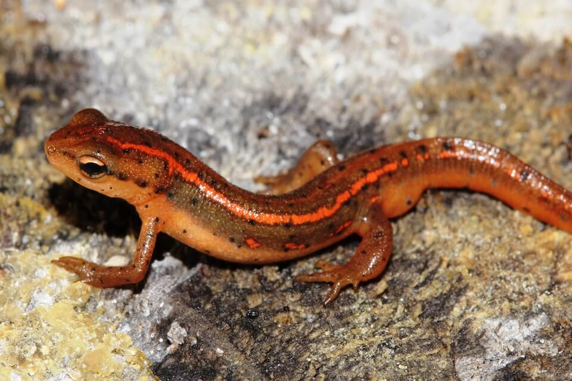

# Striped newt

### Notophthalmus perstriatus

<figcaption>Photo: FWC - Kevin Enge</figcaption>

### Overall vulnerability:

Moderate

### Conservation status:

Species of Greatest Conservation Need

## General Information

Endemic to a small range in southeastern Georgia and northeastern Florida, the striped new is olive brown in color with dark red stripes along the back.  These newts breed during the late winter when they return to temporary ponds.  This species can occur as an eft, or a terrestrial juvenile state of the lifecycle.  Efts can be identified by their bright coloring, indictive of their toxicity to predators.  Striped newts can also present in a paedomorphic, or extended juvenile, form that remains in the water.

## Habitat Requirements

**Total habitat within Florida:** 158,706 hectares (modeled)

The striped newt inhabits the fire-maintained, sandy-soiled habitats found in its southeastern range, including pine sandhills and scrub.  This species prefers ephemeral wetlands for breeding habitat because these temporary ponds lack the predators found in permanent bodies of water.

**TODO: habitat crosslinks**

**TODO: habitat map (if exists)**

## Climate Impacts

As a species with a small range, the striped newt is highly vulnerable to habitat fragmentation and loss.  While not directly linked to climate change at present, additional habitat fragmentation is likely to intensify in many areas as a changing climate begins to drive shifts in land use.  This species is also highly vulnerable to changes in precipitation patterns and hydrology.  This threat is magnified by the newt’s small range – one or two seasons of intense drought and loss of ephemeral wetlands could spur significant population decline in this species.  Fire suppression and altered fire regimes linked to the impacts of climate change could also threaten striped newt habitat.

[More information about general climate impacts to species in Florida](/impacts/species).

#### This species is expected to be impacted by sea level rise:

- 3 meters of sea level rise: 8% of habitat (13,398 ha)
- 1 meter of sea level rise: 3% of habitat (4,246 ha)
    

## Vulnerability Assessment(s)

The overall vulnerability level (Moderate) was based on the following assessment(s).
#### 

<h3><a href="/impacts/vulnerability/sivva/species">Standardized Index of Vulnerability and Value Assessment</a></h3>

Moderately vulnerable

 

The primary factors contributing to vulnerability of the striped newt are alterations to biotic interactions and disturbance regimes.

## Adaptation Strategies

- Conservation and restoration of existing wetland habitat is critical to increase habitat and species health and resilience at the onset of intensifying climate change.

- Monitoring population levels and hydrological conditions is important for this species.  Strategies such as lining breeding ponds and wetland areas to maintain hydration in the event of a significant period of drought and drop of the water table, may help the striped newt adapt to harsh conditions triggered by climate change.

- An appropriate prescribed fire regime will maintain natural conditions are reduce the risk of wild fire elevated by climate change.  Regular fire maintenance also reduces vegetation encroachment that can dehydrate wetland habitat critical to amphibians such as the striped newt.

[More information about adaptation strategies](/strategies).

## Additional Resources

- [Florida Natural Areas Inventory Profile](http://www.fnai.org/FieldGuide/pdf/Notophthalmus_perstriatus.PDF)
