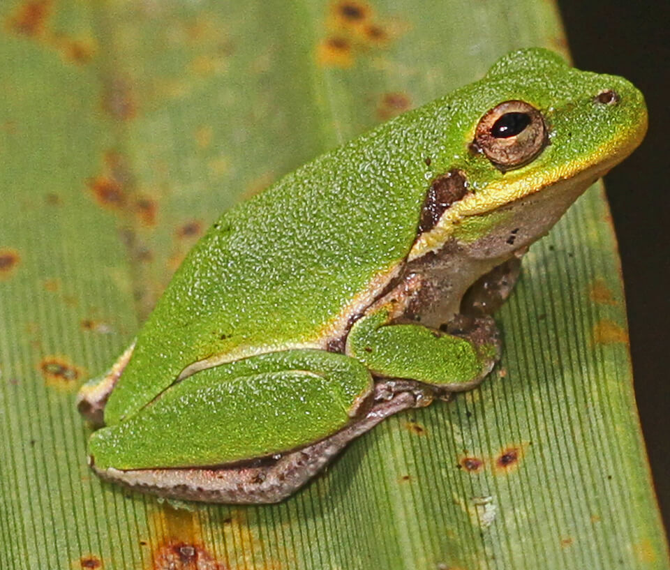

<content-header icon="frogs" title="Squirrel treefrog" subtitle="Hyla squirella">
</content-header>

<figcaption>Photo: Judy Gallagher</figcaption>

### Overall vulnerability:

Very Low

### Conservation status:

Not Listed

## General Information

These average-sized tree frogs come in a range of colors and patterns, which can make them difficult to identify.  They can be found throughout the coastal plains of the southeastern United States.  Squirrel tree frogs eat a diet of insects and breed during summer rains, capable of laying up to 1,000 eggs in shallow, ephemeral ponds.  They are sometimes called “rain frogs” in reference to their habit of calling loudly after summer showers.  The tadpole stage of this species lasts for approximately 45 days.

## Habitat Requirements

Squirrel tree frogs prefer damp environments that offer food and shelter.  Swamps, marshes and the edges of ponds and rivers make excellent habitat.

**TODO: habitat crosslinks**

## Climate Impacts

Squirrel tree frogs are vulnerable to the hydrological changes, increased periods of drought, salination from sea level rise, and increase in severe storm events expected with climate change.  The ephemeral wetlands and shallow breeding pools this species relies on are especially vulnerable to extended periods of drought. The need for increased fire suppression if controlled burns become more difficult to implement in a changing climate is also a concern as frequent fire prevents encroachment from vegetation that dehydrates tree frog habitat.

[More information about general climate impacts to species in Florida](/impacts/species).

## Vulnerability Assessment(s)

The overall vulnerability level (Very Low) was based on the following assessment(s).
#### 

<h3><a href="/impacts/vulnerability/ccvi">Climate Change Vulnerability Index</a></h3>

Not vulnerable   Presumed stable

 

Even though the squirrel treefrog requires ephemeral water bodies for breeding, it uses a wide array of temporary water bodies, and its relatively good dispersal ability and a lack of significant barriers suggest that the species will be able to track potential shifts in the availability of breeding habitat.  Less than 1% of the species' range is expected to be impacted by a 1-meter sea level rise. The squirrel treefrog is a widely distributed species and not expected to be significantly impacted by natural barriers or anthropogenic barriers.    Although many of the ephemeral water bodies used for breeding may be lost with climate change, the impact could potentially be offset by previously permanent water bodies that become ephemeral.

#### 

<h3><a href="/impacts/vulnerability/sivva/species">Standardized Index of Vulnerability and Value Assessment</a></h3>

Slightly vulnerable

 

No factors identified as significantly contributing to the vulnerability of the squirrel treefrog.

## Adaptation Strategies

- Restoration efforts to promote resilience and preserve the integrity of wetlands during increased periods of drought and hydrological change should be pursued.

- Monitoring population levels and hydrological conditions is important for this species.  Strategies such as lining breeding ponds and wetland areas to maintain hydration in the event of a significant period of drought and drop of the water table, may help the squirrel tree frog adapt to harsh conditions triggered by climate change.

- Applying an adequate fire regime to gopher frog breeding habitat at present is a critical first step in getting ahead of the challenges brought on by climate change.  If future conditions make regular prescribed burning too difficult, other habitat maintenance techniques such as mechanical thinning and removal may need to be employed.

[More information about adaptation strategies](/strategies).

## Additional Resources

- [Other Species Profile](http://ufwildlife.ifas.ufl.edu/frogs/squirreltreefrog.shtml)
