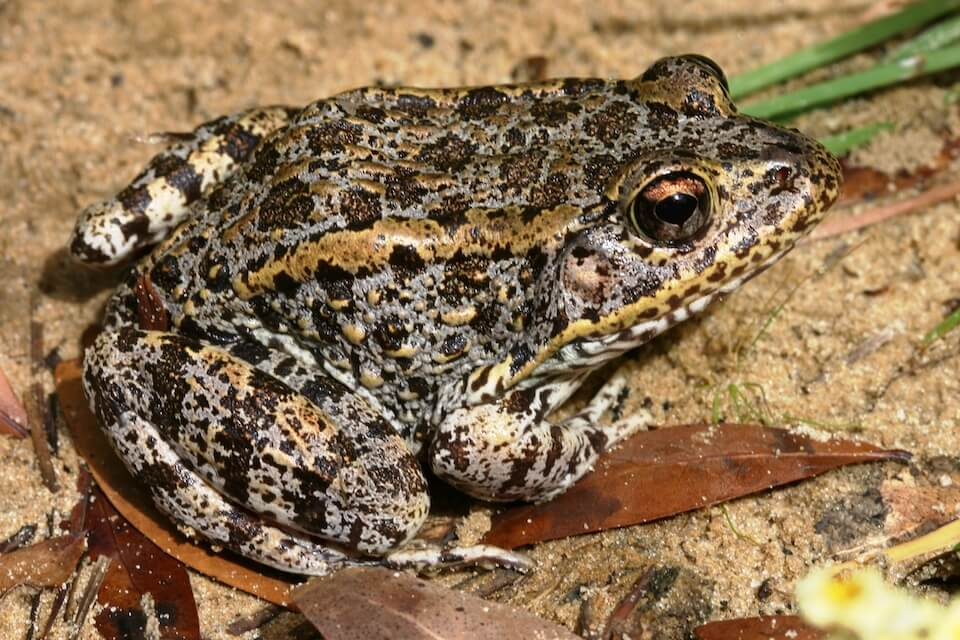

# Gopher frog

### Lithobates capito

<figcaption>Photo: FWC - Kevin Enge</figcaption>

### Overall vulnerability:

Moderate

### Conservation status:

Species of Greatest Conservation Need

## General Information

The gopher frog is a stout creature with cream-colored, warty skin and dark spots.  It is distributed through much of the Florida peninsula and parts of the panhandle where it relies on a diet of invertebrates and other frogs and toads.  The frog is named for its proclivity for inhabiting gopher tortoise burrows.  During its summer breeding season, the gopher frog travels long distances to breed in ephemeral wetlands.  From these ponds, a chorus of their deep guttural calls can sometimes be heard although gopher frogs are known to often call underwater to avoid predators.  Females lay eggs in a single mass that clings to vegetation in shallow water and can contain up to 7,000 eggs.  After hatching, tadpoles metamorphose into frogs after seven months-time.

## Habitat Requirements

**Total habitat within Florida:** 178,921 hectares (modeled)

The gopher frog’s habitat mirrors that of the gopher tortoise closely.  It can be found in a variety of hammock, flatwoods, and scrub habitats with special preference for longleaf pine and sandhills.

**TODO: habitat crosslinks**

**TODO: habitat map (if exists)**

## Climate Impacts

This species is highly vulnerable to the loss of the breeding ponds and ephemeral wetlands on which it relies.  Wetlands can dry up because of extensive drought and changes in the hydrological cycle triggered by climate change but also because of fire suppression.  Without an optimal fire regime, shrub encroachment and peat buildup often dehydrates wetlands.  This could become even more of a concern in the future if changing climatic conditions make it difficult to apply fire appropriately.

[More information about general climate impacts to species in Florida](/impacts/species).

#### This species is expected to be impacted by sea level rise:

- 3 meters of sea level rise: 6% of habitat (10,283 ha)
- 1 meter of sea level rise: 2% of habitat (4,020 ha)
    

## Vulnerability Assessment(s)

The overall vulnerability level (Moderate) was based on the following assessment(s).
#### 

<h3><a href="/impacts/vulnerability/ccvi">Climate Change Vulnerability Index</a></h3>

Highly vulnerable

 

The primary factors contributing to the vulnerability of the gopher frog are the impact of potential changes in hydrology on breeding ponds, altered fire regimes, and the dependence on a small number of species for habitat.  Due to the species dependence on ephemeral wetlands for breeding they are very sensitive to changes in hydrology.  Drier conditions projected to occur under climate change would have a negative impact on pond hydroperiod in the ponds these frogs use for breeding.  More frequent fires associated with increased temperatures could improve habitat conditions, however if natural fires become hotter and more severe then habitat would become less suitable to gopher frogs.  Gopher frogs require underground burrows, primarily created by gopher tortoise, but will also use the burrows of small mammals and stump holes.  If gopher tortoises were not on the landscape, populations of gopher frog would likely decline significantly. Less than 2% of the species' range is expected to be impacted by a 1-meter sea level rise.

#### 

<h3><a href="/impacts/vulnerability/sivva/species">Standardized Index of Vulnerability and Value Assessment</a></h3>

Slightly vulnerable

 

The primary factors contributing to vulnerability of the gopher frog are habitat fragmentation and alterations of biotic interactions.

## Adaptation Strategies

- Conservation and restoration of existing ephemeral wetland habitat is critical to increase habitat and species health and resilience at the onset of intensifying climate change.

- Monitoring population levels and hydrological conditions is important for this species.  Strategies such as lining breeding ponds and wetland areas to maintain hydration in the event of a significant period of drought and drop of the water table, may help the gopher frog adapt to harsh conditions triggered by climate change.

- Applying an adequate fire regime to gopher frog breeding habitat at present is a critical first step in getting ahead of the challenges brought on by climate change.  If future conditions make regular prescribed burning too difficult, other habitat maintenance techniques such as mechanical thinning and removal may need to be employed.

[More information about adaptation strategies](/strategies).

## Additional Resources

- [Florida Fish and Wildlife Conservation Commission Species Profile](https://myfwc.com/wildlifehabitats/profiles/amphibians/gopher-frog/)
