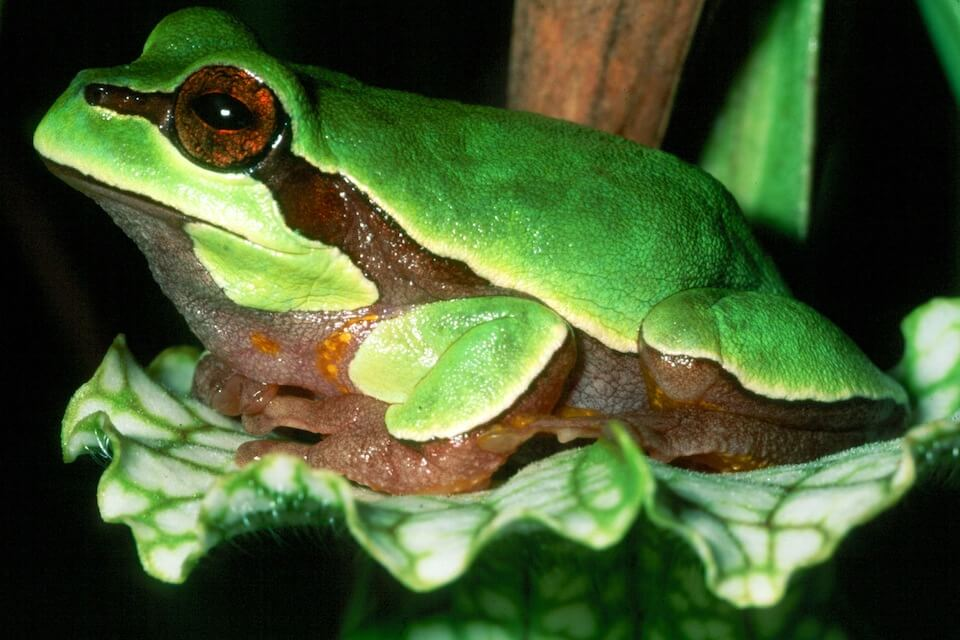

# Pine barrens treefrog

### Hyla andersonii

<figcaption>Photo: FWC</figcaption>

### Conservation status:

Species of Greatest Conservation Need

### Overall vulnerability:

Not Assessed

This small green and brown tree frog can be found in the western Florida panhandle with a range that extends through parts of Alabama, North Carolina and the New Jersey pine barrens, for which it is named.  In Florida, males can be heard calling from March through September with tadpoles found in the summer months as well.  Tadpoles of this species metamorphose relatively quickly at about 60 days, reaching full adult maturity at 11 months.  The pine barrens tree frog will venture about 350 feet from its breeding site in search of insects, which form the core of its diet.

## Habitat Requirements

**Total habitat within Florida:** 62,352 hectares (modeled)

The pine barren tree frog inhabits the seepage slopes and bogs of northern Florida.  Seepage bog pols are acidic water pools filled with decayed vegetation caused by a subsurface water table or an accumulation of rainwater.

**TODO: habitat crosslinks**

**TODO: habitat map (if exists)**

## Climate Impacts

The acidic bogs this species inhabits are delicate low nutrient systems that are highly susceptible to changes in chemistry and hydrology.  Thus, pine barrens tree frogs are vulnerable to the hydrological changes, increased periods of drought, salination from sea level rise, and increase in severe storm events expected with climate change.  The need for increased fire suppression if controlled burns become more difficult to implement in a changing climate is also a concern as frequent fire prevents encroachment from vegetation that dehydrates pine barrens tree frog habitat.

[More information about general climate impacts to species in Florida](/impacts/species).

#### This species is expected to be impacted by sea level rise:

- 3 meters of sea level rise: 2% of habitat (1,349 ha)
- 1 meter of sea level rise: <1% of habitat (576 ha)

[More information about sea level rise impacts on species in Florida](/impacts/species/slr).
    

## Vulnerability Assessment(s)

This species was not assessed for vulnerability.

## Adaptation Strategies

- Restoration efforts to promote resilience and preserve the integrity of wetlands during increased periods of drought and hydrological change should be pursued.

- Monitoring natural community shifts to prioritize areas for conservation is an important first step in ensuring tree frog habitat can be conserved in a future climate.  Since sea level rise may cause salination and changes to water chemistry in many areas of current habitat, monitoring can help conservationists get ahead of climate-driven shifts and understand where to best focus their efforts.

- Applying an adequate fire regime to gopher frog breeding habitat at present is a critical first step in getting ahead of the challenges brought on by climate change.  If future conditions make regular prescribed burning too difficult, other habitat maintenance techniques such as mechanical thinning and removal may need to be employed.

[More information about adaptation strategies](/strategies).

## Additional Resources

- [Florida Fish and Wildlife Conservation Commission Species Profile](https://myfwc.com/wildlifehabitats/profiles/amphibians/pine-barrens-treefrog/)
