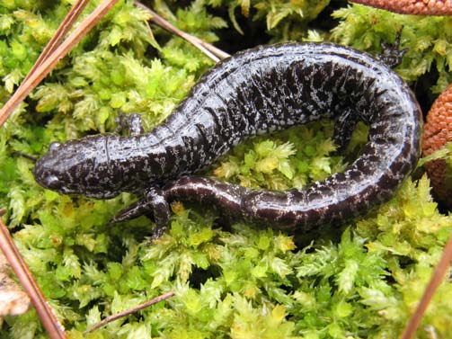

# Frosted flatwoods salamander
### *Ambystoma cingulatum*

**Conservation status:** Federally Threatened

**TODO:vulnerability**

The long and slender frosted flatwoods salamander is limited to a small range in the eastern panhandle.  This species is dark silvery gray or black with white spots, a small head and a jet-black belly.  The animal’s silvery hue and small white spots over its dark skin give the appearance of frost, for which it is named.  The frosted flatwoods salamander feeds on a diet of earthworms and spiders and migrates to small ponds and puddles during the late fall to breed.  Larvae metamorphose into salamanders after 90 days.

    
## Habitat Requirements

The frosted flatwoods salamander inhabits slash and longleaf pine flatwoods.  It seeks out areas with wiregrass ground cover and scattered ponds or ephemeral wetlands.

## Climate Impacts

As a species with a small range, the frosted flatwoods salamander is highly vulnerable to habitat fragmentation and loss.  Additional habitat fragmentation could trigger widespread dramatic population loss.  While not directly linked to climate change at present, additional habitat fragmentation is likely to intensify in many areas as a changing climate begins to drive shifts in land use.  This species is also highly vulnerable to changes in precipitation patterns and hydrology.  This threat is also magnified by the salamander’s small range – one or two seasons of intense drought and loss of ephemeral wetlands could spur significant population decline.

## Adaptation Strategies

- Conservation and restoration of existing wetland habitat is critical to increase habitat and species health and resilience at the onset of intensifying climate change.

- Monitoring population levels and hydrological conditions is important for this species.  Strategies such as lining breeding ponds and wetland areas to maintain hydration in the event of a significant period of drought and drop of the water table, may help the frosted flatwoods salamander adapt to harsh conditions triggered by climate change.

[More information about adaptation strategies](/strategies).

## Additional Resources

- [FWC Management Plan](http://www.myfwc.com/media/214298/Flatwoods_salamander_management_plan.pdf)
