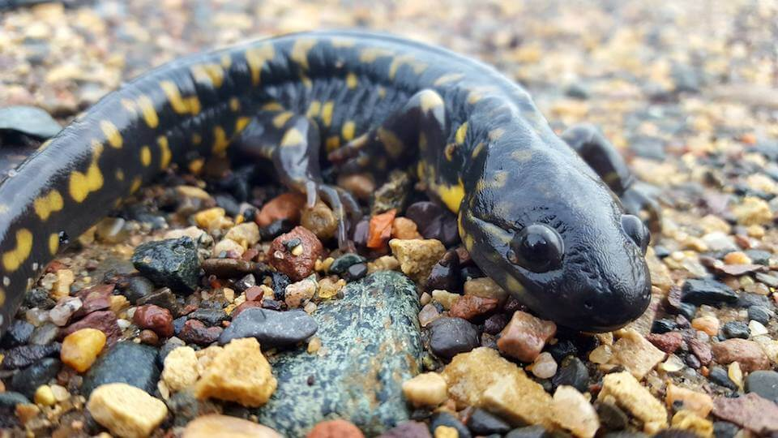

# Tiger salamander

### Ambystoma tigrinum

<figcaption>Photo: USFWS</figcaption>

### Conservation status:

Species of Greatest Conservation Need

### Overall vulnerability:

Not Assessed

Adult tiger salamanders are long, stout and striking in appearance with bright yellow splotches over a dark background.  This species occupies a wide range across North American, including Florida.  Tiger salamanders breed during the late winter when they return to temporary ponds.  Like many amphibians, tiger salamanders are loyal to their birthplace, often traveling great distances as adults to return to breed in their natal ponds.  During their terrestrial adult life, tiger salamanders often burrow under the ground in effort to retain adequate moisture, feeding on slugs, worms, and other insects found in their subterranean home.  Tiger salamanders can also present in a paedomorphic, or extended juvenile, form that remains in the water.

## Habitat Requirements

**Total habitat within Florida:** 841,632 hectares (modeled)

The tiger salamander inhabits the fire-maintained, sandy-soiled habitats found in its southeastern range, including pine sandhills and scrub.  This species prefers ephemeral wetlands for breeding habitat because these temporary ponds lack the predators found in permanent bodies of water.

**TODO: habitat crosslinks**

**TODO: habitat map (if exists)**

## Climate Impacts

Tiger salamanders are vulnerable to habitat fragmentation and loss throughout their Florida range.  While not directly linked to climate change at present, changing land use patterns in response to a changing climate may intensify fragmentation.  This species is also highly vulnerable to changes in precipitation patterns and hydrology.  Tiger salamanders require adequate moisture throughout the year, both to support the terrestrial portion of their life cycle and to maintain the ephemeral wetlands where they breed.  Fire suppression and altered fire regimes linked to the impacts of climate change could also threaten tiger salamander habitat as vegetation encroachment in the absence of regular fire can dehydrate fragile wetlands.

[More information about general climate impacts to species in Florida](/impacts/species).

#### This species is expected to be impacted by sea level rise:

- 3 meters of sea level rise: 4% of habitat (34,116 ha)
- 1 meter of sea level rise: 1% of habitat (11,611 ha)

[More information about sea level rise impacts on species in Florida](/impacts/species/slr).
    

## Vulnerability Assessment(s)

This species was not assessed for vulnerability.

## Adaptation Strategies

- Conservation and restoration of existing wetland habitat is critical to increase habitat and species health and resilience at the onset of intensifying climate change.

- Monitoring population levels and hydrological conditions is important for this species.  Strategies such as lining breeding ponds and wetland areas to maintain hydration in the event of a significant period of drought and drop of the water table, may help the tiger salamanders adapt to harsh conditions triggered by climate change.

- An appropriate prescribed fire regime will maintain natural conditions are reduce the risk of wild fire elevated by climate change.  Regular fire maintenance also reduces vegetation encroachment that can dehydrate wetland habitat critical to amphibians such as the tiger salamander.

[More information about adaptation strategies](/strategies).

## Additional Resources

- [Florida Natural Areas Inventory Profile](http://www.fnai.org/FieldGuide/pdf/Ambystoma_tigrinum.pdf)
