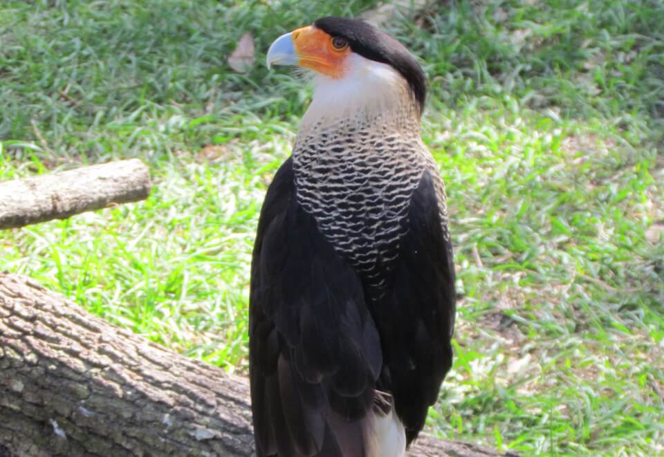

<content-header icon="raptors" title="Audubon’s crested caracara" subtitle="Polyborus plancus audubonii">
</content-header>

<figcaption>Photo: FWC - Shanna Chatraw</figcaption>

### Overall vulnerability:

Low

<h3>Habitat area: 
<a href="/species/birds/104/map" style="float:right;font-size:smaller;margin-right: 2rem;">
<fa-icon name="map"></fa-icon>
explore on map
</a>
</h3>

-   753,304 hectares within Florida (modeled)

### Conservation status:

Federally Threatened

## General Information

Audubon’s crested caracara is a large raptor with an impressive back crest, red face and pale bluish bill.  Relatively little is known about the life history and reproduction of this species.  Breeding season is thought to peak in the winter and an average clutch size of two eggs can be found in nests built of sticks, dry weed stalks and vine.  The caracara primarily relies on a diet of carrion also preys on small animals including amphibians, reptiles, mammals and other birds.

## Habitat Requirements

Audubon’s crested caracara is most often found in the wet prairie habitats of south and central Florida.  The caracara’s ideal habitat features cabbage palms.  The bird also inhabits wooded areas dominated by saw palmetto, scrub oak and cypress.

**TODO: habitat crosslinks**

## Climate Impacts

Audubon’s crested caracara is a relatively isolated species and a habitat specialist, which increases its vulnerability to severe storm events or environmental catastrophes triggered by climate change.  Inland shifting of human developing patterns driven by climate change are likely to greatly exacerbate existing pressures on this species, including habitat destruction and traffic mortality.

[More information about general climate impacts to species in Florida](/impacts/species).

#### This species is expected to be impacted by sea level rise:

- 3 meters of sea level rise: <1% of area (5,229 ha)
- 1 meter of sea level rise: <1% of area (807 ha)

[Explore sea level rise impacts map](/species/birds/104/map).

## Vulnerability Assessment(s)

The overall vulnerability level (Low) was based on the following assessment(s).
#### 

<h3><a href="/impacts/vulnerability/sivva/species">Standardized Index of Vulnerability and Value Assessment</a></h3>

Moderately vulnerable

 

The primary factors contributing to vulnerability of the Audubon's crested caracara are the presence of barriers and alterations to biotic interactions.

## Adaptation Strategies

- Protecting large patches of connected suitable habitat allowing for migration as the climate changes is important given the species’ proclivity for isolation and specific habitat preferences.

- Monitoring natural community shifts may inform conservationist’s ability to identify trends and prioritize key habitat patches in a future climate.

[More information about adaptation strategies](/strategies).

## Additional Resources

- [Florida Fish and Wildlife Conservation Commission Species Profile](https://myfwc.com/wildlifehabitats/profiles/birds/raptors-and-vultures/crested-caracara/)

- [Multi-Species Recovery Plan for South Florida](https://ecos.fws.gov/docs/recovery_plan/sfl_msrp/SFL_MSRP_Species.pdf)
