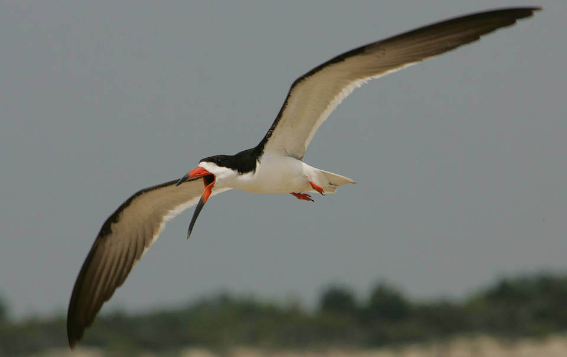

<content-header icon="shorebirds" title="Black skimmer" subtitle="Rynchops niger">
</content-header>

<figcaption>Photo: USFWS</figcaption>

### Overall vulnerability:

Moderate to High

<h3>Habitat area: 
<a href="/species/birds/107/map" style="float:right;font-size:smaller;margin-right: 2rem;">
<fa-icon name="map"></fa-icon>
explore on map
</a>
</h3>

-   10,412 hectares within Florida (modeled)

### Conservation status:

State Threatened

## General Information

The black skimmer is a seabird with a wide, graceful wingspan that can be easily identified by its large red bill which narrows to a sharp, black tip.  The lower portion of the bill is longer than the top and the bird uses its lower bill by skimming it along the surface of the water to catch fish, for which it is named.  The black skimmer has a wide range throughout Florida and many portions of the Americas.  This species breeds during the summer months between May and September and black skimmers hatch and raise their chicks in large colonies of nests on the sand.

## Habitat Requirements

Black skimmers can be found in coastal areas throughout the state including estuaries, beaches and sandbars.  They prefer sparsely vegetated patches of sand as sites for nesting colonies.

**TODO: habitat crosslinks**

## Climate Impacts

As a beach nesting species, the black skimmer is highly vulnerable to many threats that are common in coastal areas including habitat inundation from sea level rise.  An increase in the severity of storm events linked to climate change also poses a threat to black skimmers as hurricanes and strong storms during the summer nesting season can reduce breeding success and population size over time.  Habitat fragmentation stemming from changes in coastal development patterns linked to climate change is also likely to be a concern for this species.

[More information about general climate impacts to species in Florida](/impacts/species).

#### This species is expected to be impacted by sea level rise:

- 3 meters of sea level rise: 89% of area (9,296 ha)
- 1 meter of sea level rise: 60% of area (6,221 ha)

[Explore sea level rise impacts map](/species/birds/107/map).

## Vulnerability Assessment(s)

The overall vulnerability level (Moderate to High) was based on the following assessment(s).
#### 

<h3><a href="/impacts/vulnerability/sivva/species">Standardized Index of Vulnerability and Value Assessment</a></h3>

Moderately to Highly vulnerable

 

The primary factors contributing to vulnerability of the black skimmer are sea level rise, presence of barriers, changes in precipitation, alterations to biotic interactions and disturbance regimes, and synergies with development.

#### 

<h3><a href="/impacts/vulnerability/gcva">Gulf Coast Vulnerability Assessment</a></h3>

Moderately to Highly vulnerable

 

The vulnerability of black skimmers ranges from moderate to high in Florida.  The main factors affecting vulnerability include sea level rise, erosion, storm surge and runoff, synergistic effects with urbanization, and alterations to the natural disturbance regime.  Increased temperature may impact egg and chick survival.

## Adaptation Strategies

- Conservation of existing beach habitat will allow the black skimmer the best chance of increasing and maintaining a healthy population in the state as climate change begins to accelerate.  This includes controlling existing stressors, such as impacts from coastal development and traffic.  As a beach nesting species, non-native predators pose a grave threat to nesting birds and should be controlled to the extent possible.

- Conserving healthy future coastal habitat as sea levels rise and human communities begin to shift is important for this species.

[More information about adaptation strategies](/strategies).

## Additional Resources

- [Florida Fish and Wildlife Conservation Commission Species Profile](https://myfwc.com/wildlifehabitats/profiles/birds/shorebirdsseabirds/black-skimmer/)
