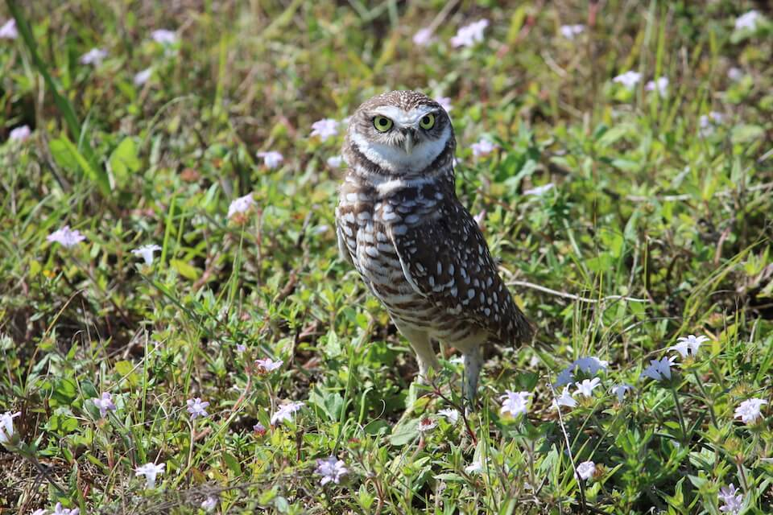

# Burrowing owl

### Athene cunicularia

<figcaption>Photo: FWC - Carol Rizkalla</figcaption>

### Overall vulnerability:

This species was not assessed for vulnerability.

### Conservation status:

State Threatened

## General Information

This tiny owl can reach a length of only 23 centimeters.  The brown patchy coloring of the burrowing owl helps this species blend in successfully with their underground habitat.  Burrowing owls are found through much of the Florida peninsula and as their name implies, they burrow into the ground to build and incubate their nests.  Burrowing owl nesting season begins in fall and extends through spring with March representing peak time for laying eggs.  During their breeding season, burrowing owls are diurnal, unlike most owls, and forage during the day for their diet of insects, small reptiles, birds and mammals.

## Habitat Requirements

**Total habitat within Florida:** 235,032 hectares (modeled)

Burrowing owls prefer open prairie habitats with minimal vegetation on the ground.  Many human-altered areas such as agricultural fields or vacant lots provide excellent burrowing owl habitat.

**TODO: habitat crosslinks**

**TODO: habitat map (if exists)**

## Climate Impacts

The burrowing owl currently faces many threats not related to climate change that are likely to be magnified as climate change accelerates. For example, the existing threat of habitat loss from land use change is only likely to increase under climate change.  Burrows can also be flooded by heavy precipitation events so extreme rainfall linked to climate change poses a substantial threat to burrowing owls.  Furthermore, changes to existing habitat and prey populations in the face of climate change is likely to negatively impact the fitness of owl burrowing owl populations.

[More information about general climate impacts to species in Florida](/impacts/species).

#### This species is expected to be impacted by sea level rise:

- 3 meters of sea level rise: 11% of habitat (25,316 ha)
- 1 meter of sea level rise: 4% of habitat (9,033 ha)
    

## Vulnerability Assessment(s)

This species was not assessed for vulnerability.

## Adaptation Strategies

- Protecting important areas of current habitat from human encroachment is a good first step for the burrowing owl.  Controlling the existing threats of excessive predation by non-native species and human activity will help increase the health of burrowing owl populations and therefore, their resilience to adapt to a changing climate.

[More information about adaptation strategies](/strategies).

## Additional Resources

- [Florida Fish and Wildlife Conservation Commission Species Profile](https://myfwc.com/wildlifehabitats/profiles/birds/owls/burrowing-owl/)
