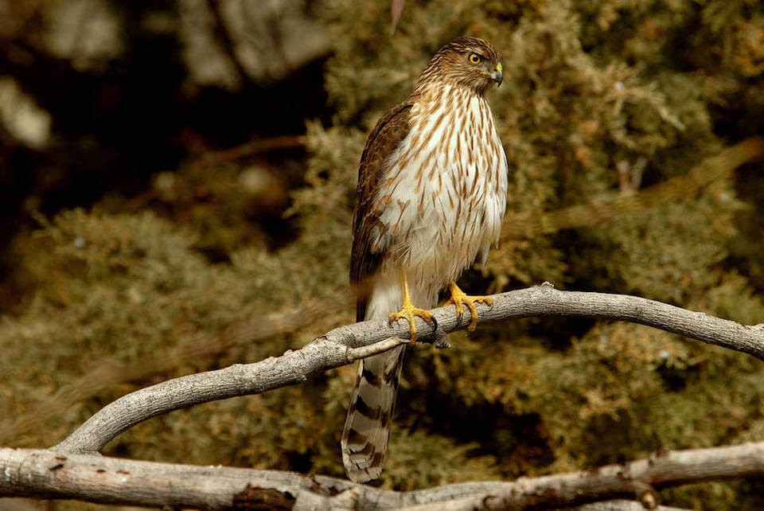

# Cooper’s hawk

### Accipiter cooperii

<figcaption>Photo: USFWS</figcaption>

### Overall vulnerability:

This species was not assessed for vulnerability.

### Conservation status:

Species of Greatest Conservation Need

## General Information

This small woodland raptor is about the size of a crow with short, rounded wings and long tail plumage.   Cooper’s hawks rely on a diet almost entirely of birds throughout their wide breeding range throughout North America from southern Canada to northern Mexico.  In Florida, Cooper’s hawks are uncommon and occur mostly in the northern portion of the state with a summer nesting season.  Males and females are similar in plumage but the female is large and built more powerfully than her mate.  As a result, Cooper’s hawk pairs can take a wide range of prey, with males focusing on smaller songbirds and females targeting larger species.

## Habitat Requirements

**Total habitat within Florida:** 3,669,236 hectares (modeled)

Cooper’s hawks prefer mixed deciduous or coniferous forests with sections of closed canopy interspersed with open habitat. In Florida, habitat types such as hardwood uplands, high pine and scrub, freshwater forested wetlands and working lands provide adequate habitat for this species.

**TODO: habitat crosslinks**

**TODO: habitat map (if exists)**

## Climate Impacts

As a species with migratory capacity and a wide range throughout a variety of local climates, the Cooper’s hawk is not likely to be as vulnerable to the impacts of climate change as is a species with a more narrow, specialized range.   However, shifting community composition in forested habitats including habitat transformation and altered predator-prey dynamics has the potential to impact Cooper’s hawk populations across the species’ entire range.  Habitat fragmentation stemming from changing human land use and migration patterns resulting from climate change is also a concern.

[More information about general climate impacts to species in Florida](/impacts/species).

#### This species is expected to be impacted by sea level rise:

- 3 meters of sea level rise: 7% of habitat (249,254 ha)
- 1 meter of sea level rise: 2% of habitat (90,100 ha)
    

## Vulnerability Assessment(s)

This species was not assessed for vulnerability.

## Adaptation Strategies

- As climate change accelerates, it may be necessary to allow or even facilitate ecological transition in forested habitats to maintain adequate canopy cover.  In many forest habitats, new compositions of tree species may be better adapted to thrive in a future climate. The Cooper’s hawk is a species likely to benefit from this type of transformative forest management as it can thrive in a wide range of forested habitat types.

- Preserving conservation lands that allow for migratory pathways across the landscape is important to facilitate movement for species that are able, such as the Cooper’s hawk and other birds.

[More information about adaptation strategies](/strategies).

## Additional Resources

- [Florida Fish and Wildlife Conservation Commission Species Profile](http://legacy.myfwc.com/bba/docs/bba_COHA.pdf)
