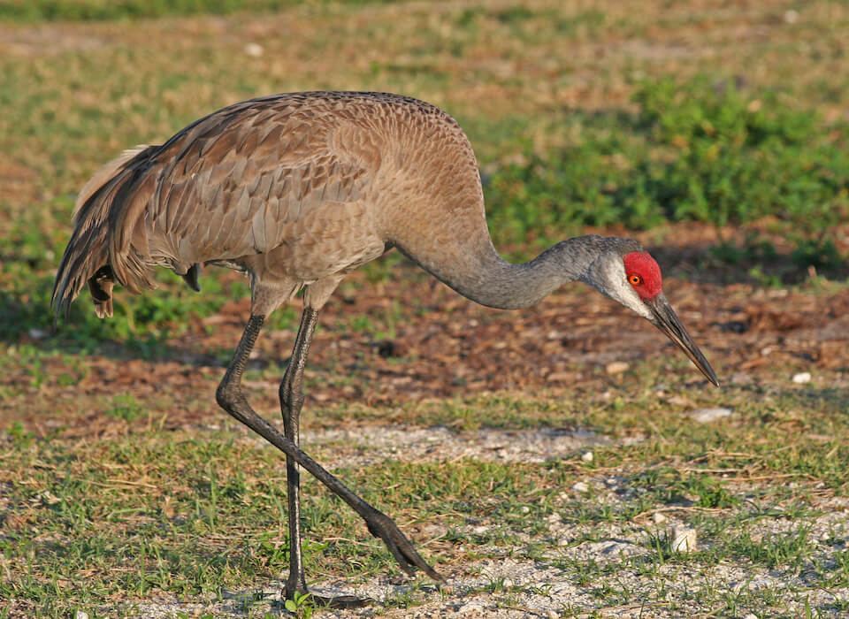

<content-header icon="cranes" title="Florida sandhill crane" subtitle="Grus canadensis pratensis">
</content-header>

<figcaption>Photo: USFWS/Joseph C Boone</figcaption>

### Overall vulnerability:

This species was not assessed for vulnerability.

<h3>Habitat area: 
<a href="/species/birds/125/map" style="float:right;font-size:smaller;margin-right: 2rem;">
<fa-icon name="map"></fa-icon>
explore on map
</a>
</h3>

-   1,436,718 hectares within Florida (modeled)

### Conservation status:

State Threatened

## General Information

The Florida sandhill crane is an elegant non-migratory bird with a wide wingspan of about 78 inches.  This species can be distinguished by the bald spot of bright red skin visible on its head as well as by its unique form in flight – it can be seen flying with its neck stretched out completed.  The Florida sandhill crane occurs in freshwater habitats throughout the Florida peninsular with the highest abundance near Kissimmee.  Florida sandhill cranes are monogamous and both mates participate in nest building, incubating eggs and rearing chicks.

## Habitat Requirements

Florida sandhill cranes inhabit freshwater marshes, prairies and floodplains including pastures and working lands.

**TODO: habitat crosslinks**

## Climate Impacts

The Florida sandhill crane is dependent on freshwater marshes and floodplains habitats which will become highly vulnerable to drought, changes in precipitation patterns and salination from sea level rise under climate change. Habitat loss and fragmentation accelerated by changing land use patterns in the face of climate change is also likely to impact this species.

[More information about general climate impacts to species in Florida](/impacts/species).

#### This species is expected to be impacted by sea level rise:

- 3 meters of sea level rise: 1% of area (21,140 ha)
- 1 meter of sea level rise: <1% of area (6,054 ha)

[Explore sea level rise impacts map](/species/birds/125/map).

## Vulnerability Assessment(s)

This species was not assessed for vulnerability.

## Adaptation Strategies

- Conserving areas of new potential habitat where freshwater marsh and floodplain migration may occur is likely to be a more appropriate strategy for the Florida sandhill crane than allowing or promoting a shift in community composition within existing habitat.   While specific changes in precipitation patterns under climate change are difficult to predict, some areas in the state are expected to become wetter while others will become drier and more prone to drought.  As climate change accelerates, Florida sandhill cranes may need to follow these precipitation shifts, moving away from areas of current habitat as they become drier.

- Monitoring natural community shifts to prioritize areas for conservation is an important first step in ensuring Florida sandhill crane habitat can be conserved in a future climate.  As locations of prime crane habitat are likely to shift under climate change, monitoring can help conservationists get ahead of natural shifts and understand where to best focus their efforts.  This strategy is also important to mitigate extensive habitat loss from altered human land use patterns in a changing climate.

[More information about adaptation strategies](/strategies).

## Additional Resources

- [Florida Fish and Wildlife Conservation Commission Species Profile](https://myfwc.com/wildlifehabitats/profiles/birds/cranes/sandhill-crane/)
