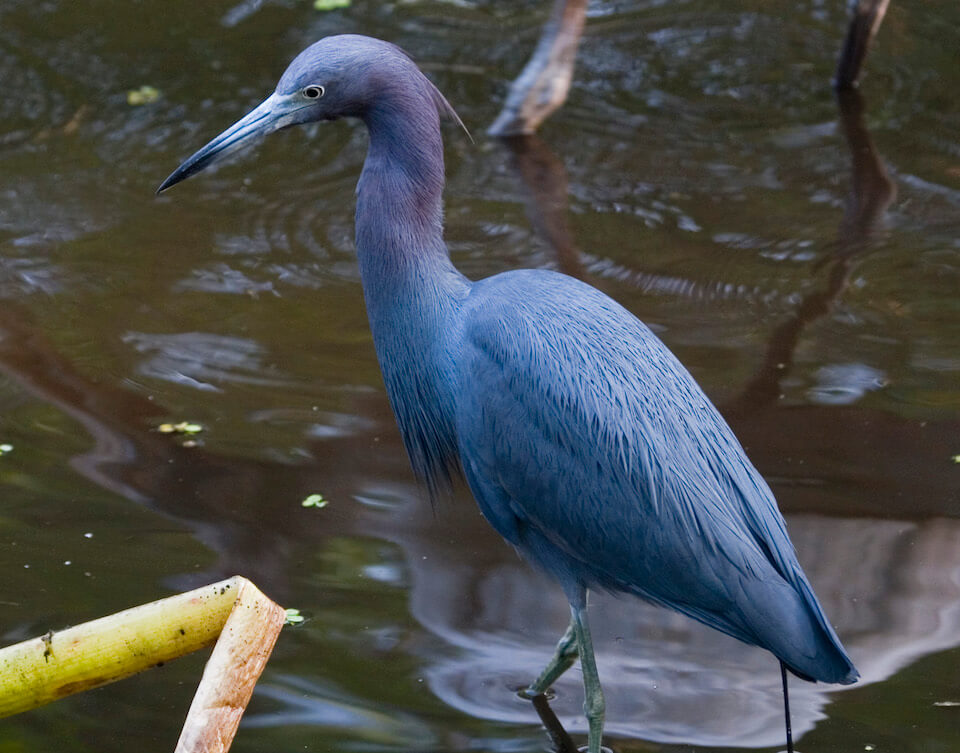

<content-header icon="waterbirds" title="Little blue heron" subtitle="Egretta caerulea"></content-header>

<figcaption>Photo: FWC</figcaption>

### Overall vulnerability:

This species was not assessed for vulnerability.

### Conservation status:

State Threatened

## General Information

This small, grayish blue wading bird is wide spread throughout the entire Florida peninsula yet rarer in the panhandle.  Its entire range extends outside of Florida northeast and west in North America and in many locations throughout Cuba, South and Central America.  Little blue herons feed on a varied diet of fish, insects and amphibians and prefer to forage alone.  Their nesting behavior is far more communal, however.  Little blue herons often nest in colonies in the company of other wading bird species

## Habitat Requirements

**Total habitat within Florida:** 4,188,604 hectares (modeled)

Little blue herons reside in a wide variety of aquatic habitat types, including fresh, brackish, and saltwater swamps, estuaries, mangroves, ponds and lakes.

**TODO: habitat crosslinks**

**TODO: habitat map (if exists)**

## Climate Impacts

The Little blue heron is currently threatened by habitat loss and fragmentation in Florida and shifting land use linked to climate change is likely to intensify this threat, especially in coastal areas.  The little blue heron’s freshwater habitats are highly vulnerable to sea level rise and salt water encroachment although the species may be able to successfully adapt to these changes.  Coastal armoring in response to sea level rise and extreme weather and disturbance events are also likely to negatively impact the species.

[More information about general climate impacts to species in Florida](/impacts/species).

#### This species is expected to be impacted by sea level rise:

- 3 meters of sea level rise: 39% of habitat (1,618,722 ha)
- 1 meter of sea level rise: 22% of habitat (936,709 ha)
    

## Vulnerability Assessment(s)

This species was not assessed for vulnerability.

## Adaptation Strategies

- Addressing existing threats including conserving existing aquatic habitat from further development to the extent possible is an important first-line adaptation strategy for this species.

- Protection of habitat corridors that allow the little blue heron to move within patches of suitable habitat as natural climate-driven shifts occur may help this species adapt.

[More information about adaptation strategies](/strategies).

## Additional Resources

- [Florida Fish and Wildlife Conservation Commission Species Profile](https://myfwc.com/wildlifehabitats/profiles/birds/waterbirds/little-blue-heron/)
