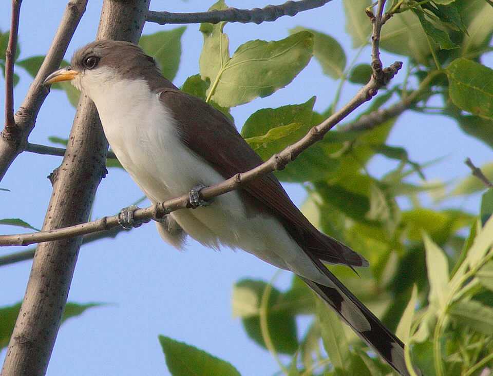

<content-header icon="perching_birds" title="Mangrove cuckoo" subtitle="Coccyzus minor"></content-header>

<figcaption>Photo: Alan Schmierer</figcaption>

### Overall vulnerability:

Moderate

### Conservation status:

Species of Greatest Conservation Need

## General Information

This elusive neotropical bird can be found in the coastal mangrove forests of south Florida.  Beyond its range within the state, the cuckoo’s distribution includes the Caribbean, coastal Mexico and Central America.  The mangrove cuckoo is a medium-sized bird with dull grey feathers.  It is most easily spotted by its long tail dotted with white spots and the black, mask-shaped markings on its face.  Mangrove cuckoos are notoriously quiet – the species rarely vocalizes and is known for its unique foraging behavior of sitting still and silent on a branch, only turning its head slightly to watch and wait for prey.

## Habitat Requirements

**Total habitat within Florida:** 191,335 hectares (modeled)

Mangrove cuckoos prefer the highly dense vegetation often found in black and red mangrove forests.  They can also be found in dense areas of rockland hammock and scrub.

**TODO: habitat crosslinks**

**TODO: habitat map (if exists)**

## Climate Impacts

As a species closely tied to coastal forests in the southern most portion of the state, the mangrove cuckoo is highly vulnerable to sea level rise.  Mangrove habitats near the coast are threatened by extreme weather events, eventual inundation from sea level rise and coastal development and armoring.  As humans attempt to adapt to climate change and protect the coastline, habitat fragmentation stemming from changes in land use is likely.  While mangrove forests may naturally migrate inland under climate change and sea level rise, human development is likely to interfere with this process, posing a threat to mangrove dependent species like the cuckoo.

[More information about general climate impacts to species in Florida](/impacts/species).

#### This species is expected to be impacted by sea level rise:

- 3 meters of sea level rise: 100% of habitat (191,316 ha)
- 1 meter of sea level rise: 100% of habitat (191,149 ha)
    

## Vulnerability Assessment(s)

The overall vulnerability level (Moderate) was based on the following assessment(s).
#### 

<h3><a href="/impacts/vulnerability/ccvi">Climate Change Vulnerability Index</a></h3>

Moderately vulnerable to Presumed stable

 

The primary factors identified as contributing to the vulnerability of the mangrove cuckoo  include its' dependence on only a few species to generate habitat, altered disturbance regime (i.e., more intense hurricanes) and potentially incompatible human responses to climate change.  Much of the mangrove cuckoo's vulnerability to climate change is based on whether the species' habitat (primarily mangroves) can shift in response to sea level rise.  Due to uncertainty in the mangroves ability to migrate/expand under climate change - two scenarios have been evaluated; one where mangroves are vulnerable and decrease in extent and the second where mangroves expand.  Projections indicate that between 90 - 100% of the species' current range is expected to be inundated under a 1-meter sea level rise.  Increased intensity of hurricanes is identified as the major disturbance regime that might have negative impacts on the amount of quality of breeding habitat. However, there is a large amount of uncertainty associated with the degree to which the disturbance regime would change and/or the impact on the species.

#### 

<h3><a href="/impacts/vulnerability/sivva/species">Standardized Index of Vulnerability and Value Assessment</a></h3>

Highly vulnerable

 

The primary factors contributing to vulnerability of the mangrove cuckoo are sea level rise, erosion, presence of barriers, changes in temperature regime, habitat fragmentation,  synergies with development, and alterations to disturbance regimes.

## Adaptation Strategies

- Conservation of existing mangrove habitat will allow the mangrove cuckoo the best chance of increasing and maintaining a healthy population in Florida as climate change begins to accelerate.  This includes controlling existing stressors, such as habitat loss and coastal development.

- Conserving healthy future mangrove habitat as sea levels rise and human communities begin to shift is important for this species.

- Protecting migratory corridors if mangrove habitat migrates inland and northward is an important adaptation strategy for this species.  Assisted migration to optimal mangrove habitat northward from the bird’s current range in a future climate is a possible strategy.

[More information about adaptation strategies](/strategies).

## Additional Resources

- [Florida Natural Areas Inventory Profile](http://www.fnai.org/FieldGuide/pdf/Coccyzus_minor.pdf)
