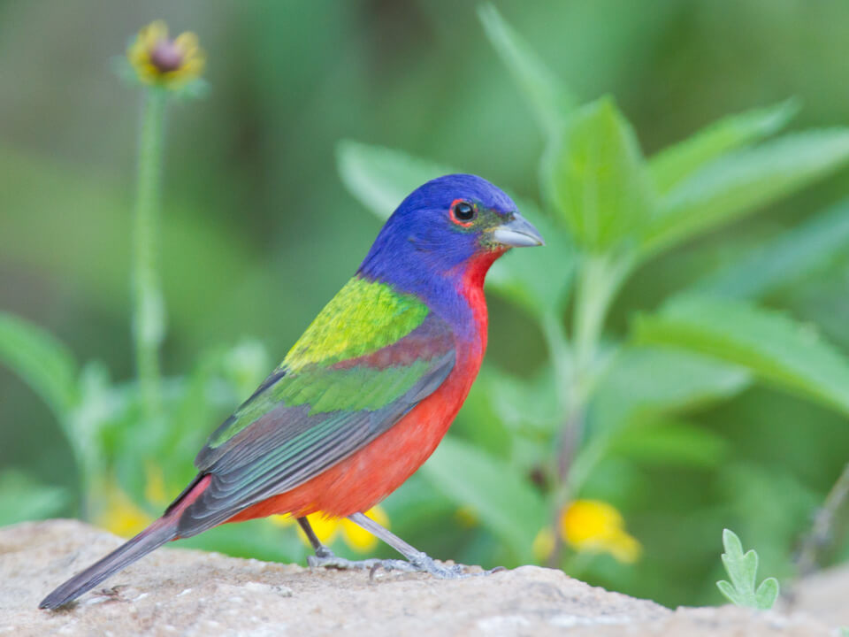

<content-header icon="perching_birds" title="Painted bunting" subtitle="Passerina ciris"></content-header>

<figcaption>Photo: Dan Pancamo</figcaption>

### Overall vulnerability:

This species was not assessed for vulnerability.

<h3>Habitat area: 
<a href="/species/birds/140/map" style="float:right;font-size:smaller;margin-right: 2rem;">
<fa-icon name="map"></fa-icon>
explore on map
</a>
</h3>

-   25,411 hectares within Florida (modeled)

### Conservation status:

Species of Greatest Conservation Need

## General Information

The magnificent painted bunting has been nicknamed “the most beautiful bird in North America” in reference to the bright blue head, red belly and green back of the male.  Painted buntings occur in two distinct breeding populations on the continent – the eastern population includes coastal North Carolina to northern Florida.  The painted bunted population has steadily declined in the east for the past 50 years, with a more recent trend toward stabilization over the past decade.  Painted buntings breed annually in the spring and territorial males are highly aggressive during this time, at times engaging in combative encounters that result in death to one or both opponents.  Females build nests of grass and leaves that they often locate in soft clumps of Spanish moss.  Should they have a failure early in the season, painted buntings can make two or three attempts at nesting in the same year.

## Habitat Requirements

The edges of coastal oak hammocks and scrub communities provide excellent painted bunting habitat but these birds also make use of roadside thickets, uncultivated fields, and even urban areas at times.

**TODO: habitat crosslinks**

## Climate Impacts

The decline of the painted bunting since the mid-20th century has left this species vulnerable to further stress from climate related impacts including habitat fragmentation and decline due to saltwater encroachment near the coast.  Although this bird has the advantage of mobility from flight, the eastern population’s small range and restriction to coastal habitats will likely make it challenging for the species to identify and thrive in a new patch of acceptable habitat as the climate changes.

[More information about general climate impacts to species in Florida](/impacts/species).

#### This species is expected to be impacted by sea level rise:

- 3 meters of sea level rise: 30% of area (7,584 ha)
- 1 meter of sea level rise: 18% of area (4,556 ha)

[Explore sea level rise impacts map](/species/birds/140/map).

## Vulnerability Assessment(s)

This species was not assessed for vulnerability.

## Adaptation Strategies

- Preserving large, connected patches of suitable habitat is a critical strategy to help the eastern painted bunting recover and increase resilience to current threats.  This will become even more important as increased habitat fragmentation pressure linked to climate change sets in.

- Monitoring natural community shifts to prioritize areas for conservation is an important first step in ensuring optimal painted bunting habitat can be conserved in a future climate.  Locations of optimal habitat type may shift due to changes in temperature and precipitation and getting ahead of these shifts is necessary to plan for conservation in a future climate.

- Monitoring and addressing current threats is an important first step, “no regrets” adaptation strategy for this species.  Painted buntings are targeted by the black-market pet trade and preyed upon by nonnative predators.  Controlling these and other threats would help the population increase resilience at the onset of climate change.

[More information about adaptation strategies](/strategies).

## Additional Resources

- [Florida Fish and Wildlife Conservation Commission Species Profile](https://myfwc.com/wildlifehabitats/profiles/birds/songbirds/painted-bunting/)
