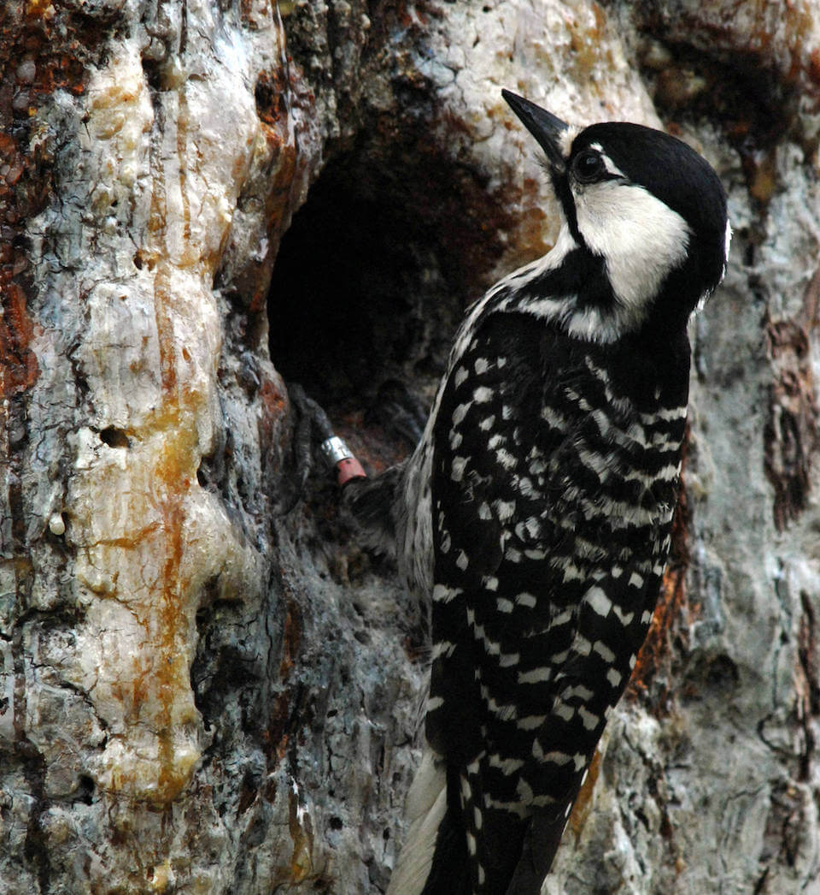

# Red-cockaded woodpecker

### Picoides borealis

<figcaption>Photo: USFWS</figcaption>

### Overall vulnerability:

High

### Conservation status:

Federally Endangered

## General Information

This rare black and white bird lives only in old growth pine forests in the American southeast.  The bird’s common name comes from the red cockade found on the male – although this small red streak found above the cheek is rarely visible.  The red-cockaded woodpecker eats a diet of insects, arthropods and seeds and nests in the spring.  These birds are cooperative breeders – between two and four adult “helpers” assist the mated pair with incubating eggs.

## Habitat Requirements

**Total habitat within Florida:** 1,105,500 hectares (modeled)

Red-cockaded woodpeckers have highly specific habitat requirements.  These birds do not seek out dead trees as do many species of woodpecker but rather excavate nesting holes only in living pines with red heart disease, a fungus that affects the trees heartwood.  The disease is not common in trees younger than 70 years old, explaining the bird’s proclivity for old growth pine.

**TODO: habitat crosslinks**

**TODO: habitat map (if exists)**

## Climate Impacts

The red-cockaded woodpecker’s highly specific habitat needs leave it extremely vulnerable to additional habitat loss and fragmentation from climate change.  Few nesting sites remain as most old growth pine forest was lost to logging over the last century.  Fire suppression exacerbated by climate change and shifting community dynamics can also degrade woodpecker habitat.

[More information about general climate impacts to species in Florida](/impacts/species).

#### This species is expected to be impacted by sea level rise:

- 3 meters of sea level rise: 8% of habitat (87,346 ha)
- 1 meter of sea level rise: 2% of habitat (19,983 ha)
    

## Vulnerability Assessment(s)

The overall vulnerability level (High) was based on the following assessment(s).
#### 

<h3><a href="/impacts/vulnerability/sivva/species">Standardized Index of Vulnerability and Value Assessment</a></h3>

Extremely vulnerable

 

The primary factors contributing to vulnerability of the red-cockaded woodpecker are the presence of barriers, habitat fragmentation, and alterations to biotic interactions and disturbance regimes.  Existing and future land use change are also significant factors leading to habitat fragmentation.  This species required old-growth longleaf pine communities, alterations to the age structure of forests (reduction in old-growth trees) will impact habitat suitability.

## Adaptation Strategies

- Conserving remaining areas of old growth pine forest is a critical first step for this species.

- Implementing an appropriate fire regime is important for the red-cockaded woodpecker.  Climate change is likely to make prescribed fire more challenging as optimal burning conditions become increasingly rare, thus implementing a consistent fire management regime early is crucial.

- As controlled burning becomes more challenging in a changing climate, other habitat management strategies such as mechanical thinning may need to be pursued to conserve woodpecker habitat.

- Creating artificial woodpecker nesting cavities in living trees is one strategy that can be considered if suitable habitat becomes further limited or degraded due to climate change.

[More information about adaptation strategies](/strategies).

## Additional Resources

- [Florida Fish and Wildlife Conservation Commission Species Profile](https://myfwc.com/wildlifehabitats/profiles/birds/woodpeckers/red-cockaded-woodpecker/)

- [Federal Recovery Plan](https://www.fws.gov/rcwrecovery/files/RecoveryPlan/finalrecoveryplan.pdf)

- [Multi-Species Recovery Plan for South Florida](https://ecos.fws.gov/docs/recovery_plan/sfl_msrp/SFL_MSRP_Species.pdf)
