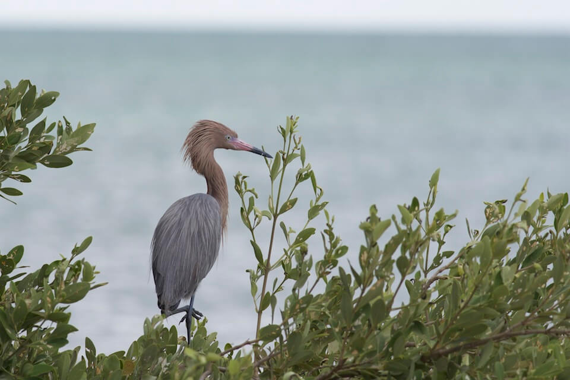

<content-header icon="waterbirds" title="Reddish Egret" subtitle="Egretta rufescens"></content-header>

<figcaption>Photo: FWC</figcaption>

### Overall vulnerability:

Very Low to Low

<h3>Habitat area: 
<a href="/species/birds/144/map" style="float:right;font-size:smaller;margin-right: 2rem;">
<fa-icon name="map"></fa-icon>
explore on map
</a>
</h3>

-   4,188,604 hectares within Florida (modeled)

### Conservation status:

State Threatened

## General Information

This water bird is the rarest species of egret in North America.  Its name reflects the bird’s more common color morph – a grayish brown body with a rust-colored head and neck.  However, this species also has a light color morph of an almost entirely white body, head and neck.  The reddish egret displays a peculiar foraging behavior when it hunts for its diet of small fish – the bird jumps up and weaves back and forth while running after its prey in a manner that resembles dancing. This species breeds in the spring and can be found year-round in coastal south Florida as well as parts of Southern California, Mexico and Costa Rica.

## Habitat Requirements

The reddish egret prefers coastal areas and can most often be found in estuaries near mangroves and lagoons.

**TODO: habitat crosslinks**

## Climate Impacts

A somewhat rare species in Florida already, the reddish egret is threatened by sea level rise and other impacts of climate change that may offset the balance of its fragile estuarine habitat.  In addition to inundation from sea level rise, warming temperatures, changing precipitation patterns and increased concentration of oceanic carbon dioxide are likely to change the water chemistry, salinity and community composition of egret habitat over time.  Although some areas of mangrove or estuarine habitat may migrate inland and northward in a changing climate, coastal development in south Florida is likely to fragment these natural shifts.

[More information about general climate impacts to species in Florida](/impacts/species).

#### This species is expected to be impacted by sea level rise:

- 3 meters of sea level rise: 39% of area (1,618,722 ha)
- 1 meter of sea level rise: 22% of area (936,709 ha)

[Explore sea level rise impacts map](/species/birds/144/map).

## Vulnerability Assessment(s)

The overall vulnerability level (Very Low to Low) was based on the following assessment(s).
#### 

<h3><a href="/impacts/vulnerability/sivva/species">Standardized Index of Vulnerability and Value Assessment</a></h3>

Slightly vulnerable

 

The primary factor contributing to vulnerability of the reddish egret is sea level rise.

## Adaptation Strategies

- Conserving areas of potential future habitat where estuarine and mangrove migration may occur by preserving connected natural areas near the coast is one strategy that may benefit the reddish egret.

- Monitoring natural shifts in ecological communities to prioritize areas for conservation in a changing climate is an important first step.  Restoring coastal vegetation and protecting natural buffers against runoff and sediment transport at priority conservation locations is a good strategy to increase egret habitat resilience as climate change begins to intensify.

[More information about adaptation strategies](/strategies).

## Additional Resources

- [Florida Fish and Wildlife Conservation Commission Species Profile](https://myfwc.com/wildlifehabitats/profiles/birds/waterbirds/reddish-egret/)
