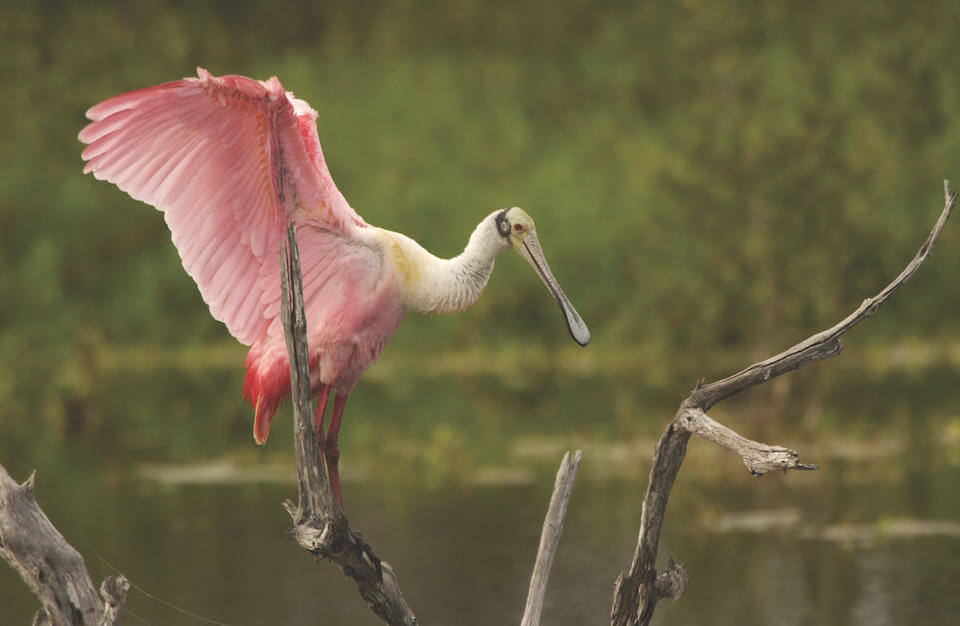

# Roseate spoonbill

### Platalea ajaja

<figcaption>Photo: FWC</figcaption>

### Overall vulnerability:

Moderate

### Conservation status:

State Threatened

## General Information

The roseate spoonbill is the only species of spoonbill endemic to the Western Hemisphere.  This species breeds throughout South America and coastal areas of Central America, the Caribbean and the Gulf of Mexico.  This large bird has an impressive wingspan of around 50 inches and appears almost entirely pink in flight – roseate spoonbills have pink wings, legs and underbellies and white necks and backs.  Their rosy coloring comes from their diet of crustaceans, a food rich in the natural pigment carotenoids.  Spoonbills have a bill reflective of their name – it is large and soon-shaped, perfectly designed for sweeping through shallow water to collect prey.  Roseate spoonbills nest in mangroves or trees in mixed colonies with other wading birds.  Both mates share in incubating and chick-rearing duties.

## Habitat Requirements

Roseate spoonbills prefer mangrove islands for nesting but can be seen in other aquatic habitats including swamps, floodplains and marshes.  In Florida, they are found in the southern tip of the peninsula as well as the central Gulf coast.

**TODO: habitat crosslinks**

**TODO: habitat map (if exists)**

## Climate Impacts

While the roseate spoonbill’s habitat is highly vulnerable to even a moderate amount of sea level rise, the species has the advantage of mobility to move away from habitat that may be no longer suitable in a changing climate.  A large amount of the mangrove habitat predicted to be inundated by sea level rise is expected to expand to new areas within the state, potentially creating areas of new suitable habitat for the roseate spoonbill.  However, human land use patterns may conflict with natural mangrove expansion and other climate-driven changes such as altered salinity levels could negatively impact the quality and quantity of available spoonbill prey.

[More information about general climate impacts to species in Florida](/impacts/species).

## Vulnerability Assessment(s)

The overall vulnerability level (Moderate) was based on the following assessment(s).
#### 

<h3><a href="/impacts/vulnerability/sivva/species">Standardized Index of Vulnerability and Value Assessment</a></h3>

Slightly vulnerable

 

The primary factors contributing to vulnerability of the Roseate spoonbill are sea level rise, erosion, presence of barriers, and synergies with development.

#### 

<h3><a href="/impacts/vulnerability/gcva">Gulf Coast Vulnerability Assessment</a></h3>

Moderately to Highly vulnerable

 

Between 25-50% of the roseate spoonbills' range is expected to be impacted by a 0.41 - 0.82 meter sea level rise. There could be substantial loss to currently used sites, but new habitat may be created as marshes and large islands are fragmented.  A projected increase in mangrove coverage could also provide nesting substrate.  Saltwater intrusion, management practices that affect the hydrologic regime, and tropical storm activity could change salinity levels in foraging sites, possibly causing a reduction in prey numbers or for prey to disperse.  Spoonbills could suffer a decrease in nesting success due to less efficient foraging conditions.  The species is highly mobile with the potential to disperse away from threats.

## Adaptation Strategies

- Conserving areas of potential future habitat where estuarine and mangrove migration may occur by preserving connected natural areas near the coast is one strategy that may benefit the roseate spoonbill.

- Monitoring natural shifts in ecological communities to prioritize areas for conservation in a changing climate is an important first step.  Restoring coastal vegetation and protecting natural buffers against runoff and sediment transport at priority conservation locations is a good strategy to increase spoonbill habitat resilience as climate change begins to intensify.

[More information about adaptation strategies](/strategies).

## Additional Resources

- [Florida Fish and Wildlife Conservation Commission Species Profile](https://myfwc.com/wildlifehabitats/profiles/birds/waterbirds/roseate-spoonbill/)
