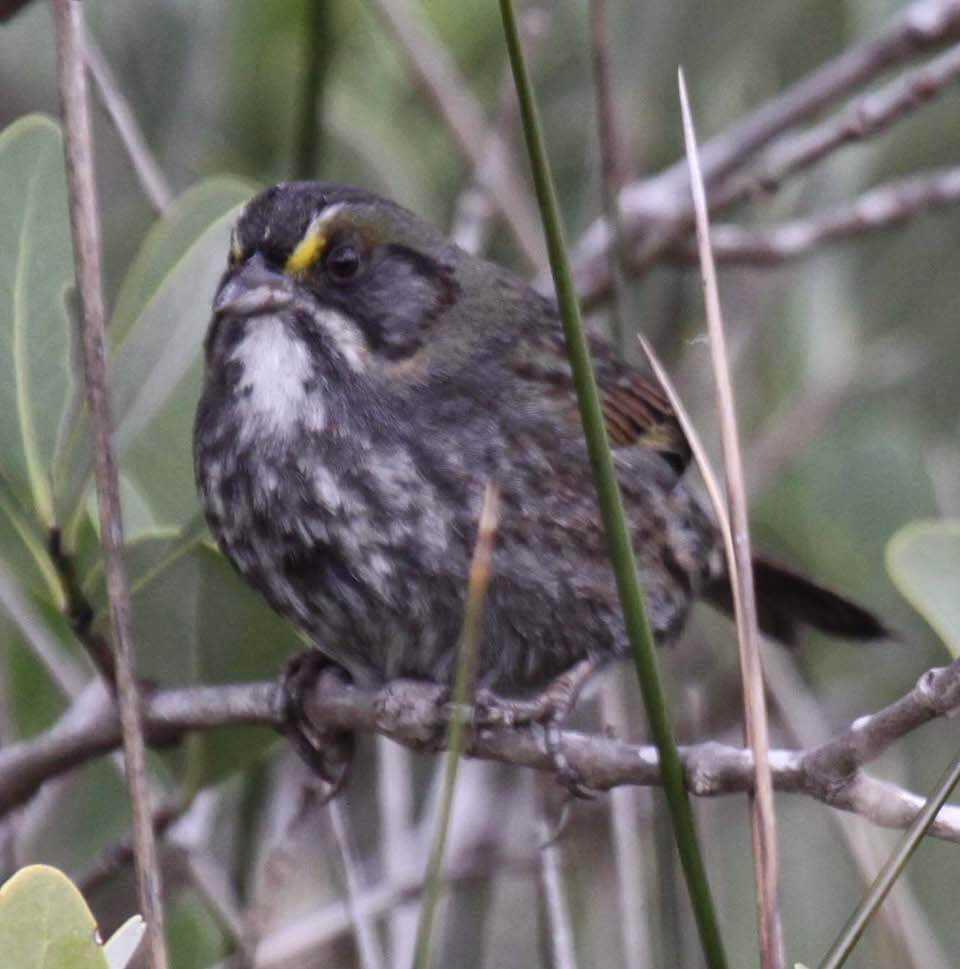

<content-header icon="perching_birds" title="Scott’s seaside sparrow" subtitle="Ammodramus maritimus peninsulae"></content-header>

<figcaption>Photo: FWC - John Mangold</figcaption>

### Overall vulnerability:

Low

<h3>Habitat area: 
<a href="/species/birds/151/map" style="float:right;font-size:smaller;margin-right: 2rem;">
<fa-icon name="map"></fa-icon>
explore on map
</a>
</h3>

-   67,469 hectares within Florida (modeled)

### Conservation status:

State Threatened

## General Information

The Scott’s seaside sparrow is one of multiple subspecies of seaside sparrows to occur in the state, with a range along Florida’s central Gulf coast from Pasco County to Dixie County.  The plumage of these small birds varies slightly by subspecies – the Scott’s seaside sparrow’s often have an olive tint to their greyish brown feathers.  Seaside sparrows feed on insects, spiders, crustaceans and seeds found within the marsh grasses where they nest on the ground.

## Habitat Requirements

Scott’s seaside sparrows inhabit tidal marshes within their narrow range.

**TODO: habitat crosslinks**

## Climate Impacts

As a grass nesting species, the seaside sparrow is extremely vulnerable to many threats that are common in coastal areas including habitat inundation from sea level rise.  Seaside sparrow nests in marsh grasses near the coast are easily destroyed by extreme weather events, human disturbance, predation, and even hide tides, all of which are likely to increase as climate change accelerates.  Given the hazardous conditions to which they are accustomed, it is not uncommon for these birds to start over with new nests following a nest failure early in the season.  However, an especially bad year or a severe storm event late in the season can destroy seaside sparrow clutches for the year, negatively impacting the bird’s already small population.  Habitat fragmentation stemming from changes in coastal development patterns linked to climate change is also likely to be a concern for this subspecies.

[More information about general climate impacts to species in Florida](/impacts/species).

#### This species is expected to be impacted by sea level rise:

- 3 meters of sea level rise: 100% of area (67,456 ha)
- 1 meter of sea level rise: 99% of area (66,905 ha)

[Explore sea level rise impacts map](/species/birds/151/map).

## Vulnerability Assessment(s)

The overall vulnerability level (Low) was based on the following assessment(s).
#### 

<h3><a href="/impacts/vulnerability/sivva/species">Standardized Index of Vulnerability and Value Assessment</a></h3>

Moderately vulnerable

 

The primary factors contributing to vulnerability of the Scott's seaside sparrow are sea level rise, erosion, presence of barriers, runoff and storm surge, alterations to biotic interactions, and synergies with development.

## Adaptation Strategies

- Conservation of existing salt marsh habitat will allow the Louisiana seaside sparrow the best chance of increasing and maintaining a healthy population on the Gulf coast as climate change begins to accelerate.  This includes controlling existing stressors, such as habitat loss and coastal development.

- Conserving healthy future coastal marsh habitat as sea levels rise and human communities begin to shift is important for this species.

- Protecting migratory corridors if salt marsh habitat migrates inland is an important adaptation strategy for the Scott’s seaside sparrow.  Although a significant portion of current habitat is expected to be lost to sea level rise, new areas of suitable habitat may emerge inland if conservation efforts support their natural transition.

[More information about adaptation strategies](/strategies).

## Additional Resources

- [Florida Fish and Wildlife Conservation Commission Species Profile](https://myfwc.com/wildlifehabitats/profiles/birds/songbirds/scotts-seaside-sparrow/)
