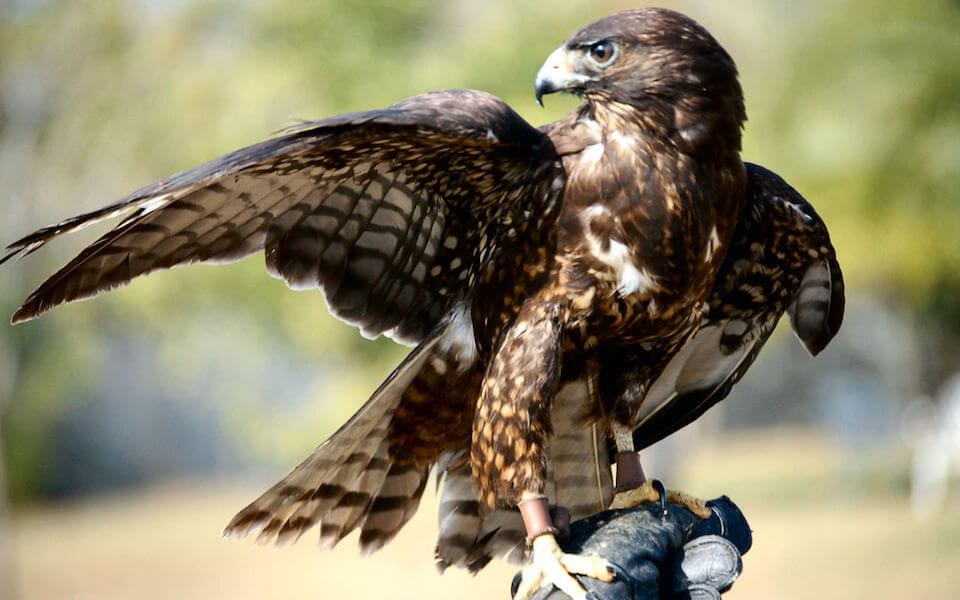

<content-header icon="raptors" title="Short-tailed hawk" subtitle="Buteo brachyurus"></content-header>

<figcaption><a href="https://commons.wikimedia.org/w/index.php?curid=6731944" target="_blank" rel="noopener noreferrer">Photo: Amendezg</a></figcaption>

### Overall vulnerability:

Low

### Conservation status:

Species of Greatest Conservation Need

## General Information

Within the United State, the short-tailed hawk can only be found in the Florida peninsula.  While short-tailed hawks have an extended geographic range to the south, through parts of Central and South America, the Florida population of this species is distinct and only migratory within the state.  Short-tailed hawks have two color morphs (a light and a dark variety) that are not indicative of sex.  In Florida, dark birds are more common.  Despite this hawk’s common name, its tail is not particularly short.  Short-tailed hawks are rare in Florida and have proven difficult to study.  These birds nest in the early spring each year and rely on a diet of small birds, with less frequent supplements of mammals and reptiles.

## Habitat Requirements

**Total habitat within Florida:** 1,650,411 hectares (modeled)

Short-tailed hawks require dense mature woodlands for breeding.  Wetlands, cypress swamps and bays are common habitat types for this species.  Ecotones and transitional areas are common components of short-tailed hawk foraging habitat – this species requires open areas adjacent to wooded stands for hunting.

**TODO: habitat crosslinks**

**TODO: habitat map (if exists)**

## Climate Impacts

Although this species has the advantage of mobility, the Florida short-tailed hawk population is currently highly threatened by habitat loss and fragmentation throughout its range in the state.  Short-tailed hawks face a loss of nesting sites and foraging habitat that is likely to become more extreme under shifting ecological community dynamics and land use patterns spurred by climate change.  This species has extremely strong nest-fidelity so preserving historic nesting sites is critical.  However, natural and human-induced changes related to climate change, such as changing hydrology may result in loss or degradation of historic nesting sites, creating a significant challenge for the short-tailed hawk in its struggle to adapt.  As Florida short-tailed hawks are migratory within the state, their wintering habitat is likely to be impacted in ways distinct from their nesting habitat– sea level rise is likely to be a particular threat to wintering grounds.

[More information about general climate impacts to species in Florida](/impacts/species).

#### This species is expected to be impacted by sea level rise:

- 3 meters of sea level rise: 39% of habitat (644,395 ha)
- 1 meter of sea level rise: 22% of habitat (358,387 ha)
    

## Vulnerability Assessment(s)

The overall vulnerability level (Low) was based on the following assessment(s).
#### 

<h3><a href="/impacts/vulnerability/ccvi">Climate Change Vulnerability Index</a></h3>

Moderately vulnerable (winter range)

 

The short-tailed hawks' wintering and nesting range differ in exposure to climate change, particularly sea level rise.  Vulnerability was assessed for each, wintering habitat and nesting habitat.  In the winter range , the primary factors contributing to vulnerability were sea level rise and the impact of potential changes in hydrology and disturbance regimes on migratory prey (birds) resources.  In the breeding range, potentially incompatible human responses to climate change posed a threat.  Additional factors include impact of potential changes in hydrology and disturbance regimes on swamp forest.  This species could potentially expand its range in  Florida, based on minimal impacts from barriers combined with good dispersal.

#### 

<h3><a href="/impacts/vulnerability/sivva/species">Standardized Index of Vulnerability and Value Assessment</a></h3>

Slightly vulnerable

 

The primary factors contributing to vulnerability of the short-tailed hawk are sea level rise and erosion.

## Adaptation Strategies

- Preserving historic nesting sites for as long as possible in a changing climate is a good first step to increase population resilience for this species.

- As climate change accelerates however, it may be necessary to allow or even facilitate ecological transition in forested habitats to maintain adequate canopy cover.  In many forest habitats, new compositions of tree species may be better adapted to thrive in a future climate.

- Preserving conservation lands that allow for migratory pathways across the landscape is important to facilitate movement for species that are able, such as the short-tailed hawk and other birds.

[More information about adaptation strategies](/strategies).

## Additional Resources

- [Florida Natural Areas Inventory Profile](http://www.fnai.org/FieldGuide/pdf/Buteo_brachyurus.PDF)
