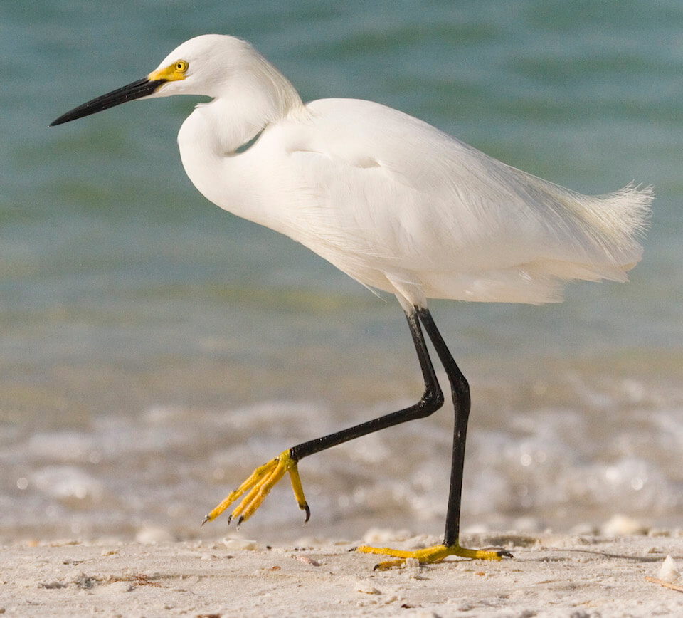

# Snowy egret

### Egretta thula

<figcaption>Photo: FWC</figcaption>

### Overall vulnerability:

This species was not assessed for vulnerability.

### Conservation status:

Species of Greatest Conservation Need

## General Information

The snowy egret is a small and active wading bird, easily identifiable by its bright white body, black legs and yellow feet.  This species of egret is widespread throughout much of the United States and South America.  They are yearlong residents in Florida and are found throughout the panhandle and peninsula.  Snowy egrets build nests of sticks in low trees or bushes alongside other wading bird species during their spring breeding season.  Young remain in the nest for about three months although they begin to fly at only 25 days after hatching.  Snowy egrets forage for a diet of shrimp, fish and aquatic invertebrates.

## Habitat Requirements

**Total habitat within Florida:** 4,188,604 hectares (modeled)

Snowy egrets inhabit shallow estuarine areas including mangroves, bays, saltmarsh pools and tidal channels.

**TODO: habitat crosslinks**

**TODO: habitat map (if exists)**

## Climate Impacts

This species may be somewhat buffered from the impacts of climate change by its robust population across a wide geographic range, however, the snowy egret habitat is likely to be highly impact by climate change over time.  Inundation from sea level rise, warming temperatures, changing precipitation patterns and increased concentration of oceanic carbon dioxide are likely to change the water chemistry, salinity and community composition of egret habitat over time.  Although some areas of mangrove or estuarine habitat may migrate inland and northward in a changing climate, coastal development in south Florida is likely to fragment these natural shifts.

[More information about general climate impacts to species in Florida](/impacts/species).

#### This species is expected to be impacted by sea level rise:

- 3 meters of sea level rise: 39% of habitat (1,618,722 ha)
- 1 meter of sea level rise: 22% of habitat (936,709 ha)
    

## Vulnerability Assessment(s)

This species was not assessed for vulnerability.

## Adaptation Strategies

- Conserving areas of potential future habitat where estuarine and mangrove migration may occur by preserving connected natural areas near the coast is one strategy that may benefit the snowy egret.

- Monitoring natural shifts in ecological communities to prioritize areas for conservation in a changing climate is an important first step.  Restoring coastal vegetation and protecting natural buffers against runoff and sediment transport at priority conservation locations is a good strategy to increase egret habitat resilience as climate change begins to intensify.

[More information about adaptation strategies](/strategies).

## Additional Resources

- [Florida Fish and Wildlife Conservation Commission Species Profile](https://myfwc.com/wildlifehabitats/profiles/birds/waterbirds/snowy-egret/)
