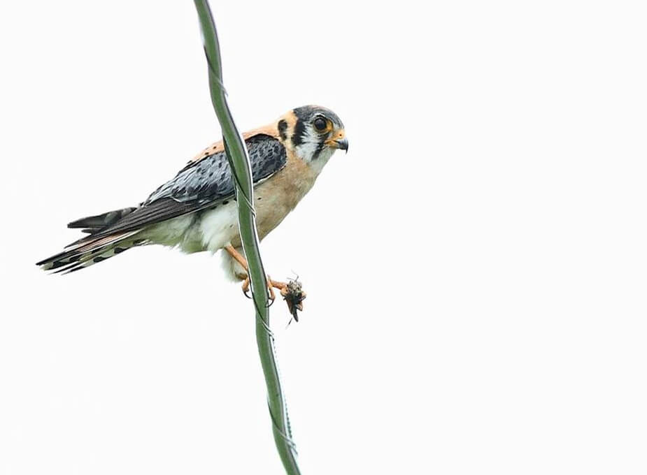

<content-header icon="raptors" title="Southeastern American kestrel" subtitle="Falco sparverius paulus"></content-header>

<figcaption>Photo: FWC</figcaption>

### Overall vulnerability:

This species was not assessed for vulnerability.

<h3>Habitat area: 
<a href="/species/birds/159/map" style="float:right;font-size:smaller;margin-right: 2rem;">
<fa-icon name="map"></fa-icon>
explore on map
</a>
</h3>

-   545,146 hectares within Florida (modeled)

### Conservation status:

State Threatened

## General Information

This rare nonmigratory subspecies of kestrel is endemic to Florida and other areas of the American Southeast.  Southeastern American kestrels require a wide territory to forage and nest.  Breeding pairs remain bonded for years and typically maintain the same territory together year after year.  These kestrels rely primarily on a diet of grasshoppers and small lizards in Florida, often keeping watch for prey and diving to capture it from a perched position.

## Habitat Requirements

Old-growth longleaf pine, scrub and sandhill habitats in Florida are favored by the Southeastern American kestrel.  These birds are highly dependent regular fire to maintain high quality habitat.  Southeastern American kestrels primarily nest in dead tree cavities, hollowed out previously by woodpeckers.  Kestrels also utilize working lands and open lots in residential areas but suitable habitat for these birds must contain both nesting sites and adequate foraging grounds.

**TODO: habitat crosslinks**

## Climate Impacts

Although this species has the advantage of mobility, Southeastern American kestrels are currently rare and threatened by habitat loss and fragmentation in Florida, a situation likely to worsen as human communities push inland from coastal areas under climate change.  Rising temperatures, shifting precipitation patterns and altered fire regimes are likely to alter community structure in kestrel habitat over time.  Spreading invasive plant species in a changing climate could change community composition, resulting in poorer quality kestrel habitat.  Southeastern American kestrels also face an exceptionally high mortality rate as chicks due to predation, with only 30 % of hatchlings surviving to one year.  The spread of nonnative predators in a changing climate could compound this threat.

[More information about general climate impacts to species in Florida](/impacts/species).

#### This species is expected to be impacted by sea level rise:

- 3 meters of sea level rise: <1% of area (4,340 ha)
- 1 meter of sea level rise: <1% of area (369 ha)

[Explore sea level rise impacts map](/species/birds/159/map).

## Vulnerability Assessment(s)

This species was not assessed for vulnerability.

## Adaptation Strategies

- Preserving historic nesting sites for as long as possible in a changing climate is a good first step to increase population resilience for this species.

- Implementing an appropriate fire regime is an important adaptive management strategy for this species.  If kestrel habitat is not regularly burned, quality can decline.  Climate change is likely to make prescribed fire more challenging as optimal burning conditions become increasingly rare, thus implementing a consistent fire management regime early is crucial.

- As controlled burning becomes more challenging in a changing climate, other habitat management strategies such as mechanical thinning may need to be pursued to maintain optimal habitat quality.

- Controlling existing threats not directly related to climate change, such as habitat loss and fragmentation, and predation by nonnative species is an important first-step adaptation strategy for this species.

- Preserving conservation lands that allow for migratory pathways across the landscape is important to facilitate movement for species that are able, such as the Southeastern American kestrel and other birds.

- Southeastern American kestrels have been known to successfully use nesting boxes in place of tree cavities.  This is a good strategy to continue and increase if traditional nesting sites become rarer due to climate change.

[More information about adaptation strategies](/strategies).

## Additional Resources

- [Florida Fish and Wildlife Conservation Commission Species Profile](https://myfwc.com/wildlifehabitats/profiles/birds/raptors-and-vultures/american-kestrel/)
