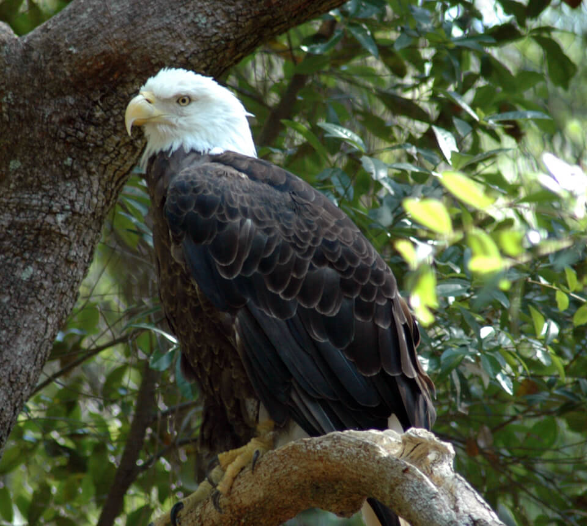

<content-header icon="raptors" title="Southern bald eagle" subtitle="Haliaeetus leucocephalus"></content-header>

<figcaption>Photo: FWC</figcaption>

### Overall vulnerability:

This species was not assessed for vulnerability.

### Conservation status:

Species of Greatest Conservation Need

## General Information

Florida is home to one of the largest concentrations of nesting bald eagles in the lower 48 states with an estimated 1,499 nested pairs recorded in 2014.  This iconic and majestic raptor is easily recognizable from its broad, dark brown wingspan, white head and yellow bill.  Bald eagles mature slowly, reaching full adult plumage at around 5 years.  Highly social birds throughout most of the year, bald eagles are fiercely territorial once they arrive at their nesting territories in the fall.  Breeding season begins with nest building or repair and can extend through May when young eagles fledge.  Bald eagles build large and strong nests, most often in native pines.  Bald eagles capture a wide variety of prey including fish, birds and small mammals.

## Habitat Requirements

**Total habitat within Florida:** 4,305,038 hectares (modeled)

Bald eagle nesting habitat in Florida is concentrated around fresh water.  Inland lake and river systems in the peninsula and along the Gulf coast offer idea habitat for nesting, roosting and foraging.

**TODO: habitat crosslinks**

**TODO: habitat map (if exists)**

## Climate Impacts

Bald eagles will have the advantage of mobility, a wide range, and a diverse prey base as they adapt to a changing climate.  However, eagles require high quality habitat to meet their nesting and foraging needs – expanses of space away from other eagles and near fresh and salt water with tall trees.  Loss of habitat quantity and quality is likely as ecological and human communities respond to a changing climate.

[More information about general climate impacts to species in Florida](/impacts/species).

#### This species is expected to be impacted by sea level rise:

- 3 meters of sea level rise: 25% of habitat (1,095,351 ha)
- 1 meter of sea level rise: 16% of habitat (675,058 ha)
    

## Vulnerability Assessment(s)

This species was not assessed for vulnerability.

## Adaptation Strategies

- Preserving historic nesting habitat for as long as possible in a changing climate is a good first step to increase population resilience for this species.

- As climate change accelerates however, it may be necessary to allow or even facilitate ecological transition in forested habitats to maintain adequate canopy cover.  In many forest habitats, new compositions of tree species may be better adapted to thrive in a future climate.

- Preserving conservation lands that allow for migratory pathways across the landscape is important to facilitate movement for species that are able, such as the bald eagle and other birds.

[More information about adaptation strategies](/strategies).

## Additional Resources

- [Florida Fish and Wildlife Conservation Commission Species Profile](https://myfwc.com/wildlifehabitats/profiles/birds/raptors-and-vultures/bald-eagle/)

- [Multi-Species Recovery Plan for South Florida](https://ecos.fws.gov/docs/recovery_plan/sfl_msrp/SFL_MSRP_Species.pdf)
