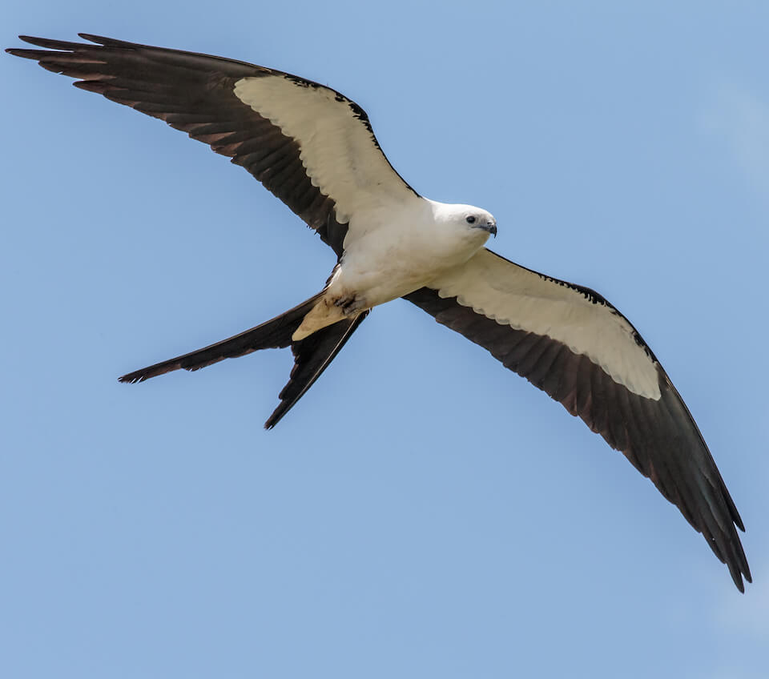

<content-header icon="raptors" title="Swallow-tailed kite" subtitle="Elanoides forficatus"></content-header>

<figcaption>Photo: Andy Morffew</figcaption>

### Overall vulnerability:

This species was not assessed for vulnerability.

<h3>Habitat area: 
<a href="/species/birds/167/map" style="float:right;font-size:smaller;margin-right: 2rem;">
<fa-icon name="map"></fa-icon>
explore on map
</a>
</h3>

-   3,714,812 hectares within Florida (modeled)

### Conservation status:

Species of Greatest Conservation Need

## General Information

Easily identifiable by its elegant, streamlined form and exceptional aerial grace, the swallow-tailed kite breeds throughout South America, Mexico and parts of the southeastern United States.  While not a common species in Florida, most of the North American breeding population can be found in the state.  Kites arrive in Florida for the annual breeding season by March and depart for their southern wintering grounds by August.  Swallow-tailed kites are easiest to detect during the courtship and nest-building phase of their time in Florida, during which they can be heard and seen courting and carrying bits of moss and lichen for their nests. Though they nest in large colonies, swallow-tailed kites remain inconspicuous and quiet while engaged in incubation and early chick-rearing.  During the breeding season, these raptors forage on a diverse diet of flying insects, frogs, lizards, snakes and small songbirds.

## Habitat Requirements

Swallow-tailed kites prefer large tracks of forested wetland for breeding habitat.  Swamps, floodplain forest, hardwood hammocks and mangroves are all habitat types associated with this species.  These birds require stands of tall pine and cypress trees large enough to accommodate a nesting colony and habitat supporting large numbers of insects and small, arboreal animals for prey.  Because of their flexibility to nest in a variety of Florida habitat types, swallow-tailed kites are found scattered in small numbers throughout the state.

**TODO: habitat crosslinks**

## Climate Impacts

Although this species has the advantage of mobility, swallow-tailed kites are threatened by habitat loss and fragmentation throughout the state.  Swallow-tailed kites face a loss of nesting sites and foraging habitat that is likely to become more extreme under shifting ecological community dynamics and land use patterns spurred by climate change.  Climate change-drive changes in hydrology, precipitation patterns, temperature extremes and severe storm events may impact the quality of breeding habitat and the availability of adequate prey.  Areas of swallow-tailed kite habitat near the coast are also likely to be impacted by sea level rise and gradual salination of freshwater habitat.  Even if swallow-tailed kites are not directly affected by many of these changes, their prey base is likely to be.

[More information about general climate impacts to species in Florida](/impacts/species).

#### This species is expected to be impacted by sea level rise:

- 3 meters of sea level rise: 16% of area (576,113 ha)
- 1 meter of sea level rise: 9% of area (317,959 ha)

[Explore sea level rise impacts map](/species/birds/167/map).

## Vulnerability Assessment(s)

This species was not assessed for vulnerability.

## Adaptation Strategies

- As climate change accelerates however, it may be necessary to allow or even facilitate ecological transition in forested habitats to maintain adequate canopy cover for nesting sites.  In many forest habitats, new compositions of tree species may be better adapted to thrive in a future climate.

- Preserving conservation lands that allow for migratory pathways across the landscape is important to facilitate movement for species that are able, such as the swallow-tailed kite and other birds.

[More information about adaptation strategies](/strategies).

## Additional Resources

- [Florida Fish and Wildlife Conservation Commission Species Profile](https://myfwc.com/wildlifehabitats/profiles/birds/raptors-and-vultures/swallow-tailed-kite/)
