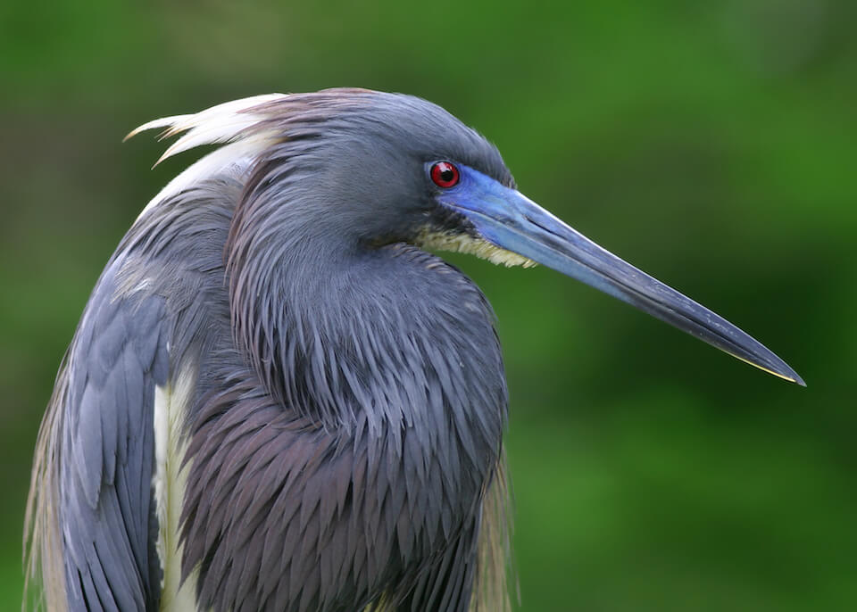

<content-header icon="waterbirds" title="Tricolored heron" subtitle="Egretta tricolor">
</content-header>

<figcaption>Photo: FWC</figcaption>

### Overall vulnerability:

Very Low

<h3>Habitat area: 
<a href="/species/birds/169/map" style="float:right;font-size:smaller;margin-right: 2rem;">
<fa-icon name="map"></fa-icon>
explore on map
</a>
</h3>

-   4,188,604 hectares within Florida (modeled)

### Conservation status:

State Threatened

## General Information

This mid-sized heron is named for its unique and lovely coloring.  Tricolored herons have a slate-blue head and neck, a bright purple chest and a white underbelly.  These birds occupy a wide range in Florida and beyond, from Massachusetts through Brazil.  They are year-round residents of Florida, common in the peninsula and rarer in the panhandle of the state.  Tricolored herons eat a diet primarily of fish and breed in colonies, after which females build nests in tree or shrubs found in their watery habitat.

## Habitat Requirements

Tricolored herons reside in a wide variety of aquatic habitat types, including fresh, brackish, and saltwater swamps, estuaries, mangroves, lagoons and marshes.

**TODO: habitat crosslinks**

## Climate Impacts

The tricolored heron is currently threatened by habitat loss and fragmentation in Florida and shifting land use linked to climate change is likely to intensify this threat, especially in coastal areas.  The tricolored heron’s fresh and brackish water habitats are highly vulnerable to sea level rise and salt water encroachment.  Although this species may be able to successfully adapt to changes in salinity, the quality of habitat and availability of prey may decline.  Coastal armoring in response to sea level rise and extreme weather and disturbance events are also likely to negatively impact the species.

[More information about general climate impacts to species in Florida](/impacts/species).

#### This species is expected to be impacted by sea level rise:

- 3 meters of sea level rise: 39% of area (1,618,722 ha)
- 1 meter of sea level rise: 22% of area (936,709 ha)

[Explore sea level rise impacts map](/species/birds/169/map).

## Vulnerability Assessment(s)

The overall vulnerability level (Very Low) was based on the following assessment(s).
#### 

<h3><a href="/impacts/vulnerability/sivva/species">Standardized Index of Vulnerability and Value Assessment</a></h3>

Slightly vulnerable

 

The primary factor contributing to vulnerability of the tricolored heron is minimal habitat protection.

## Adaptation Strategies

- Addressing existing threats including conserving existing aquatic habitat from further development to the extent possible is an important first-line adaptation strategy for this species.

- Protection of habitat corridors that allow the tricolored heron to move within patches of suitable habitat as natural climate-driven shifts occur may help this species adapt.

[More information about adaptation strategies](/strategies).

## Additional Resources

- [Florida Fish and Wildlife Conservation Commission Species Profile](https://myfwc.com/wildlifehabitats/profiles/birds/waterbirds/tricolored-heron/)
