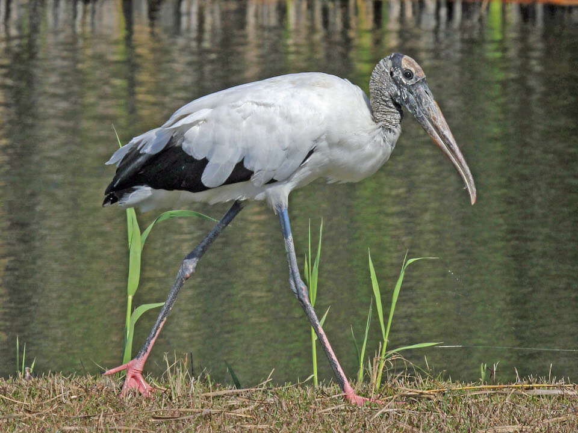

<content-header icon="waterbirds" title="Wood stork" subtitle="Mycteria americana">
</content-header>

<figcaption>Photo: Dick Daniels</figcaption>

### Overall vulnerability:

Moderate

<h3>Habitat area: 
<a href="/species/birds/170/map" style="float:right;font-size:smaller;margin-right: 2rem;">
<fa-icon name="map"></fa-icon>
explore on map
</a>
</h3>

-   4,188,604 hectares within Florida (modeled)

### Conservation status:

Federally Threatened

## General Information

The wood stork is large and long-legged, identifiable by its hairless neck, covered only with rough gray skin.  Atypically for birds, wood storks lack the ability to vocalize as adults and are only capable of making hissing sounds.  Wood storks breed in Florida and the other parts of the southeast with an extensive migratory range throughout North and South America.  These water birds are opportunistic feeders, hunting by dragging their open bill through water and snapping up any prey that meets it, usually fish, crayfish, amphibians and reptiles.  Male wood storks take on the responsibility of building nests out of twigs, typically located in trees standing in water.  After an incubation of about 30 days, young wood storks fledge about 12 weeks after hatching.

## Habitat Requirements

Mixed hardwood swamps, mangroves and cypress stands provide optimal nesting habitat for wood storks in Florida.  Foraging habitat is more variable – they are open to many types of shallow freshwater or estuarine marshes, but are limited to water depths less than 10-12 inches.

**TODO: habitat crosslinks**

## Climate Impacts

The wood stork is highly vulnerable to the anticipated hydrological impacts of climate change.  Wood storks require normal hydrological cycles with periods of natural flooding to increase and concentrate prey populations.  Periods of drought, changing precipitation patterns and altered salinity and water chemistry are likely to impact wood stork habitat quality and prey availability to an extent that limits this species from successfully breeding.  Coastal armoring in response to sea level rise and extreme weather and disturbance events are also likely to negatively impact this species.  The wood stork population in South Florida has already suffered substantial decline due to habitat fragmentation and alteration from agricultural expansion.  Additional fragmentation and alteration of natural hydrological cycles linked to climate change is likely to stress this species considerably.

[More information about general climate impacts to species in Florida](/impacts/species).

#### This species is expected to be impacted by sea level rise:

- 3 meters of sea level rise: 39% of area (1,618,722 ha)
- 1 meter of sea level rise: 22% of area (936,709 ha)

[Explore sea level rise impacts map](/species/birds/170/map).

## Vulnerability Assessment(s)

The overall vulnerability level (Moderate) was based on the following assessment(s).
#### 

<h3><a href="/impacts/vulnerability/sivva/species">Standardized Index of Vulnerability and Value Assessment</a></h3>

Highly vulnerable

 

The primary factors contributing to vulnerability of the wood stork are changes in precipitation, habitat fragmentation, and synergies with development.   Appropriate water levels are critical for reproductive success.

## Adaptation Strategies

- Addressing existing threats including conserving existing wetland habitat from further development or alteration to the extent possible is an important first-line adaptation strategy for this species.

- Protection of habitat corridors that allow the wood stork to move within patches of suitable habitat as natural climate-driven shifts occur may help this species adapt.

[More information about adaptation strategies](/strategies).

## Additional Resources

- [Florida Fish and Wildlife Conservation Commission Species Profile](https://myfwc.com/wildlifehabitats/profiles/birds/waterbirds/wood-stork/)

- [Multi-Species Recovery Plan for South Florida](https://ecos.fws.gov/docs/recovery_plan/sfl_msrp/SFL_MSRP_Species.pdf)
